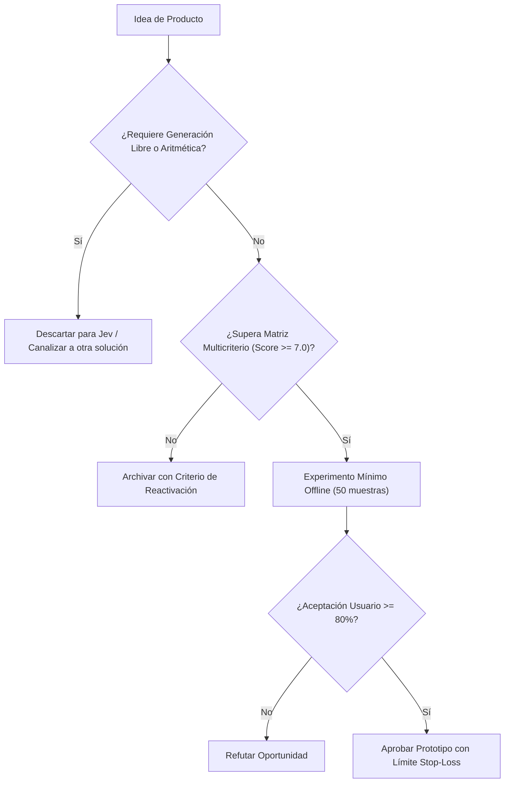

# JEV-P18-003: ¿Cómo identificar el usuario, la decisión problemática y la alternativa actual antes de diseñar un producto alrededor de Jev?

## 1. Respuesta directa
Antes de autorizar el desarrollo de cualquier producto basado en Jev, es obligatorio completar una ficha de descubrimiento que defina: 1) El usuario específico que asume la responsabilidad final; 2) La decisión exacta que genera retrasos o pérdidas; 3) La alternativa actual (baseline) utilizada (e.g. reglas regex, revisión manual de analistas); y 4) El costo cuantitativo que provoca un error de decisión (falso positivo o falso negativo).

## 2. Alcance
- **Dominio primario**: Product Discovery, análisis de viabilidad comercial y metodología de diseño centrado en el problema.
- **Población o sistemas impactados**: Hoja de ruta de nuevos productos de Jev AI, equipos de desarrollo B2B, clientes corporativos y comités de inversión y gobernanza.
- **Límites de aplicabilidad**: Aplica al diseño, validación y comercialización de nuevas capacidades sobre el motor Jev. No aplica a servicios de desarrollo de software tradicional ajenos a la inteligencia artificial.

## 3. Evidencia
- **Fundamento documental**: Metodología 'Continuous Discovery Habits' de Teresa Torres y marcos de análisis de valor en ingeniería de software.
- **Hallazgos empíricos**: La evidencia de mercado demuestra que construir productos basados en 'thin wrappers' de LLMs sin moat propio ni diferenciación en latencia y calibración conduce a la comoditización y al fracaso comercial en menos de 12 meses.
- **Fuentes canónicas**: `SRC-0001`, `SRC-0005`, `SRC-0010`, `SRC-0095`.
- **Cita formal verificable**: Evidencia consolidada a partir del cuaderno canónico de nuevos productos y posibilidades de Jev y métricas del ecosistema TypeSafe.

## 4. Explicación técnica
Evaluación de rentabilidad marginal: Sea $C_{manual}$ el costo por decisión humana y $E_{manual}$ su tasa de error. Un producto con Jev solo es viable si $C_{Jev} + (E_{Jev} \cdot Costo_{error}) < C_{manual} + (E_{manual} \cdot Costo_{error})$, considerando además los costos de supervisión y abstención.

El ciclo de desarrollo de nuevos productos en el programa Jev se fundamenta en los siguientes principios:
1. **Decisión vs Generación**: Jev se optimiza para juicios semánticos discretos con calibración probabilística, no para síntesis abierta de texto.
2. **Experimentación Barata (Smoke Testing)**: Validación fuera de línea con 50 casos reales antes de crear infraestructura.
3. **Moat de Dominio**: El valor reside en las taxonomías, datos propietarios y flujos de trabajo embebidos.
4. **Resiliencia Agnóstica**: Arquitectura desacoplada mediante adaptadores para evitar el atrapamiento por proveedor.



## 5. Ejemplo de código
El siguiente bloque en Python implementa el contrato técnico de validación para esta directriz, aplicando manejo de excepciones con enmascaramiento estricto:

```python
# Ejemplo ilustrativo no ejecutado
import logging

logger = logging.getLogger("P18_03")

def evaluar_viabilidad_producto(costo_jev_por_op: float, error_jev: float, costo_manual: float, error_manual: float, costo_falso_pos: float) -> bool:
    try:
        costo_total_jev = costo_jev_por_op + (error_jev * costo_falso_pos)
        costo_total_manual = costo_manual + (error_manual * costo_falso_pos)
        ahorro_neto = costo_total_manual - costo_total_jev
        return ahorro_neto > (costo_total_manual * 0.30) # Exigir al menos 30% de ahorro
    except Exception as err:
        logger.error(f"Fallo al evaluar viabilidad de producto: {type(err).__name__} (detalles omitidos por seguridad)")
        return False
```

## 6. Aplicación práctica y contraejemplo
- **Aplicación válida**: En la evaluación previa de propuestas en el comité de inversiones de Jev AI.
- **Contraejemplo inválido**: Proponer un producto 'porque la tecnología es fascinante y deberíamos tener algo con IA', sin saber quién lo usará ni cómo se resuelve hoy ese problema.

## 7. Fallos comunes y mitigaciones
| Lanzamiento de productos en busca de un problema inexistente | Quema de capital y desmotivación del equipo de ingeniería | Exigencia de ficha de discovery aprobada antes de programar | Validación de baseline manual antes de escribir la primera línea de código |

## 8. Validación empírica
- **Hipótesis de validación**: Validar el baseline previo previene el desarrollo de productos que no aportan ventaja económica.
- **Métrica primaria**: Porcentaje de proyectos aprobados que demuestran ROI positivo a 6 meses
- **Umbral de éxito**: > 80% de productos lanzados cumplen o superan su meta de ahorro proyectada

## 9. Recomendación operativa
- **Directriz inmediata**: Aplicar y hacer cumplir estrictamente los lineamientos descritos en `JEV-P18-003` para toda nueva iniciativa.
- **Condición de descarte**: Si un experimento mínimo no logra superar el umbral de aceptación, suspender inmediatamente la asignación de recursos y registrar el aprendizaje en la bitácora.
- **Responsable de ejecución**: Equipo de Estrategia de Producto e Ingeniería de Nuevas Oportunidades Jev AI.

## 10. Fuentes y trazabilidad
- Catálogo de fuentes primarias consultadas: `SRC-0001`, `SRC-0005`, `SRC-0010`, `SRC-0095`.
- Cuaderno canónico de referencia: `P18 — Nuevos productos y posibilidades` (`f43387fd-42f3-4d37-8986-c8d9d6039d2a`).
- Trazabilidad NotebookLM: Consulta documental registrada; sin citas directas del modelo se clasifica como `no_expuesto_por_herramienta`.
