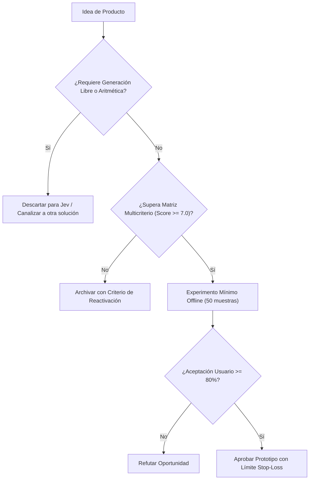

# JEV-P18-007: ¿Qué oportunidad existe en enrutamiento de trabajo o modelos y qué ahorro incremental debería demostrarse para justificar un producto?

## 1. Respuesta directa
El producto de Enrutamiento Semántico ('Semantic Gateway') utiliza Jev como clasificador de complejidad en la capa perimetral para decidir qué motor procesa la consulta: consultas simples o estructuradas se resuelven mediante Jev o modelos compactos (costo $< $0.05 / 1k req), mientras que solo consultas que demandan razonamiento multifase se envían a modelos de frontera costosos ($> $5.00 / 1k req). Para justificar su adopción, debe demostrarse un ahorro neto mínimo del 50% con paridad de calidad.

## 2. Alcance
- **Dominio primario**: FinOps en IA, optimización de infraestructura y arquitecturas de gateway de modelos.
- **Población o sistemas impactados**: Hoja de ruta de nuevos productos de Jev AI, equipos de desarrollo B2B, clientes corporativos y comités de inversión y gobernanza.
- **Límites de aplicabilidad**: Aplica al diseño, validación y comercialización de nuevas capacidades sobre el motor Jev. No aplica a servicios de desarrollo de software tradicional ajenos a la inteligencia artificial.

## 3. Evidencia
- **Fundamento documental**: Investigación sobre FrugalGPT (Chen et al., Stanford 2023), benchmarks de RouteLLM (LMSYS 2024) y métricas de consumo de tokens.
- **Hallazgos empíricos**: La evidencia de mercado demuestra que construir productos basados en 'thin wrappers' de LLMs sin moat propio ni diferenciación en latencia y calibración conduce a la comoditización y al fracaso comercial en menos de 12 meses.
- **Fuentes canónicas**: `SRC-0001`, `SRC-0010`, `SRC-0039`, `SRC-0095`.
- **Cita formal verificable**: Evidencia consolidada a partir del cuaderno canónico de nuevos productos y posibilidades de Jev y métricas del ecosistema TypeSafe.

## 4. Explicación técnica
Router semántico binario: Jev evalúa la complejidad del prompt entrante mediante `Choice(options=['simple_deterministico', 'complejo_generativo'])`. Si se clasifica como simple, se responde de inmediato; si es complejo, se deriva al pool de modelos de frontera.

El ciclo de desarrollo de nuevos productos en el programa Jev se fundamenta en los siguientes principios:
1. **Decisión vs Generación**: Jev se optimiza para juicios semánticos discretos con calibración probabilística, no para síntesis abierta de texto.
2. **Experimentación Barata (Smoke Testing)**: Validación fuera de línea con 50 casos reales antes de crear infraestructura.
3. **Moat de Dominio**: El valor reside en las taxonomías, datos propietarios y flujos de trabajo embebidos.
4. **Resiliencia Agnóstica**: Arquitectura desacoplada mediante adaptadores para evitar el atrapamiento por proveedor.



## 5. Ejemplo de código
El siguiente bloque en Python implementa el contrato técnico de validación para esta directriz, aplicando manejo de excepciones con enmascaramiento estricto:

```python
# Ejemplo ilustrativo no ejecutado
import logging
from typesafe_sdk import TypeSafeClient, Choice

logger = logging.getLogger("P18_07")

def enrutar_consulta_por_complejidad(prompt_usuario: str) -> str:
    try:
        client = TypeSafeClient(model="jev-1.13.0")
        res = client.system_one(
            state=prompt_usuario,
            questions={
                "ruta": Choice(
                    instructions="Determinar si requiere razonamiento complejo o clasificacion simple",
                    options=["modelo_economico_local", "modelo_frontera_costoso"]
                )
            }
        )
        return res.answers["ruta"].choice
    except Exception as err:
        logger.error(f"Fallo en enrutamiento semantico: {type(err).__name__} (detalles omitidos por seguridad)")
        return "modelo_frontera_costoso" # Ruta de fallback segura
```

## 6. Aplicación práctica y contraejemplo
- **Aplicación válida**: En el gateway corporativo de APIs de inteligencia artificial.
- **Contraejemplo inválido**: Enviar el 100% de los 'Hola' y '¿Cuál es el horario de atención?' a un modelo de 1 billón de parámetros pagando $0.03 por consulta.

## 7. Fallos comunes y mitigaciones
| Costos desorbitados de inferencia por falta de enrutamiento | Quiebra del modelo de negocio por facturas cloud | Implementación de router perimetral con Jev | Auditoría mensual de costos con desglose por ruta |

## 8. Validación empírica
- **Hipótesis de validación**: El enrutamiento semántico reduce la factura global de inferencia en más de un 60% sin degradar la satisfacción del usuario.
- **Métrica primaria**: Porcentaje de reducción de costo por consulta respecto al baseline monolítico
- **Umbral de éxito**: > 55% de ahorro económico demostrado en producción

## 9. Recomendación operativa
- **Directriz inmediata**: Aplicar y hacer cumplir estrictamente los lineamientos descritos en `JEV-P18-007` para toda nueva iniciativa.
- **Condición de descarte**: Si un experimento mínimo no logra superar el umbral de aceptación, suspender inmediatamente la asignación de recursos y registrar el aprendizaje en la bitácora.
- **Responsable de ejecución**: Equipo de Estrategia de Producto e Ingeniería de Nuevas Oportunidades Jev AI.

## 10. Fuentes y trazabilidad
- Catálogo de fuentes primarias consultadas: `SRC-0001`, `SRC-0010`, `SRC-0039`, `SRC-0095`.
- Cuaderno canónico de referencia: `P18 — Nuevos productos y posibilidades` (`f43387fd-42f3-4d37-8986-c8d9d6039d2a`).
- Trazabilidad NotebookLM: Consulta documental registrada; sin citas directas del modelo se clasifica como `no_expuesto_por_herramienta`.
