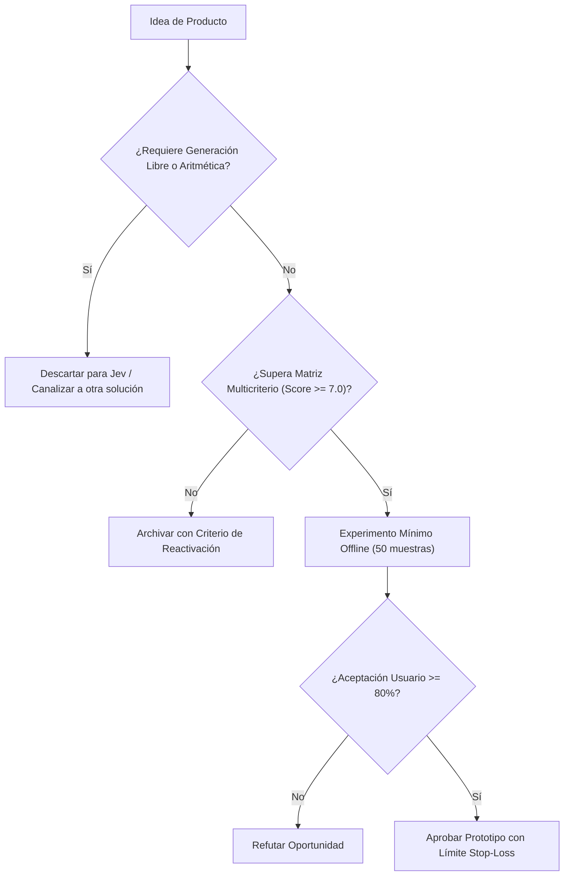

# JEV-P18-009: ¿Qué funciones de revisión de requisitos, incidencias o documentación de software podrían integrarse en herramientas de desarrollo con valor medible?

## 1. Respuesta directa
El producto 'SpecLinter' se integra en pipelines de desarrollo (GitHub Actions / GitLab CI) para analizar historias de usuario y requerimientos en Markdown. El linter audita tres aspectos medibles: 1) Existencia de criterios de aceptación verificables; 2) Ausencia de términos vagos o ambiguos ('rápido', 'amigable'); y 3) Consistencia con la arquitectura documentada. Si la especificación falla, bloquea el paso del ticket al sprint de desarrollo.

## 2. Alcance
- **Dominio primario**: Developer Tools (DevTools), ingeniería de requisitos y automatización del ciclo de desarrollo.
- **Población o sistemas impactados**: Hoja de ruta de nuevos productos de Jev AI, equipos de desarrollo B2B, clientes corporativos y comités de inversión y gobernanza.
- **Límites de aplicabilidad**: Aplica al diseño, validación y comercialización de nuevas capacidades sobre el motor Jev. No aplica a servicios de desarrollo de software tradicional ajenos a la inteligencia artificial.

## 3. Evidencia
- **Fundamento documental**: Estándar IEEE 830 / ISO/IEC/IEEE 29148 de especificación de requisitos y estudios sobre costo de defectos tardíos.
- **Hallazgos empíricos**: La evidencia de mercado demuestra que construir productos basados en 'thin wrappers' de LLMs sin moat propio ni diferenciación en latencia y calibración conduce a la comoditización y al fracaso comercial en menos de 12 meses.
- **Fuentes canónicas**: `SRC-0001`, `SRC-0010`, `SRC-0039`, `SRC-0095`.
- **Cita formal verificable**: Evidencia consolidada a partir del cuaderno canónico de nuevos productos y posibilidades de Jev y métricas del ecosistema TypeSafe.

## 4. Explicación técnica
Auditoría por contrato `Score` y `Choice`: El archivo Markdown se procesa por secciones. Cada historia se somete a validación de ambigüedad. Se devuelven flags deterministas con los números de línea observados.

El ciclo de desarrollo de nuevos productos en el programa Jev se fundamenta en los siguientes principios:
1. **Decisión vs Generación**: Jev se optimiza para juicios semánticos discretos con calibración probabilística, no para síntesis abierta de texto.
2. **Experimentación Barata (Smoke Testing)**: Validación fuera de línea con 50 casos reales antes de crear infraestructura.
3. **Moat de Dominio**: El valor reside en las taxonomías, datos propietarios y flujos de trabajo embebidos.
4. **Resiliencia Agnóstica**: Arquitectura desacoplada mediante adaptadores para evitar el atrapamiento por proveedor.



## 5. Ejemplo de código
El siguiente bloque en Python implementa el contrato técnico de validación para esta directriz, aplicando manejo de excepciones con enmascaramiento estricto:

```python
# Ejemplo ilustrativo no ejecutado
import logging
from typesafe_sdk import TypeSafeClient, Choice

logger = logging.getLogger("P18_09")

def auditar_especificacion_historia(texto_historia: str) -> dict:
    try:
        client = TypeSafeClient(model="jev-1.13.0")
        res = client.system_one(
            state=texto_historia,
            questions={
                "calidad_criterios": Choice(
                    instructions="Evaluar si los criterios de aceptacion son falsables y no ambiguos",
                    options=["criterios_verificables", "criterios_vagos_ambiguos", "ausencia_de_criterios"]
                )
            }
        )
        dictamen = res.answers["calidad_criterios"].choice
        return {"aprobado": dictamen == "criterios_verificables", "dictamen": dictamen}
    except Exception as err:
        logger.error(f"Fallo en linter semantico: {type(err).__name__} (detalles omitidos por seguridad)")
        return {"aprobado": False, "dictamen": "error_auditoria"}
```

## 6. Aplicación práctica y contraejemplo
- **Aplicación válida**: En la GitHub Action que audita Pull Requests en repositorios de ingeniería.
- **Contraejemplo inválido**: Permitir que entren a desarrollo tickets que dicen 'mejorar el rendimiento de la base de datos' sin métricas de latencia ni condiciones de éxito claras.

## 7. Fallos comunes y mitigaciones
| Historias de usuario ambiguas que generan retrabajo | Desviación de plazos en sprints y frustración técnica | Bloqueo en CI de especificaciones con términos ambiguos | Reporte automático al autor con sugerencias de precisión |

## 8. Validación empírica
- **Hipótesis de validación**: El filtrado previo de especificaciones reduce los bugs por mala interpretación de requerimientos en un 35%.
- **Métrica primaria**: Porcentaje de historias devueltas por ambigüedad antes de codificar
- **Umbral de éxito**: > 90% de historias que superan el linter se completan sin redefinición de alcance

## 9. Recomendación operativa
- **Directriz inmediata**: Aplicar y hacer cumplir estrictamente los lineamientos descritos en `JEV-P18-009` para toda nueva iniciativa.
- **Condición de descarte**: Si un experimento mínimo no logra superar el umbral de aceptación, suspender inmediatamente la asignación de recursos y registrar el aprendizaje en la bitácora.
- **Responsable de ejecución**: Equipo de Estrategia de Producto e Ingeniería de Nuevas Oportunidades Jev AI.

## 10. Fuentes y trazabilidad
- Catálogo de fuentes primarias consultadas: `SRC-0001`, `SRC-0010`, `SRC-0039`, `SRC-0095`.
- Cuaderno canónico de referencia: `P18 — Nuevos productos y posibilidades` (`f43387fd-42f3-4d37-8986-c8d9d6039d2a`).
- Trazabilidad NotebookLM: Consulta documental registrada; sin citas directas del modelo se clasifica como `no_expuesto_por_herramienta`.
