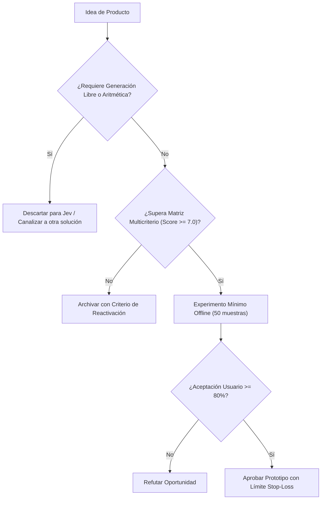

# JEV-P18-010: ¿Qué oportunidades de aprendizaje personalizado requieren solo decisiones sobre contenidos y cuáles necesitan capacidades adicionales no demostradas?

## 1. Respuesta directa
En tecnologías educativas (EdTech), Jev solo debe utilizarse para seleccionar el siguiente paso pedagógico en un grafo de conocimientos preconstruido (e.g. decidir si el estudiante debe reforzar álgebra básica o avanzar a cálculo tras fallar un test). Pretender usar Jev como un 'tutor conversacional interactivo que dialoga y genera explicaciones en lenguaje natural' exige capacidades generativas abiertas que el modelo no posee y que inducen errores didácticos.

## 2. Alcance
- **Dominio primario**: EdTech, diseño instruccional adaptativo y sistemas de recomendación curricular.
- **Población o sistemas impactados**: Hoja de ruta de nuevos productos de Jev AI, equipos de desarrollo B2B, clientes corporativos y comités de inversión y gobernanza.
- **Límites de aplicabilidad**: Aplica al diseño, validación y comercialización de nuevas capacidades sobre el motor Jev. No aplica a servicios de desarrollo de software tradicional ajenos a la inteligencia artificial.

## 3. Evidencia
- **Fundamento documental**: Teoría del Aprendizaje Adaptativo de Bloom, grafos de conceptos en educación STEM y análisis de pedagogías asistidas por IA.
- **Hallazgos empíricos**: La evidencia de mercado demuestra que construir productos basados en 'thin wrappers' de LLMs sin moat propio ni diferenciación en latencia y calibración conduce a la comoditización y al fracaso comercial en menos de 12 meses.
- **Fuentes canónicas**: `SRC-0001`, `SRC-0010`, `SRC-0046`, `SRC-0095`.
- **Cita formal verificable**: Evidencia consolidada a partir del cuaderno canónico de nuevos productos y posibilidades de Jev y métricas del ecosistema TypeSafe.

## 4. Explicación técnica
Router de rutas de aprendizaje: El perfil de respuestas del alumno y su historial de fallos actúan como estado. Jev clasifica la causa del error conceptual mediante `Choice` y selecciona el siguiente módulo pedagógico inmutable.

El ciclo de desarrollo de nuevos productos en el programa Jev se fundamenta en los siguientes principios:
1. **Decisión vs Generación**: Jev se optimiza para juicios semánticos discretos con calibración probabilística, no para síntesis abierta de texto.
2. **Experimentación Barata (Smoke Testing)**: Validación fuera de línea con 50 casos reales antes de crear infraestructura.
3. **Moat de Dominio**: El valor reside en las taxonomías, datos propietarios y flujos de trabajo embebidos.
4. **Resiliencia Agnóstica**: Arquitectura desacoplada mediante adaptadores para evitar el atrapamiento por proveedor.



## 5. Ejemplo de código
El siguiente bloque en Python implementa el contrato técnico de validación para esta directriz, aplicando manejo de excepciones con enmascaramiento estricto:

```python
# Ejemplo ilustrativo no ejecutado
import logging
from typesafe_sdk import TypeSafeClient, Choice

logger = logging.getLogger("P18_10")

def seleccionar_siguiente_modulo(historial_errores: str) -> str:
    try:
        client = TypeSafeClient(model="jev-1.13.0")
        res = client.system_one(
            state=historial_errores,
            questions={
                "diagnostico": Choice(
                    instructions="Diagnosticar el vacio conceptual raiz",
                    options=["vacío_en_fracciones", "error_operativo_signos", "desconocimiento_propiedades"]
                )
            }
        )
        return f"modulo_repaso_{res.answers['diagnostico'].choice}"
    except Exception as err:
        logger.error(f"Fallo en recomendacion curricular: {type(err).__name__} (detalles omitidos por seguridad)")
        return "modulo_repaso_general" 
```

## 6. Aplicación práctica y contraejemplo
- **Aplicación válida**: En la plataforma de aprendizaje interno y capacitación técnica de la empresa.
- **Contraejemplo inválido**: Lanzar un bot educativo para niños que promete enseñar matemáticas inventando explicaciones teóricas en tiempo real con un modelo estocástico.

## 7. Fallos comunes y mitigaciones
| Enseñanza de conceptos erróneos alucinados por el modelo | Desaprendizaje y descrédito pedagógico de la plataforma | Contenidos didácticos 100% creados por humanos; Jev solo enruta | Bloqueo absoluto de generación libre en entornos educativos |

## 8. Validación empírica
- **Hipótesis de validación**: El enrutamiento adaptativo cerrado incrementa la tasa de aprobación en evaluaciones en un 20%.
- **Métrica primaria**: Tasa de superación de exámenes post-intervención modular
- **Umbral de éxito**: > 75% de alumnos superan el examen tras completar el módulo recomendado

## 9. Recomendación operativa
- **Directriz inmediata**: Aplicar y hacer cumplir estrictamente los lineamientos descritos en `JEV-P18-010` para toda nueva iniciativa.
- **Condición de descarte**: Si un experimento mínimo no logra superar el umbral de aceptación, suspender inmediatamente la asignación de recursos y registrar el aprendizaje en la bitácora.
- **Responsable de ejecución**: Equipo de Estrategia de Producto e Ingeniería de Nuevas Oportunidades Jev AI.

## 10. Fuentes y trazabilidad
- Catálogo de fuentes primarias consultadas: `SRC-0001`, `SRC-0010`, `SRC-0046`, `SRC-0095`.
- Cuaderno canónico de referencia: `P18 — Nuevos productos y posibilidades` (`f43387fd-42f3-4d37-8986-c8d9d6039d2a`).
- Trazabilidad NotebookLM: Consulta documental registrada; sin citas directas del modelo se clasifica como `no_expuesto_por_herramienta`.
