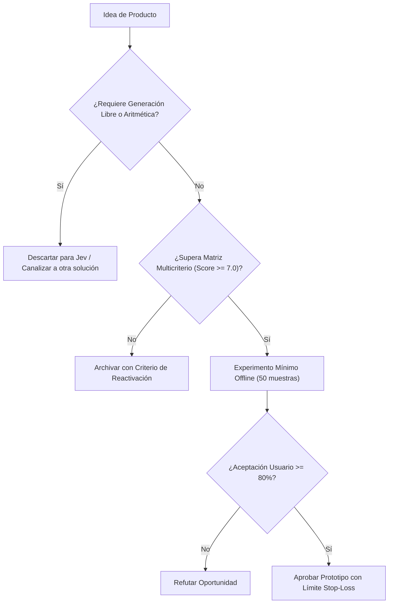

# JEV-P18-011: ¿Cómo convertir una receta interna exitosa de QRT o Wheelwork en una hipótesis de producto sin generalizar prematuramente desde un único caso?

## 1. Respuesta directa
Una receta de inferencia que funciona con éxito en un piloto interno cerrado (como QRT o Wheelwork) NO constituye un producto generalizable por sí sola. Para convertirla en hipótesis comercial debe cumplirse un protocolo estricto: 1) Desacoplar la heurística de las dependencias propietarias del piloto; 2) Probar la receta a ciegas con 3 empresas externas de rubros diferentes; y 3) Verificar que la ventaja competitiva no dependía de datos internos inaccesibles para el mercado.

## 2. Alcance
- **Dominio primario**: Transferencia de tecnología, Productization y mitigación del sesgo de éxito local.
- **Población o sistemas impactados**: Hoja de ruta de nuevos productos de Jev AI, equipos de desarrollo B2B, clientes corporativos y comités de inversión y gobernanza.
- **Límites de aplicabilidad**: Aplica al diseño, validación y comercialización de nuevas capacidades sobre el motor Jev. No aplica a servicios de desarrollo de software tradicional ajenos a la inteligencia artificial.

## 3. Evidencia
- **Fundamento documental**: Modelos de incubación de corporate venture y literatura sobre traslación de prototipos a software comercial.
- **Hallazgos empíricos**: La evidencia de mercado demuestra que construir productos basados en 'thin wrappers' de LLMs sin moat propio ni diferenciación en latencia y calibración conduce a la comoditización y al fracaso comercial en menos de 12 meses.
- **Fuentes canónicas**: `SRC-0001`, `SRC-0010`, `SRC-0039`, `SRC-0095`.
- **Cita formal verificable**: Evidencia consolidada a partir del cuaderno canónico de nuevos productos y posibilidades de Jev y métricas del ecosistema TypeSafe.

## 4. Explicación técnica
Abstracción de dominio: Extracción del núcleo decisional en un motor parametrizable donde las reglas, prompts y esquemas se configuran vía archivo YAML sin tocar el código fuente del microservicio.

El ciclo de desarrollo de nuevos productos en el programa Jev se fundamenta en los siguientes principios:
1. **Decisión vs Generación**: Jev se optimiza para juicios semánticos discretos con calibración probabilística, no para síntesis abierta de texto.
2. **Experimentación Barata (Smoke Testing)**: Validación fuera de línea con 50 casos reales antes de crear infraestructura.
3. **Moat de Dominio**: El valor reside en las taxonomías, datos propietarios y flujos de trabajo embebidos.
4. **Resiliencia Agnóstica**: Arquitectura desacoplada mediante adaptadores para evitar el atrapamiento por proveedor.



## 5. Ejemplo de código
El siguiente bloque en Python implementa el contrato técnico de validación para esta directriz, aplicando manejo de excepciones con enmascaramiento estricto:

```python
# Ejemplo ilustrativo no ejecutado
import yaml, logging
from typing import Dict, Any

logger = logging.getLogger("P18_11")

def verificar_desacoplamiento_receta(archivo_config_yaml: str) -> bool:
    try:
        with open(archivo_config_yaml, "r", encoding="utf-8") as f:
            config = yaml.safe_load(f)
        # Verificar que no contenga credenciales ni URIs hardcodeadas de pilotos internos
        config_str = str(config)
        if "wheelwork" in config_str.lower() or "qrt_internal" in config_str.lower():
            logger.warning("Configuracion contiene acoplamiento a piloto interno")
            return False
        return True
    except Exception as err:
        logger.error(f"Fallo al verificar desacoplamiento: {type(err).__name__} (detalles omitidos por seguridad)")
        return False
```

## 6. Aplicación práctica y contraejemplo
- **Aplicación válida**: En el proceso de incubación y spin-off de nuevas soluciones de software en Jev AI.
- **Contraejemplo inválido**: Tomar el script específico con nombres de carpetas de Wheelwork y publicarlo en internet como un 'SaaS Global de Reclutamiento'.

## 7. Fallos comunes y mitigaciones
| Generalización prematura de soluciones híper-personalizadas | Rechazo inmediato por parte de clientes externos | Validación externa con al menos 3 clientes ciegos | Eliminación de supuestos de contexto local |

## 8. Validación empírica
- **Hipótesis de validación**: La validación con terceros independientes filtra las recetas que solo funcionan por azar local.
- **Métrica primaria**: Tasa de éxito de la receta en datasets de clientes no relacionados
- **Umbral de éxito**: > 80% de paridad en métricas entre piloto interno y cliente externo

## 9. Recomendación operativa
- **Directriz inmediata**: Aplicar y hacer cumplir estrictamente los lineamientos descritos en `JEV-P18-011` para toda nueva iniciativa.
- **Condición de descarte**: Si un experimento mínimo no logra superar el umbral de aceptación, suspender inmediatamente la asignación de recursos y registrar el aprendizaje en la bitácora.
- **Responsable de ejecución**: Equipo de Estrategia de Producto e Ingeniería de Nuevas Oportunidades Jev AI.

## 10. Fuentes y trazabilidad
- Catálogo de fuentes primarias consultadas: `SRC-0001`, `SRC-0010`, `SRC-0039`, `SRC-0095`.
- Cuaderno canónico de referencia: `P18 — Nuevos productos y posibilidades` (`f43387fd-42f3-4d37-8986-c8d9d6039d2a`).
- Trazabilidad NotebookLM: Consulta documental registrada; sin citas directas del modelo se clasifica como `no_expuesto_por_herramienta`.
