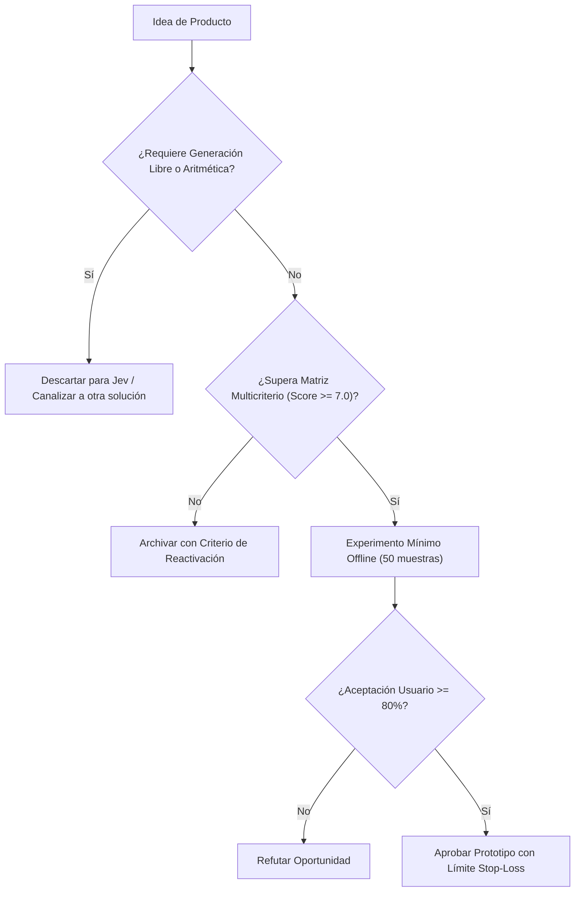

# JEV-P18-019: ¿Qué cartera de experimentos combina mejoras inmediatas, exploración de mayor incertidumbre y límites explícitos de inversión?

## 1. Respuesta directa
El presupuesto de desarrollo e investigación se distribuye bajo una regla estricta de asignación de capital: 1) 70% a mejoras incrementales directas en los pilotos existentes (QRT, Wheelwork); 2) 20% a expansión y nuevos conectores de alta certeza; y 3) 10% a exploración de frontera de alto riesgo e incertidumbre. Toda iniciativa de exploración cuenta con un límite presupuestario 'Stop-Loss' de 40 horas de ingeniería y $1,000 USD de inferencia: si no arroja resultados positivos al alcanzar el límite, se apaga de forma definitiva.

## 2. Alcance
- **Dominio primario**: Portfolio Management, asignación de recursos de I+D y disciplina presupuestaria.
- **Población o sistemas impactados**: Hoja de ruta de nuevos productos de Jev AI, equipos de desarrollo B2B, clientes corporativos y comités de inversión y gobernanza.
- **Límites de aplicabilidad**: Aplica al diseño, validación y comercialización de nuevas capacidades sobre el motor Jev. No aplica a servicios de desarrollo de software tradicional ajenos a la inteligencia artificial.

## 3. Evidencia
- **Fundamento documental**: Modelo de Tres Horizontes de McKinsey, regla de innovación 70/20/10 de Google y gestión de riesgos financieros.
- **Hallazgos empíricos**: La evidencia de mercado demuestra que construir productos basados en 'thin wrappers' de LLMs sin moat propio ni diferenciación en latencia y calibración conduce a la comoditización y al fracaso comercial en menos de 12 meses.
- **Fuentes canónicas**: `SRC-0001`, `SRC-0010`, `SRC-0039`, `SRC-0095`.
- **Cita formal verificable**: Evidencia consolidada a partir del cuaderno canónico de nuevos productos y posibilidades de Jev y métricas del ecosistema TypeSafe.

## 4. Explicación técnica
Monitor de consumo de recursos con Stop-Loss: Sistema de telemetría de desarrollo que audita los logs de tiempo en Jira y facturación en la nube. Al superar el 90% del límite asignado a un experimento, dispara una alerta; al llegar al 100%, suspende automáticamente las claves de API del proyecto.

El ciclo de desarrollo de nuevos productos en el programa Jev se fundamenta en los siguientes principios:
1. **Decisión vs Generación**: Jev se optimiza para juicios semánticos discretos con calibración probabilística, no para síntesis abierta de texto.
2. **Experimentación Barata (Smoke Testing)**: Validación fuera de línea con 50 casos reales antes de crear infraestructura.
3. **Moat de Dominio**: El valor reside en las taxonomías, datos propietarios y flujos de trabajo embebidos.
4. **Resiliencia Agnóstica**: Arquitectura desacoplada mediante adaptadores para evitar el atrapamiento por proveedor.



## 5. Ejemplo de código
El siguiente bloque en Python implementa el contrato técnico de validación para esta directriz, aplicando manejo de excepciones con enmascaramiento estricto:

```python
# Ejemplo ilustrativo no ejecutado
import logging

logger = logging.getLogger("P18_19")

def auditar_limite_stop_loss(horas_consumidas: float, costo_computo_usd: float, limite_horas: float = 40.0, limite_usd: float = 1000.0) -> bool:
    try:
        if horas_consumidas >= limite_horas or costo_computo_usd >= limite_usd:
            logger.critical("LIMITE STOP-LOSS ALCANZADO: El experimento debe finalizar o solicitar extension formal")
            return False
        return True
    except Exception as err:
        logger.error(f"Fallo en auditoria de Stop-Loss: {type(err).__name__} (detalles omitidos por seguridad)")
        return False
```

## 6. Aplicación práctica y contraejemplo
- **Aplicación válida**: En la gestión financiera de proyectos de innovación tecnológica.
- **Contraejemplo inválido**: Dejar que un ingeniero investigue una idea teórica durante 9 meses sin control presupuestario ni entregables tangibles, consumiendo el 40% del presupuesto de la empresa.

## 7. Fallos comunes y mitigaciones
| Proyectos eternos de investigación que consumen capital sin producir valor | Quiebra operativa de startups por descontrol de gastos | Distribución 70/20/10 con límites Stop-Loss rígidos | Revisión quincenal de consumo de recursos por proyecto |

## 8. Validación empírica
- **Hipótesis de validación**: La disciplina de Stop-Loss protege el capital de la empresa permitiendo la innovación controlada.
- **Métrica primaria**: Desviación presupuestaria en experimentos de exploración
- **Umbral de éxito**: 0.0% de proyectos de exploración superan su límite Stop-Loss sin aprobación expresa

## 9. Recomendación operativa
- **Directriz inmediata**: Aplicar y hacer cumplir estrictamente los lineamientos descritos en `JEV-P18-019` para toda nueva iniciativa.
- **Condición de descarte**: Si un experimento mínimo no logra superar el umbral de aceptación, suspender inmediatamente la asignación de recursos y registrar el aprendizaje en la bitácora.
- **Responsable de ejecución**: Equipo de Estrategia de Producto e Ingeniería de Nuevas Oportunidades Jev AI.

## 10. Fuentes y trazabilidad
- Catálogo de fuentes primarias consultadas: `SRC-0001`, `SRC-0010`, `SRC-0039`, `SRC-0095`.
- Cuaderno canónico de referencia: `P18 — Nuevos productos y posibilidades` (`f43387fd-42f3-4d37-8986-c8d9d6039d2a`).
- Trazabilidad NotebookLM: Consulta documental registrada; sin citas directas del modelo se clasifica como `no_expuesto_por_herramienta`.
