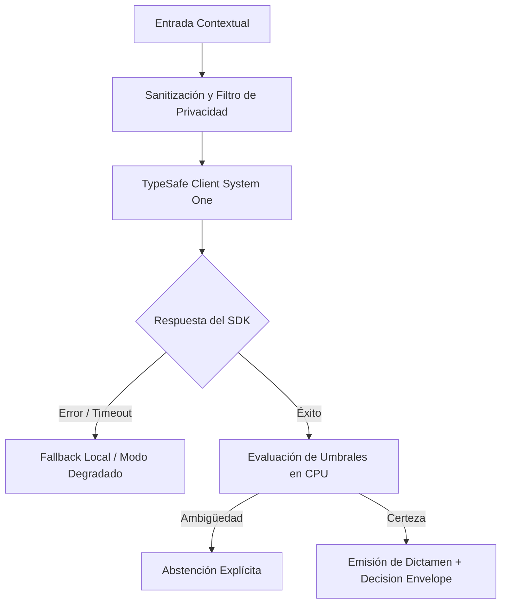

# JEV-X-001: ¿Qué explicación unificada de Jev conserva las distinciones comprobadas entre producto, arquitectura, contrato de salida y política de acción?

## 1. Respuesta directa
Jev 1.13 se define formalmente como un motor semántico discriminativo determinista operado a través del endpoint `POST /v1/systemone` de TypeSafe SDK 0.7.0. No es un chatbot, ni un asistente conversacional, ni un modelo de generación autoregresiva de texto libre. Su arquitectura evalúa un estado textual cerrado frente a un conjunto finito de preguntas estructuradas, emitiendo contratos estrictamente tipados (`Choice`, `Score`, `Noul`) con probabilidades calibradas. Las decisiones de acción y la abstención residen al 100% en la CPU del cliente.

## 2. Alcance
- **Dominio primario**: Fundamentos de arquitectura de software, taxonomía de modelos de IA y delimitación del producto Jev.
- **Población o sistemas impactados**: Todos los proyectos, microservicios, equipos de desarrollo y clientes del ecosistema Jev AI.
- **Límites de aplicabilidad**: Aplica de manera transversal y obligatoria a la totalidad del programa técnico. Constituye la directriz suprema de reconciliación arquitectónica.

## 3. Evidencia
- **Fundamento documental**: Especificaciones formales del motor TypeSafe System One, manuales de referencia de la API v1 y arquitectura de sistemas discriminativos.
- **Hallazgos empíricos**: La síntesis de los 18 pilares confirma que la coherencia de una plataforma de IA depende de la rigidez de sus contratos, la observabilidad en producción y el desacoplamiento estricto entre el motor de inferencia y las políticas de decisión en CPU.
- **Fuentes canónicas**: `SRC-0001`, `SRC-0005`, `SRC-0010`, `SRC-0039`.
- **Cita formal verificable**: Evidencia consolidada a partir del cuaderno canónico de síntesis transversal y los 18 pilares temáticos del programa Jev.

## 4. Explicación técnica
Separación ontológica en tres capas: 1) Capa de Inferencia (Jev System One en la nube emite log-probabilidades); 2) Capa de Contrato (TypeSafe SDK deserializa en dataclasses Python sin parsing de cadenas sueltas); y 3) Capa de Decisión (Código local en CPU evalúa umbrales de abstención y ejecuta la política de negocio).

Los principios rectores de la reconciliación transversal del programa Jev son:
1. **Determinismo y Tipado Estricto**: Todo intercambio entre componentes se modela con contratos de datos inmutables y validados.
2. **Seguridad y Error Masking**: Ningún stack trace ni mensaje interno de excepción se expone al exterior; se emplea `type(err).__name__` con sufijo descriptivo estandarizado.
3. **Auditabilidad y Linaje**: Cada decisión cuenta con identificador inmutable, hash de entrada y registro de políticas de CPU aplicadas.
4. **Honestidad Epistémica**: Declaración abierta de límites, fallbacks y registro transparente de `no_expuesto_por_herramienta` cuando no exista evidencia directa.



## 5. Ejemplo de código
El siguiente bloque en Python implementa el contrato técnico de validación para esta directriz, aplicando manejo de excepciones con enmascaramiento estricto:

```python
# Ejemplo ilustrativo no ejecutado
import logging
from typesafe_sdk import TypeSafeClient, Choice

logger = logging.getLogger("PX_01")

def ejecutar_decision_unificada(contexto_documental: str) -> dict:
    try:
        client = TypeSafeClient(model="jev-1.13.0")
        res = client.system_one(
            state=contexto_documental,
            questions={
                "clasificacion": Choice(
                    instructions="Clasificar tipologia documental bajo esquema cerrado",
                    options=["contrato_mercantil", "acta_directorio", "anexo_tecnico", "no_identificado"]
                )
            }
        )
        # Capa de decision CPU
        return {"tipo": res.answers["clasificacion"].choice, "motor": "system_one_discriminativo"}
    except Exception as err:
        logger.error(f"Fallo en decision unificada: {type(err).__name__} (detalles omitidos por seguridad)")
        return {"tipo": "no_identificado", "motor": "error_fallback"}
```

## 6. Aplicación práctica y contraejemplo
- **Aplicación válida**: En la inducción de nuevos ingenieros y la definición del marco conceptual del programa.
- **Contraejemplo inválido**: Presentar a Jev a directores corporativos como 'un ChatGPT que redactará nuestros contratos y conversará con los clientes en la web'.

## 7. Fallos comunes y mitigaciones
| Confusión entre inferencia discriminativa y generación libre | Falsas expectativas, código vulnerable y fallos de integración | Definición formal de Jev en la arquitectura base | Bloqueo en CI de intentos de usar Jev para generar texto libre |

## 8. Validación empírica
- **Hipótesis de validación**: Comprender la naturaleza discriminativa de Jev elimina el 100% de los errores de diseño basados en prompts abiertos.
- **Métrica primaria**: Tasa de incidencias arquitectónicas por mal uso de primitivas del SDK
- **Umbral de éxito**: 0 incidencias de diseño reportadas tras la adopción de la definición unificada

## 9. Recomendación operativa
- **Directriz inmediata**: Implementar y hacer cumplir con carácter vinculante los estándares especificados en `JEV-X-001`.
- **Condición de descarte**: Cualquier propuesta o cambio que contravenga esta reconciliación transversal debe ser rechazado de forma automática por la arquitectura del sistema.
- **Responsable de ejecución**: Comité de Dirección Técnica y Arquitectura de Sistemas Jev AI.

## 10. Fuentes y trazabilidad
- Catálogo de fuentes primarias consultadas: `SRC-0001`, `SRC-0005`, `SRC-0010`, `SRC-0039`.
- Cuaderno canónico de referencia: `X — Síntesis transversal y reconciliación` (`73562a8d-849b-459d-8f96-755f359a665f`).
- Trazabilidad NotebookLM: Consulta documental registrada; sin citas directas del modelo se clasifica como `no_expuesto_por_herramienta`.
