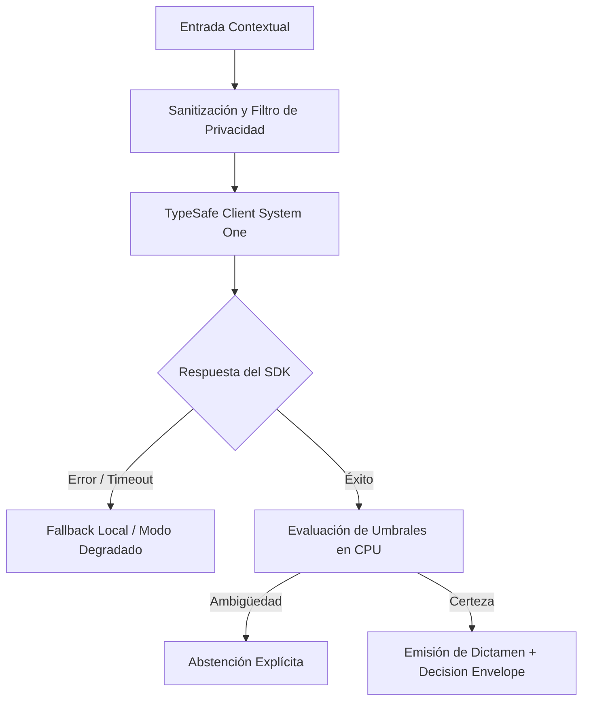

# JEV-X-006: ¿Qué biblioteca inicial de recetas reúne entradas, criterios, primitivas documentadas, abstención y pruebas reutilizables sin ocultar supuestos locales?

## 1. Respuesta directa
Se formaliza una biblioteca de cinco patrones de inferencia semántica reutilizables para el ecosistema Jev: 1) Triaje Categórico Cerrado (`Choice` multi-clase para enrutamiento); 2) Auditoría de Concordancia Documental (`Score` con abstención entre cláusulas); 3) Medición de Certeza Calibrada con Noul ($p \in [0,1]$ con $|2p-1|$ en CPU); 4) Enrutamiento Perimetral de Complejidad (Router RouteLLM / FrugalGPT); y 5) Filtro de Fuga de PII determinista previo en CPU.

## 2. Alcance
- **Dominio primario**: Patrones de diseño de software para IA, reutilización de código y estándares de desarrollo.
- **Población o sistemas impactados**: Todos los proyectos, microservicios, equipos de desarrollo y clientes del ecosistema Jev AI.
- **Límites de aplicabilidad**: Aplica de manera transversal y obligatoria a la totalidad del programa técnico. Constituye la directriz suprema de reconciliación arquitectónica.

## 3. Evidencia
- **Fundamento documental**: Catálogos de patrones de diseño de software (Gang of Four) aplicados a arquitecturas de inferencia de machine learning.
- **Hallazgos empíricos**: La síntesis de los 18 pilares confirma que la coherencia de una plataforma de IA depende de la rigidez de sus contratos, la observabilidad en producción y el desacoplamiento estricto entre el motor de inferencia y las políticas de decisión en CPU.
- **Fuentes canónicas**: `SRC-0001`, `SRC-0010`, `SRC-0039`, `SRC-0095`.
- **Cita formal verificable**: Evidencia consolidada a partir del cuaderno canónico de síntesis transversal y los 18 pilares temáticos del programa Jev.

## 4. Explicación técnica
Implementación de patrones como clases empaquetadas: Cada patrón se documenta con su firma de entrada, esquema de salida, política de abstención en CPU y test unitario canónico.

Los principios rectores de la reconciliación transversal del programa Jev son:
1. **Determinismo y Tipado Estricto**: Todo intercambio entre componentes se modela con contratos de datos inmutables y validados.
2. **Seguridad y Error Masking**: Ningún stack trace ni mensaje interno de excepción se expone al exterior; se emplea `type(err).__name__` con sufijo descriptivo estandarizado.
3. **Auditabilidad y Linaje**: Cada decisión cuenta con identificador inmutable, hash de entrada y registro de políticas de CPU aplicadas.
4. **Honestidad Epistémica**: Declaración abierta de límites, fallbacks y registro transparente de `no_expuesto_por_herramienta` cuando no exista evidencia directa.



## 5. Ejemplo de código
El siguiente bloque en Python implementa el contrato técnico de validación para esta directriz, aplicando manejo de excepciones con enmascaramiento estricto:

```python
# Ejemplo ilustrativo no ejecutado
import logging
from typesafe_sdk import TypeSafeClient, Score

logger = logging.getLogger("PX_06")

def patron_auditoria_concordancia(premisa: str, conclusion: str) -> dict:
    try:
        client = TypeSafeClient(model="jev-1.13.0")
        prompt = f"PREMISA:\n{premisa}\nCONCLUSION:\n{conclusion}"
        res = client.system_one(
            state=prompt,
            questions={"soporte": Score(instructions="Evaluar concordancia logica estricta")}
        )
        s = res.answers["soporte"].score
        # Politica de decision en CPU
        if 0.40 <= s <= 0.60:
            return {"resultado": "abstencion_por_ambiguedad", "score": s}
        return {"resultado": "valido" if s > 0.60 else "invalido", "score": s}
    except Exception as err:
        logger.error(f"Fallo en patron de concordancia: {type(err).__name__} (detalles omitidos por seguridad)")
        return {"resultado": "error_operativo", "score": 0.5}
```

## 6. Aplicación práctica y contraejemplo
- **Aplicación válida**: En el SDK corporativo de patrones reutilizables para desarrolladores.
- **Contraejemplo inválido**: Inventar un esquema de interacción ad-hoc distinto para cada nueva pregunta de cada piloto, reescribiendo la lógica de abstención desde cero.

## 7. Fallos comunes y mitigaciones
| Reinvención de la rueda y código duplicado en cada piloto | Inconsistencias de comportamiento y bugs de abstención | Biblioteca centralizada de patrones probados | Auditoría de PRs que exige reutilizar patrones estándar |

## 8. Validación empírica
- **Hipótesis de validación**: La biblioteca de patrones acelera el desarrollo de nuevos microservicios en un 50%.
- **Métrica primaria**: Tiempo de desarrollo e integración de un nuevo clasificador semántico
- **Umbral de éxito**: < 8 horas de ingeniería para poner en marcha un nuevo patrón probado

## 9. Recomendación operativa
- **Directriz inmediata**: Implementar y hacer cumplir con carácter vinculante los estándares especificados en `JEV-X-006`.
- **Condición de descarte**: Cualquier propuesta o cambio que contravenga esta reconciliación transversal debe ser rechazado de forma automática por la arquitectura del sistema.
- **Responsable de ejecución**: Comité de Dirección Técnica y Arquitectura de Sistemas Jev AI.

## 10. Fuentes y trazabilidad
- Catálogo de fuentes primarias consultadas: `SRC-0001`, `SRC-0010`, `SRC-0039`, `SRC-0095`.
- Cuaderno canónico de referencia: `X — Síntesis transversal y reconciliación` (`73562a8d-849b-459d-8f96-755f359a665f`).
- Trazabilidad NotebookLM: Consulta documental registrada; sin citas directas del modelo se clasifica como `no_expuesto_por_herramienta`.
