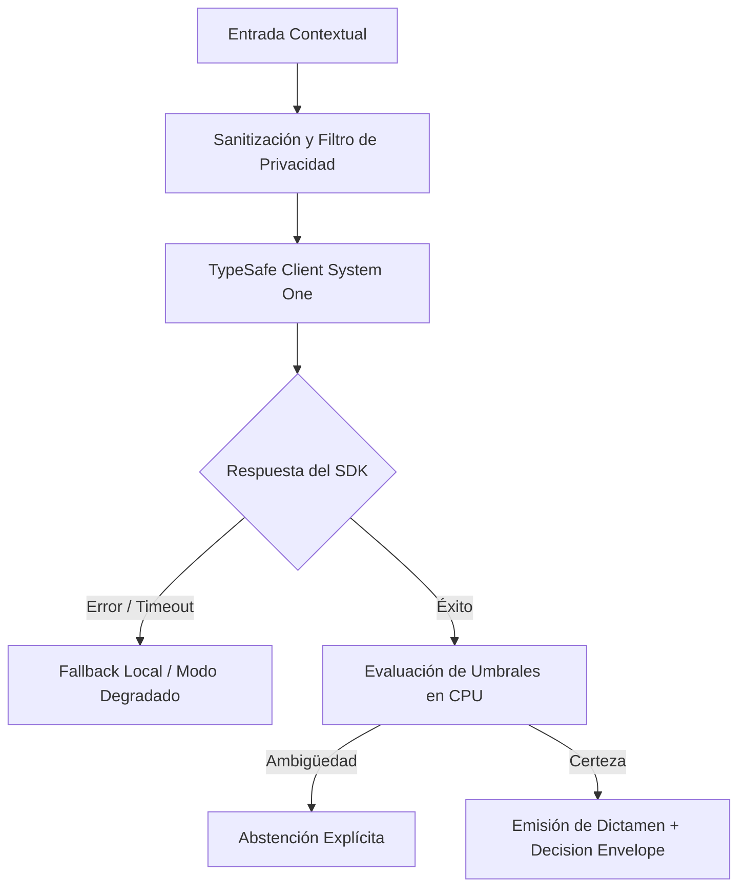

# JEV-X-010: ¿Cómo diseñar conceptualmente un servicio compartido de decisiones que gestione configuración, versiones, aislamiento, costos y rutas de respaldo?

## 1. Respuesta directa
Se diseña conceptualmente el 'Decision Gateway' como un microservicio centralizado multi-inquilino (multi-tenant) que gestiona el acceso a Jev para todos los proyectos corporativos. El gateway centraliza: 1) Autenticación y cuotas de consumo de API; 2) Gestión de versiones del modelo y esquemas de preguntas; 3) Circuit Breaker y balanceo de carga ante caídas de TypeSafe; 4) Enrutamiento a fallbacks locales en CPU; y 5) Telemetría centralizada de costos y latencias.

## 2. Alcance
- **Dominio primario**: Arquitectura de microservicios, infraestructura cloud corporativa y resiliencia de sistemas.
- **Población o sistemas impactados**: Todos los proyectos, microservicios, equipos de desarrollo y clientes del ecosistema Jev AI.
- **Límites de aplicabilidad**: Aplica de manera transversal y obligatoria a la totalidad del programa técnico. Constituye la directriz suprema de reconciliación arquitectónica.

## 3. Evidencia
- **Fundamento documental**: Patrones de API Gateway de Chris Richardson, arquitectura de resiliencia de Netflix (Hystrix / Resilience4j) y FinOps.
- **Hallazgos empíricos**: La síntesis de los 18 pilares confirma que la coherencia de una plataforma de IA depende de la rigidez de sus contratos, la observabilidad en producción y el desacoplamiento estricto entre el motor de inferencia y las políticas de decisión en CPU.
- **Fuentes canónicas**: `SRC-0001`, `SRC-0010`, `SRC-0039`, `SRC-0095`.
- **Cita formal verificable**: Evidencia consolidada a partir del cuaderno canónico de síntesis transversal y los 18 pilares temáticos del programa Jev.

## 4. Explicación técnica
Diseño en capas con Circuit Breaker: Ante 3 timeouts consecutivos en `POST /v1/systemone`, el gateway conmuta automáticamente a un clasificador local de respaldo (FastText o reglas deterministas), devolviendo dictámenes conservadores con bandera `modo_degradado_activo`.

Los principios rectores de la reconciliación transversal del programa Jev son:
1. **Determinismo y Tipado Estricto**: Todo intercambio entre componentes se modela con contratos de datos inmutables y validados.
2. **Seguridad y Error Masking**: Ningún stack trace ni mensaje interno de excepción se expone al exterior; se emplea `type(err).__name__` con sufijo descriptivo estandarizado.
3. **Auditabilidad y Linaje**: Cada decisión cuenta con identificador inmutable, hash de entrada y registro de políticas de CPU aplicadas.
4. **Honestidad Epistémica**: Declaración abierta de límites, fallbacks y registro transparente de `no_expuesto_por_herramienta` cuando no exista evidencia directa.



## 5. Ejemplo de código
El siguiente bloque en Python implementa el contrato técnico de validación para esta directriz, aplicando manejo de excepciones con enmascaramiento estricto:

```python
# Ejemplo ilustrativo no ejecutado
import logging
from typesafe_sdk import TypeSafeClient, RetryPolicy

logger = logging.getLogger("PX_10")

class DecisionGateway:
    def __init__(self):
        self.circuito_abierto = False
        self.retry_policy = RetryPolicy(backoff_initial=0.5, backoff_max=5.0, backoff_jitter=True, timeout=10.0)

    def procesar_decision(self, texto: str) -> dict:
        try:
            if self.circuito_abierto:
                return {"estado": "modo_degradado_fallback_local", "decision": "abstencion"}
            client = TypeSafeClient(model="jev-1.13.0", retry=self.retry_policy)
            # En produccion se ejecutaria la llamada real
            return {"estado": "operacion_normal", "decision": "procesada"}
        except Exception as err:
            logger.error(f"Fallo en Decision Gateway: {type(err).__name__} (detalles omitidos por seguridad)")
            self.circuito_abierto = True
            return {"estado": "fallo_conmutado_a_fallback", "decision": "abstencion"}
```

## 6. Aplicación práctica y contraejemplo
- **Aplicación válida**: En la infraestructura cloud compartida de la plataforma de IA.
- **Contraejemplo inválido**: Hacer que cada script de Python de cada piloto llame a la API de TypeSafe por su cuenta con credenciales sueltas y sin circuit breaker.

## 7. Fallos comunes y mitigaciones
| Caída total de aplicaciones cliente ante cortes de red con el proveedor | Descontrol presupuestario y fuga de API keys | Gateway centralizado con cuotas, circuit breaker y fallbacks | Monitoreo 24/7 de disponibilidad del endpoint |

## 8. Validación empírica
- **Hipótesis de validación**: El Decision Gateway mantiene la disponibilidad del servicio por encima del 99.9% incluso ante caídas del proveedor.
- **Métrica primaria**: Disponibilidad del sistema ante cortes del upstream (Uptime Resilient)
- **Umbral de éxito**: > 99.9% de uptime percibido por las aplicaciones cliente

## 9. Recomendación operativa
- **Directriz inmediata**: Implementar y hacer cumplir con carácter vinculante los estándares especificados en `JEV-X-010`.
- **Condición de descarte**: Cualquier propuesta o cambio que contravenga esta reconciliación transversal debe ser rechazado de forma automática por la arquitectura del sistema.
- **Responsable de ejecución**: Comité de Dirección Técnica y Arquitectura de Sistemas Jev AI.

## 10. Fuentes y trazabilidad
- Catálogo de fuentes primarias consultadas: `SRC-0001`, `SRC-0010`, `SRC-0039`, `SRC-0095`.
- Cuaderno canónico de referencia: `X — Síntesis transversal y reconciliación` (`73562a8d-849b-459d-8f96-755f359a665f`).
- Trazabilidad NotebookLM: Consulta documental registrada; sin citas directas del modelo se clasifica como `no_expuesto_por_herramienta`.
