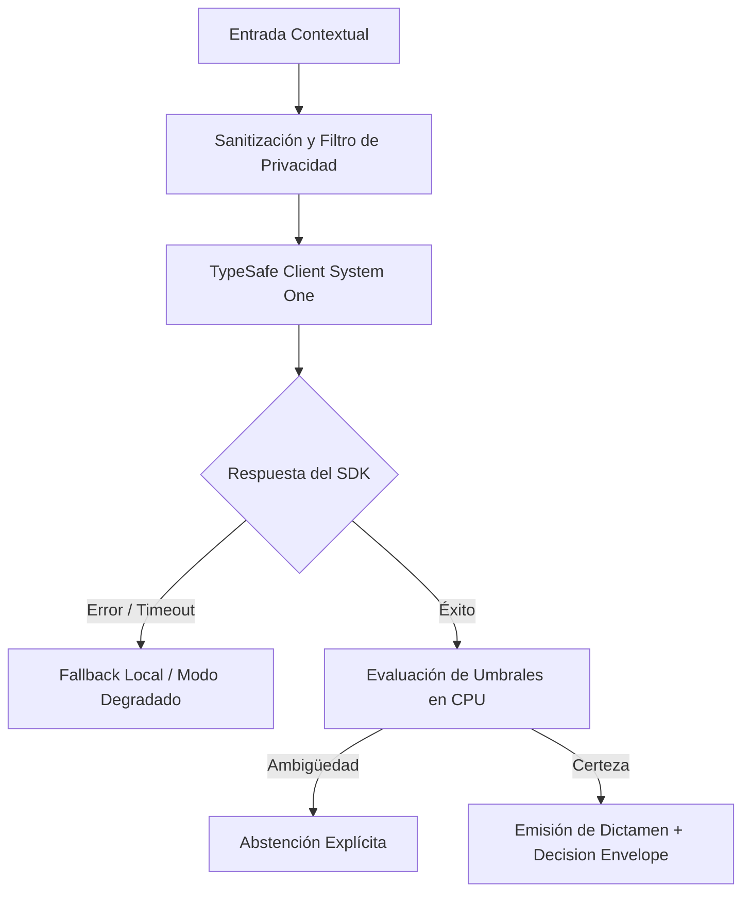

# JEV-X-014: ¿Qué plan por etapas, con criterios de avance y abandono, llevaría esos pilotos desde datos sintéticos hasta una evaluación real autorizada?

## 1. Respuesta directa
El avance de los pilotos se estructura en cuatro fases estrictamente secuenciales con compuertas de paso formalizadas (Phase Gateways): 1) Fase 0 (Evaluación teórica y contratos con datos sintéticos); 2) Fase 1 (Laboratorio ciego con datos históricos anonimizados, $N \ge 200$); 3) Fase 2 (Shadow Deployment en paralelo, evaluando sin tomar acción en producción); y 4) Fase 3 (Despliegue supervisado con humanos en el bucle). Queda prohibido saltar fases sin un informe de auditoría aprobado.

## 2. Alcance
- **Dominio primario**: Metodología de despliegue de software de IA, mitigación de riesgos de producción y ciclo de vida de pilotos.
- **Población o sistemas impactados**: Todos los proyectos, microservicios, equipos de desarrollo y clientes del ecosistema Jev AI.
- **Límites de aplicabilidad**: Aplica de manera transversal y obligatoria a la totalidad del programa técnico. Constituye la directriz suprema de reconciliación arquitectónica.

## 3. Evidencia
- **Fundamento documental**: Buenas prácticas de despliegue en sistemas críticos (NASA Technology Readiness Levels - TRL, marcos de Phase-Gate de Cooper).
- **Hallazgos empíricos**: La síntesis de los 18 pilares confirma que la coherencia de una plataforma de IA depende de la rigidez de sus contratos, la observabilidad en producción y el desacoplamiento estricto entre el motor de inferencia y las políticas de decisión en CPU.
- **Fuentes canónicas**: `SRC-0001`, `SRC-0005`, `SRC-0010`, `SRC-0095`.
- **Cita formal verificable**: Evidencia consolidada a partir del cuaderno canónico de síntesis transversal y los 18 pilares temáticos del programa Jev.

## 4. Explicación técnica
Protocolo de compuerta determinista: Para avanzar de Fase 2 a Fase 3, el sistema debe registrar en modo shadow un acuerdo humano-máquina superior al 85% y cero fallos de seguridad durante al menos 14 días continuos de operación.

Los principios rectores de la reconciliación transversal del programa Jev son:
1. **Determinismo y Tipado Estricto**: Todo intercambio entre componentes se modela con contratos de datos inmutables y validados.
2. **Seguridad y Error Masking**: Ningún stack trace ni mensaje interno de excepción se expone al exterior; se emplea `type(err).__name__` con sufijo descriptivo estandarizado.
3. **Auditabilidad y Linaje**: Cada decisión cuenta con identificador inmutable, hash de entrada y registro de políticas de CPU aplicadas.
4. **Honestidad Epistémica**: Declaración abierta de límites, fallbacks y registro transparente de `no_expuesto_por_herramienta` cuando no exista evidencia directa.



## 5. Ejemplo de código
El siguiente bloque en Python implementa el contrato técnico de validación para esta directriz, aplicando manejo de excepciones con enmascaramiento estricto:

```python
# Ejemplo ilustrativo no ejecutado
import logging

logger = logging.getLogger("PX_14")

def evaluar_compuerta_fase_2_a_3(acuerdo_humano: float, dias_sin_incidentes: int) -> bool:
    try:
        cumple_acuerdo = acuerdo_humano >= 0.85
        cumple_estabilidad = dias_sin_incidentes >= 14
        return cumple_acuerdo and cumple_estabilidad
    except Exception as err:
        logger.error(f"Fallo al evaluar compuerta de paso: {type(err).__name__} (detalles omitidos por seguridad)")
        return False
```

## 6. Aplicación práctica y contraejemplo
- **Aplicación válida**: En el comité de control de cambios (CAB) de la infraestructura de Jev AI.
- **Contraejemplo inválido**: Conectar un script experimental directamente a los servidores de producción de un cliente tras probarlo una tarde con tres ejemplos.

## 7. Fallos comunes y mitigaciones
| Lanzamientos precipitados a producción sin fase shadow previa | Errores no detectados que impactan directamente al cliente | Avance estricto condicionado al cumplimiento de compuertas | Auditoría documental obligatoria para cada transición |

## 8. Validación empírica
- **Hipótesis de validación**: El modelo de cuatro fases con compuertas reduce a cero los incidentes de interrupción de servicio en clientes.
- **Métrica primaria**: Tasa de incidentes críticos post-lanzamiento en Fase 3
- **Umbral de éxito**: 0 incidentes de parada no programada o fallo grave en producción

## 9. Recomendación operativa
- **Directriz inmediata**: Implementar y hacer cumplir con carácter vinculante los estándares especificados en `JEV-X-014`.
- **Condición de descarte**: Cualquier propuesta o cambio que contravenga esta reconciliación transversal debe ser rechazado de forma automática por la arquitectura del sistema.
- **Responsable de ejecución**: Comité de Dirección Técnica y Arquitectura de Sistemas Jev AI.

## 10. Fuentes y trazabilidad
- Catálogo de fuentes primarias consultadas: `SRC-0001`, `SRC-0005`, `SRC-0010`, `SRC-0095`.
- Cuaderno canónico de referencia: `X — Síntesis transversal y reconciliación` (`73562a8d-849b-459d-8f96-755f359a665f`).
- Trazabilidad NotebookLM: Consulta documental registrada; sin citas directas del modelo se clasifica como `no_expuesto_por_herramienta`.
