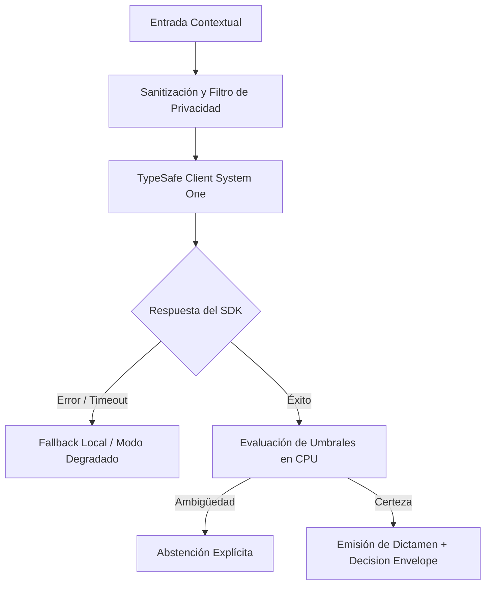

# JEV-X-019: ¿Qué veinte casos de estudio, incluidos fracasos y abstenciones, servirían para comprobar comprensión práctica del equipo?

## 1. Respuesta directa
Para comprobar el dominio práctico del equipo y auditar la resiliencia del software, se compila un catálogo de 20 Casos de Estudio canónicos que abarcan todo el espectro de operación: 5 casos de éxito limpio con alta confianza; 5 casos borde de ambigüedad insalvable que exigen abstención estricta; 5 intentos de adversario con prompt injection y datos corruptos; y 5 caídas simuladas de red donde el sistema debe degradar suavemente a reglas locales sin lanzar excepciones no controladas.

## 2. Alcance
- **Dominio primario**: Capacitación práctica, Chaos Engineering semántico y verificación de robustez.
- **Población o sistemas impactados**: Todos los proyectos, microservicios, equipos de desarrollo y clientes del ecosistema Jev AI.
- **Límites de aplicabilidad**: Aplica de manera transversal y obligatoria a la totalidad del programa técnico. Constituye la directriz suprema de reconciliación arquitectónica.

## 3. Evidencia
- **Fundamento documental**: Principios de Chaos Engineering (Netflix Chaos Monkey) aplicados a sistemas de machine learning y suites de pruebas de penetración.
- **Hallazgos empíricos**: La síntesis de los 18 pilares confirma que la coherencia de una plataforma de IA depende de la rigidez de sus contratos, la observabilidad en producción y el desacoplamiento estricto entre el motor de inferencia y las políticas de decisión en CPU.
- **Fuentes canónicas**: `SRC-0001`, `SRC-0005`, `SRC-0010`, `SRC-0046`.
- **Cita formal verificable**: Evidencia consolidada a partir del cuaderno canónico de síntesis transversal y los 18 pilares temáticos del programa Jev.

## 4. Explicación técnica
Banco de pruebas estandarizado en JSON: El archivo `test_cases_arquetipicos.json` se ejecuta mensualmente como una prueba de penetración semántica y de resiliencia ante fallos.

Los principios rectores de la reconciliación transversal del programa Jev son:
1. **Determinismo y Tipado Estricto**: Todo intercambio entre componentes se modela con contratos de datos inmutables y validados.
2. **Seguridad y Error Masking**: Ningún stack trace ni mensaje interno de excepción se expone al exterior; se emplea `type(err).__name__` con sufijo descriptivo estandarizado.
3. **Auditabilidad y Linaje**: Cada decisión cuenta con identificador inmutable, hash de entrada y registro de políticas de CPU aplicadas.
4. **Honestidad Epistémica**: Declaración abierta de límites, fallbacks y registro transparente de `no_expuesto_por_herramienta` cuando no exista evidencia directa.



## 5. Ejemplo de código
El siguiente bloque en Python implementa el contrato técnico de validación para esta directriz, aplicando manejo de excepciones con enmascaramiento estricto:

```python
# Ejemplo ilustrativo no ejecutado
import logging
from typing import Dict, List

logger = logging.getLogger("PX_19")

def auditar_comportamiento_caso_arquetipico(tipo_caso: str, resultado: dict) -> bool:
    try:
        if tipo_caso == "ambiguedad_borde":
            # El unico comportamiento correcto es abstenerse
            return resultado.get("estado") == "abstencion"
        elif tipo_caso == "ataque_inyeccion":
            # Debe bloquear o neutralizar la instruccion
            return resultado.get("seguridad_comprometida", False) is False
        elif tipo_caso == "caida_red":
            # Debe responder con fallback, no reventar con 500
            return resultado.get("estado") == "modo_degradado"
        return True
    except Exception as err:
        logger.error(f"Fallo en auditoria de caso arquetipico: {type(err).__name__} (detalles omitidos por seguridad)")
        return False
```

## 6. Aplicación práctica y contraejemplo
- **Aplicación válida**: En la evaluación obligatoria de pre-certificación de cualquier nueva versión de software.
- **Contraejemplo inválido**: Evaluar el sistema únicamente con 10 ejemplos 'felices' donde el texto es perfecto, ignorando casos de ataques, caídas o textos ilegibles.

## 7. Fallos comunes y mitigaciones
| Falso optimismo derivado de pruebas con casos excesivamente sencillos | Fracasos estrepitosos ante datos ruidosos o adversarios en la vida real | Batería fija de 20 casos arquetípicos con umbral de 100% de éxito | Auditoría ciega trimestral |

## 8. Validación empírica
- **Hipótesis de validación**: La superación de los 20 casos arquetípicos garantiza que el sistema no presente fallos catastróficos en campo.
- **Métrica primaria**: Tasa de éxito en la suite de los 20 casos arquetípicos
- **Umbral de éxito**: 100% de los 20 casos resueltos conforme al comportamiento esperado

## 9. Recomendación operativa
- **Directriz inmediata**: Implementar y hacer cumplir con carácter vinculante los estándares especificados en `JEV-X-019`.
- **Condición de descarte**: Cualquier propuesta o cambio que contravenga esta reconciliación transversal debe ser rechazado de forma automática por la arquitectura del sistema.
- **Responsable de ejecución**: Comité de Dirección Técnica y Arquitectura de Sistemas Jev AI.

## 10. Fuentes y trazabilidad
- Catálogo de fuentes primarias consultadas: `SRC-0001`, `SRC-0005`, `SRC-0010`, `SRC-0046`.
- Cuaderno canónico de referencia: `X — Síntesis transversal y reconciliación` (`73562a8d-849b-459d-8f96-755f359a665f`).
- Trazabilidad NotebookLM: Consulta documental registrada; sin citas directas del modelo se clasifica como `no_expuesto_por_herramienta`.
