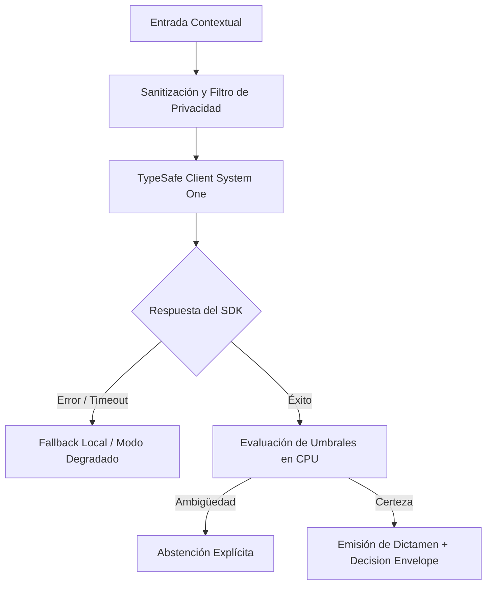

# JEV-X-021: ¿Qué capacidades futuras cambiarían materialmente nuestra arquitectura y qué señales observables indicarían que merece reevaluarse?

## 1. Respuesta directa
Se establecen tres señales observables en el ecosistema tecnológico que justificarían una reevaluación integral de la arquitectura actual de Jev: 1) La disponibilidad de modelos de lenguaje compactos de $\le 1B$ parámetros con calibración probabilística nativa que puedan ejecutarse en CPU local a $> 100$ req/s con costo marginal cero; 2) La estandarización de primitivas semánticas por parte del W3C o IETF en navegadores y servidores; o 3) La aceleración por hardware neuromórfico a nivel de chip.

## 2. Alcance
- **Dominio primario**: Prospectiva tecnológica, evolución de arquitecturas de software y estrategia a largo plazo.
- **Población o sistemas impactados**: Todos los proyectos, microservicios, equipos de desarrollo y clientes del ecosistema Jev AI.
- **Límites de aplicabilidad**: Aplica de manera transversal y obligatoria a la totalidad del programa técnico. Constituye la directriz suprema de reconciliación arquitectónica.

## 3. Evidencia
- **Fundamento documental**: Tendencias en Small Language Models (SLMs: Phi, Gemma, Llama-3.2-1B), avances en hardware especializado y estandarización de APIs.
- **Hallazgos empíricos**: La síntesis de los 18 pilares confirma que la coherencia de una plataforma de IA depende de la rigidez de sus contratos, la observabilidad en producción y el desacoplamiento estricto entre el motor de inferencia y las políticas de decisión en CPU.
- **Fuentes canónicas**: `SRC-0001`, `SRC-0010`, `SRC-0039`, `SRC-0095`.
- **Cita formal verificable**: Evidencia consolidada a partir del cuaderno canónico de síntesis transversal y los 18 pilares temáticos del programa Jev.

## 4. Explicación técnica
Vigilancia tecnológica continua: Monitoreo trimestral de benchmarks de modelos compactos de código abierto frente a las métricas de TypeSafe System One para evaluar la conveniencia de una migración hacia despliegues 100% locales.

Los principios rectores de la reconciliación transversal del programa Jev son:
1. **Determinismo y Tipado Estricto**: Todo intercambio entre componentes se modela con contratos de datos inmutables y validados.
2. **Seguridad y Error Masking**: Ningún stack trace ni mensaje interno de excepción se expone al exterior; se emplea `type(err).__name__` con sufijo descriptivo estandarizado.
3. **Auditabilidad y Linaje**: Cada decisión cuenta con identificador inmutable, hash de entrada y registro de políticas de CPU aplicadas.
4. **Honestidad Epistémica**: Declaración abierta de límites, fallbacks y registro transparente de `no_expuesto_por_herramienta` cuando no exista evidencia directa.



## 5. Ejemplo de código
El siguiente bloque en Python implementa el contrato técnico de validación para esta directriz, aplicando manejo de excepciones con enmascaramiento estricto:

```python
# Ejemplo ilustrativo no ejecutado
import logging

logger = logging.getLogger("PX_21")

def evaluar_disparador_migracion_local(latencia_slm_ms: float, costo_por_req: float, brier_score_slm: float) -> bool:
    try:
        # Se justifica migrar a local si la latencia es < 50ms, costo es cero y calibracion es excelente
        es_rapido = latencia_slm_ms <= 50.0
        es_economico = costo_por_req <= 0.001
        esta_calibrado = brier_score_slm <= 0.10
        return es_rapido and es_economico and esta_calibrado
    except Exception as err:
        logger.error(f"Fallo al evaluar disparador de migracion: {type(err).__name__} (detalles omitidos por seguridad)")
        return False
```

## 6. Aplicación práctica y contraejemplo
- **Aplicación válida**: En la revisión estratégica anual de la arquitectura tecnológica de Jev AI.
- **Contraejemplo inválido**: Casarse eternamente con un proveedor en la nube y negarse a evaluar modelos locales más rápidos y baratos cuando la tecnología ya maduró.

## 7. Fallos comunes y mitigaciones
| Quedar atrapado en tecnologías caras y obsoletas por inercia arquitectónica | Pérdida de competitividad frente a competidores con arquitecturas modernas | Criterios explícitos de migración definidos de antemano | Benchmarks periódicos de alternativas de código abierto |

## 8. Validación empírica
- **Hipótesis de validación**: Tener disparadores claros asegura que la compañía adopte mejoras disruptivas en el momento exacto.
- **Métrica primaria**: Tiempo de adopción de nuevas tecnologías desde su maduración comercial
- **Umbral de éxito**: < 6 meses entre la consolidación de un modelo compacto local y su evaluación en piloto

## 9. Recomendación operativa
- **Directriz inmediata**: Implementar y hacer cumplir con carácter vinculante los estándares especificados en `JEV-X-021`.
- **Condición de descarte**: Cualquier propuesta o cambio que contravenga esta reconciliación transversal debe ser rechazado de forma automática por la arquitectura del sistema.
- **Responsable de ejecución**: Comité de Dirección Técnica y Arquitectura de Sistemas Jev AI.

## 10. Fuentes y trazabilidad
- Catálogo de fuentes primarias consultadas: `SRC-0001`, `SRC-0010`, `SRC-0039`, `SRC-0095`.
- Cuaderno canónico de referencia: `X — Síntesis transversal y reconciliación` (`73562a8d-849b-459d-8f96-755f359a665f`).
- Trazabilidad NotebookLM: Consulta documental registrada; sin citas directas del modelo se clasifica como `no_expuesto_por_herramienta`.
