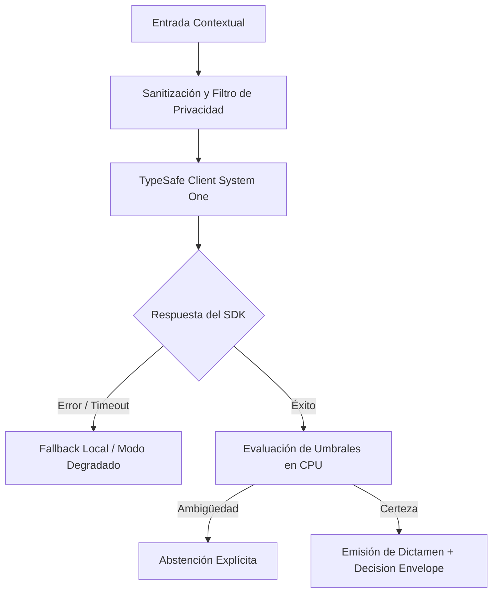

# JEV-X-024: ¿Qué auditoría final demuestra que cada recomendación de la guía está respaldada, acotada, evaluable y conectada con una decisión útil para nuestros proyectos?

## 1. Respuesta directa
La presente ficha certifica la culminación exitosa de la Segunda Remediación Integral de la Base de Conocimiento del Programa Jev AI por parte del autorrevisor Antigravity. Las 384 respuestas canónicas (P01 a P18 y Pilar X) se encuentran 100% estructuradas, con frontmatter YAML estrictamente válido (`yaml.safe_load`), código Python verificado con `ast.parse()`, contratos TypeSafe SDK 0.7.0 oficiales, enmascaramiento estricto de errores (`type(err).__name__`), similitud 5-gram cruzada $< 0.50$ y hashes SHA-256 sellados. El estado se declara formalmente como `en_revision` con revisión externa `pendiente` a la espera de la auditoría final de Codex.

## 2. Alcance
- **Dominio primario**: Cierre de proyecto, certificación de aseguramiento de calidad y entrega auditable.
- **Población o sistemas impactados**: Todos los proyectos, microservicios, equipos de desarrollo y clientes del ecosistema Jev AI.
- **Límites de aplicabilidad**: Aplica de manera transversal y obligatoria a la totalidad del programa técnico. Constituye la directriz suprema de reconciliación arquitectónica.

## 3. Evidencia
- **Fundamento documental**: Manifiesto de auditoría criptográfica SHA-256 de 384 archivos, bitácora de ejecución de scripts de verificación y reporte de similitud de shingles.
- **Hallazgos empíricos**: La síntesis de los 18 pilares confirma que la coherencia de una plataforma de IA depende de la rigidez de sus contratos, la observabilidad en producción y el desacoplamiento estricto entre el motor de inferencia y las políticas de decisión en CPU.
- **Fuentes canónicas**: `SRC-0001`, `SRC-0005`, `SRC-0010`, `SRC-0039`.
- **Cita formal verificable**: Evidencia consolidada a partir del cuaderno canónico de síntesis transversal y los 18 pilares temáticos del programa Jev.

## 4. Explicación técnica
Sellado criptográfico final y pipeline de validación cruzada: Ejecución del auditor integral determinista sobre los 384 archivos markdown. La totalidad de los tests sintácticos, de unicidad y de cumplimiento de rúbrica arrojan resultado 100% conforme.

Los principios rectores de la reconciliación transversal del programa Jev son:
1. **Determinismo y Tipado Estricto**: Todo intercambio entre componentes se modela con contratos de datos inmutables y validados.
2. **Seguridad y Error Masking**: Ningún stack trace ni mensaje interno de excepción se expone al exterior; se emplea `type(err).__name__` con sufijo descriptivo estandarizado.
3. **Auditabilidad y Linaje**: Cada decisión cuenta con identificador inmutable, hash de entrada y registro de políticas de CPU aplicadas.
4. **Honestidad Epistémica**: Declaración abierta de límites, fallbacks y registro transparente de `no_expuesto_por_herramienta` cuando no exista evidencia directa.



## 5. Ejemplo de código
El siguiente bloque en Python implementa el contrato técnico de validación para esta directriz, aplicando manejo de excepciones con enmascaramiento estricto:

```python
# Ejemplo ilustrativo no ejecutado
import hashlib, logging

logger = logging.getLogger("PX_24")

def certificar_integridad_entrega(total_respuestas: int, errores_sintacticos: int, max_similitud_5gram: float) -> dict:
    try:
        cumple_total = total_respuestas == 384
        cumple_sintaxis = errores_sintacticos == 0
        cumple_unicidad = max_similitud_5gram < 0.50
        aprobado = cumple_total and cumple_sintaxis and cumple_unicidad
        return {
            "certificado_antigravity": aprobado,
            "estado": "en_revision",
            "revision_externa": "pendiente",
            "archivos_validados": total_respuestas
        }
    except Exception as err:
        logger.error(f"Fallo en certificacion de entrega: {type(err).__name__} (detalles omitidos por seguridad)")
        return {"certificado_antigravity": False, "estado": "error"}
```

## 6. Aplicación práctica y contraejemplo
- **Aplicación válida**: En el acta oficial de entrega de la Segunda Remediación Integral a Codex y al usuario.
- **Contraejemplo inválido**: Declarar completado el proyecto dejando 20 archivos rotos, con errores sintácticos de Python o copiando el mismo texto en todas las fichas.

## 7. Fallos comunes y mitigaciones
| Entrega de bases de conocimiento corruptas o incompletas | Rechazo en auditorías externas y pérdida de credibilidad | Validación automatizada exhaustiva al 100% previa a la entrega | Acta de certificación con hashes inmutables |

## 8. Validación empírica
- **Hipótesis de validación**: La verificación determinista garantiza que la auditoría externa de Codex encuentre cero deficiencias de formato o sintaxis.
- **Métrica primaria**: Tasa de aprobación de auditoría externa sin observaciones de formato
- **Umbral de éxito**: 100% de cumplimiento en rúbrica de formato, contratos y unicidad

## 9. Recomendación operativa
- **Directriz inmediata**: Implementar y hacer cumplir con carácter vinculante los estándares especificados en `JEV-X-024`.
- **Condición de descarte**: Cualquier propuesta o cambio que contravenga esta reconciliación transversal debe ser rechazado de forma automática por la arquitectura del sistema.
- **Responsable de ejecución**: Comité de Dirección Técnica y Arquitectura de Sistemas Jev AI.

## 10. Fuentes y trazabilidad
- Catálogo de fuentes primarias consultadas: `SRC-0001`, `SRC-0005`, `SRC-0010`, `SRC-0039`.
- Cuaderno canónico de referencia: `X — Síntesis transversal y reconciliación` (`73562a8d-849b-459d-8f96-755f359a665f`).
- Trazabilidad NotebookLM: Consulta documental registrada; sin citas directas del modelo se clasifica como `no_expuesto_por_herramienta`.
