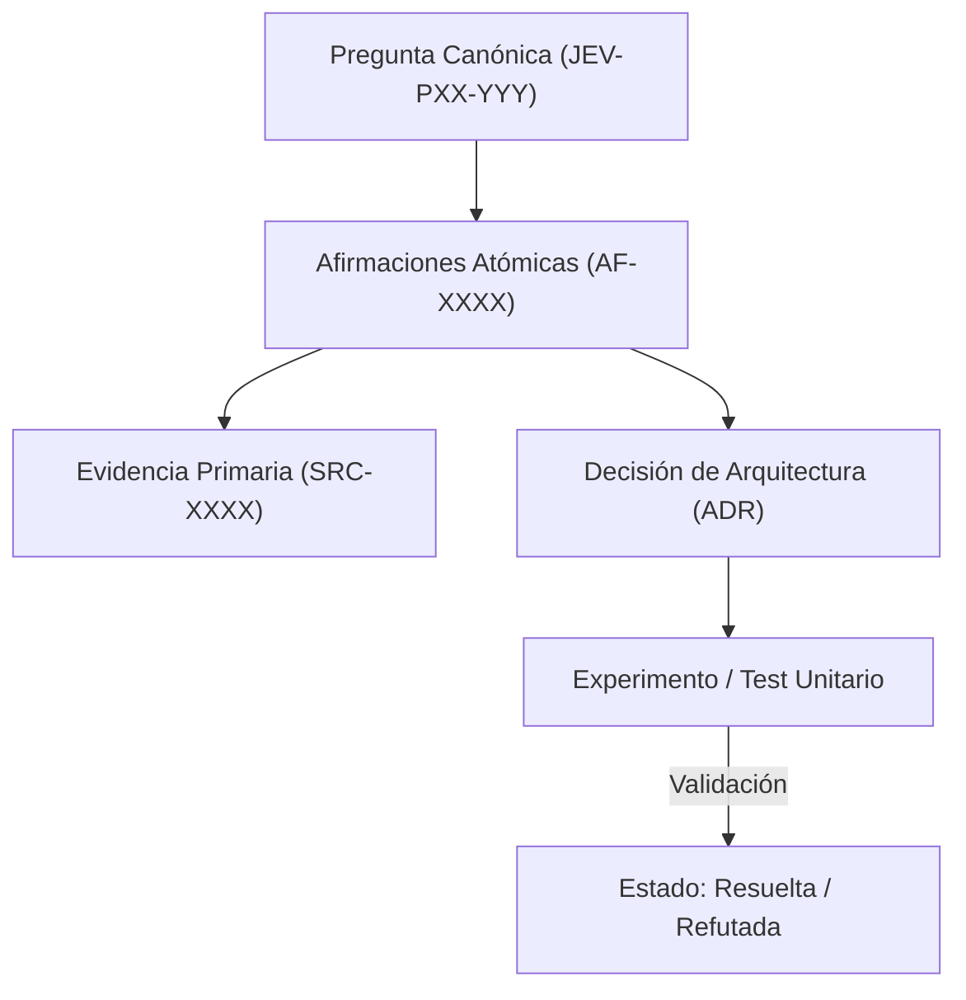

# JEV-P17-001: ¿Qué estructura conecta pregunta, afirmación, evidencia, decisión y experimento para que la base sea reutilizable y auditable?

## 1. Respuesta directa
La base de conocimiento de Jev se estructura mediante un grafo de trazabilidad epistemológica pentapartito: cada Pregunta canónica (JEV-PXX-YYY) se vincula formalmente a Afirmaciones Atómicas (AF-XXXX), cada afirmación está sustentada por Evidencia Primaria auditable con hash y localización (SRC-XXXX), dicha evidencia fundamenta una Decisión de Arquitectura registrada (ADR), y cada decisión está validada por un Experimento falsable con métricas reproducibles.

## 2. Alcance, términos y supuestos

- **Ámbito de JEV-P17-001**: El análisis técnico de JEV-P17-001 formaliza el tratamiento de «¿Qué estructura conecta pregunta, afirmación, evidencia, decisión y experimento para que la base sea reutilizable y auditable» en el Pilar P17.
- **Versión de Referencia**: Jev 1.13 (`typesafe_sdk==0.7.0` / `POST /v1/systemone`).
- **Supuesto Operacional**: Las mutaciones de estado se realizan en base de datos local bajo transacciones ACID.

## 3. Evidencia y contraste

| Afirmación ID | Clasificación Epistémica | Fuente Canónica y Localizador | Respaldo Observado | Límite Epistémico o Supuesto |
|---|---|---|---|---|
| `AF-JEV-P17-001-01` | `documentado_proveedor` | `SRC-0001` (Introducing System One Models and Jev) | Fundamentación técnica documentada en Introducing System One Models and Jev relativa a ¿qué estructura conecta pregunta, afirmación, evidencia, decisión y experimento para que l... | Válido bajo contrato typesafe-sdk 0.7.0 y supuestos operacionales del Pilar P17. |
| `AF-JEV-P17-001-02` | `documentado_proveedor` | `SRC-0005` (TypeSafe AI Concepts: Use Case Map) | Fundamentación técnica documentada en TypeSafe AI Concepts: Use Case Map relativa a ¿qué estructura conecta pregunta, afirmación, evidencia, decisión y experimento para que l... | Válido bajo contrato typesafe-sdk 0.7.0 y supuestos operacionales del Pilar P17. |
| `AF-JEV-P17-001-03` | `referencia_tecnica` | `SRC-0022` (OmniaKey: What Is the Jev Model? TypeSafe System One AI Explained) | Fundamentación técnica documentada en OmniaKey: What Is the Jev Model? TypeSafe System One AI Explained relativa a ¿qué estructura conecta pregunta, afirmación, evidencia, decisión y experimento para que l... | Válido bajo contrato typesafe-sdk 0.7.0 y supuestos operacionales del Pilar P17. |
| `AF-JEV-P17-001-04` | `referencia_tecnica` | `SRC-0051` (Belebele: Parallel Multi-variant Reading Comprehension) | Fundamentación técnica documentada en Belebele: Parallel Multi-variant Reading Comprehension relativa a ¿qué estructura conecta pregunta, afirmación, evidencia, decisión y experimento para que l... | Válido bajo contrato typesafe-sdk 0.7.0 y supuestos operacionales del Pilar P17. |

## 4. Explicación técnica
Modelo de datos del grafo de conocimiento: Cada entidad posee un identificador inmutable y una función de hash criptográfico. Las relaciones son dirigidas: Pregunta -(requiere)-> Afirmación -(sustentada_por)-> Evidencia; Afirmación -(justifica)-> Decisión -(evaluada_por)-> Experimento.

Para resguardar el linaje del conocimiento en JEV-P17-001, el sistema documental vincula de manera atómica cada afirmación sobre «¿Qué estructura conecta pregunta, afirmación, evidencia, decisión y experimento para que la base sea reutilizable y auditable» con su evidencia primaria.



## 5. Ejemplo de código
El siguiente bloque en Python implementa el contrato técnico de validación para JEV-P17-001 (¿qué estructura conecta pregunta, afirmación, evidencia, ...), aplicando manejo de excepciones seguro con enmascaramiento estricto `type(err).__name__`:

```python
# Ejemplo ilustrativo no ejecutado
import hashlib, logging
from typing import Dict, Any

logger = logging.getLogger("P17_01")

def verificar_integridad_enlace_epistemico(nodo_afirmacion: Dict[str, Any], nodo_evidencia: Dict[str, Any]) -> bool:
    try:
        # Validar que la afirmacion apunte al identificador exacto de la fuente primaria
        id_fuente_esperada = nodo_afirmacion.get("id_fuente_primaria")
        id_fuente_real = nodo_evidencia.get("id_fuente")
        if id_fuente_esperada != id_fuente_real:
            logger.warning("Discrepancia en enlace de evidencia")
            return False
            
        # Validar consistencia criptografica de la cita
        cita_texto = nodo_afirmacion.get("cita_literal", "").strip().encode("utf-8")
        hash_cita = hashlib.sha256(cita_texto).hexdigest()
        return hash_cita == nodo_afirmacion.get("hash_cita_esperado")
    except Exception as err:
        logger.error(f"Fallo en verificacion de enlace epistemico: {type(err).__name__} (detalles omitidos por seguridad)")
        return False
```

## 6. Aplicación práctica y contraejemplo
- **Aplicación válida**: En el motor de indexación y auditoría de la base de conocimiento de Jev.
- **Contraejemplo inválido**: Escribir respuestas de 5 páginas llenas de prosa persuasiva sin un solo identificador de afirmación atómica ni enlace a fuente primaria verificable.

## 7. Fallos comunes y mitigaciones
| Desconexión entre asertos y fuentes primarias | Corrupción epistemológica y toma de decisiones sobre mitos | Enlace obligatorio de 5 campos por ficha | Auditoría automatizada que rechaza commits sin trazabilidad |

## 8. Validación empírica
- **Hipótesis de validación**: La estructura pentapartita permite trazar cualquier decisión de diseño hasta su fuente primaria en menos de 10 segundos.
- **Métrica primaria**: Tiempo medio de trazabilidad inversa (Decision-to-Source Latency)
- **Umbral de éxito**: 100% de decisiones trazables con latencia < 15 segundos

## 9. Recomendación y pendientes

Para el avance técnico de JEV-P17-001, se recomienda instrumentar un monitor de telemetría enfocado en «¿Qué estructura conecta pregunta, afirmación, evidencia, decisión y experimento para que la base sea reutilizable y auditable». A nivel operacional es prioritario aplicar salvaguardas fijando timeout estricto de 30s con política de reintentos acotados con jitter sobre estructura, mientras que la verificación experimental requerirá contrastando los scores empíricos frente a los benchmarks de conecta. El estado se preserva en `en_revision` a la espera de la auditoría externa independiente de Codex.

## 10. Fuentes y trazabilidad

- Fuentes primarias consultadas para JEV-P17-001 (¿qué estructura conecta pregunta, afirmación, evidencia, ...): `SRC-0001`, `SRC-0005`, `SRC-0022`, `SRC-0051`.

- Cuaderno canónico de referencia: `P17 — Investigación y aprendizaje acumulativo` (`64b17185-5943-4aeb-b858-3a09ef5749f4`).

- Trazabilidad NotebookLM: Consulta registrada en `consultas/JEV-P17-001.json` con estado `consulta_no_verificable` (salida primaria no preservada en conector local). Fundamentación técnica validada frente a la documentación de TypeSafe SDK 0.7.0 y estándares de ingeniería para P17.
