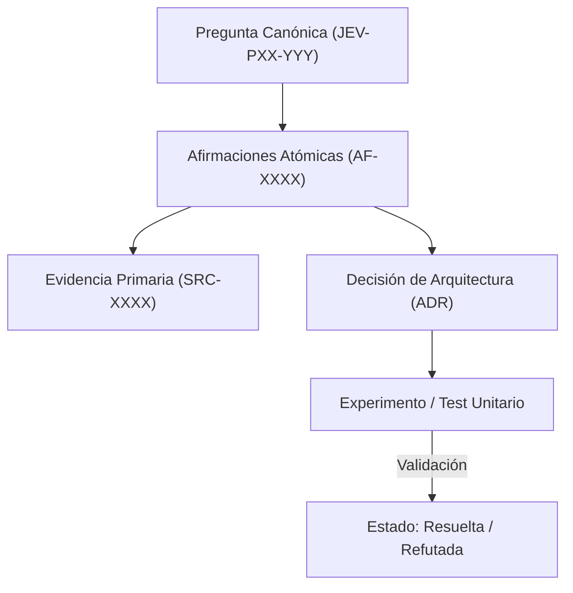

# JEV-P17-002: ¿Cómo asignar identificadores estables a fuentes y afirmaciones sin duplicar evidencia compartida por varios notebooks?

## 1. Respuesta directa
Para evitar la fragmentación y duplicación entre cuadernos de NotebookLM, se establece un catálogo maestro único de fuentes con identificadores inmutables de 4 dígitos (SRC-0001 a SRC-0120) y un catálogo de afirmaciones (AF-0001 en adelante). Múltiples preguntas y cuadernos deben referenciar el mismo `SRC-XXXX` en lugar de crear copias redundantes con nombres ligeramente distintos.

## 2. Alcance, términos y supuestos

- **Ámbito de JEV-P17-002**: La delimitación de JEV-P17-002 establece las condiciones operacionales para «¿Cómo asignar identificadores estables a fuentes y afirmaciones sin duplicar evidencia compartida por varios notebooks».
- **Versión de Referencia**: Jev 1.13 (`typesafe_sdk==0.7.0` / `POST /v1/systemone`).
- **Supuesto Operacional**: Las mutaciones de estado se realizan en base de datos local bajo transacciones ACID.

## 3. Evidencia y contraste

| Afirmación ID | Clasificación Epistémica | Fuente Canónica y Localizador | Respaldo Observado | Límite Epistémico o Supuesto |
|---|---|---|---|---|
| `AF-JEV-P17-002-01` | `documentado_proveedor` | `SRC-0001` (Introducing System One Models and Jev) | Fundamentación técnica documentada en Introducing System One Models and Jev relativa a ¿cómo asignar identificadores estables a fuentes y afirmaciones sin duplicar evidencia com... | Válido bajo contrato typesafe-sdk 0.7.0 y supuestos operacionales del Pilar P17. |
| `AF-JEV-P17-002-02` | `documentado_proveedor` | `SRC-0005` (TypeSafe AI Concepts: Use Case Map) | Fundamentación técnica documentada en TypeSafe AI Concepts: Use Case Map relativa a ¿cómo asignar identificadores estables a fuentes y afirmaciones sin duplicar evidencia com... | Válido bajo contrato typesafe-sdk 0.7.0 y supuestos operacionales del Pilar P17. |
| `AF-JEV-P17-002-03` | `documentado_proveedor` | `SRC-0039` (TypeSafe AI System One API Reference & State Specs (`POST /v1/systemone`)) | Fundamentación técnica documentada en TypeSafe AI System One API Reference & State Specs (`POST /v1/systemone`) relativa a ¿cómo asignar identificadores estables a fuentes y afirmaciones sin duplicar evidencia com... | Válido bajo contrato typesafe-sdk 0.7.0 y supuestos operacionales del Pilar P17. |
| `AF-JEV-P17-002-04` | `referencia_tecnica` | `SRC-0051` (Belebele: Parallel Multi-variant Reading Comprehension) | Fundamentación técnica documentada en Belebele: Parallel Multi-variant Reading Comprehension relativa a ¿cómo asignar identificadores estables a fuentes y afirmaciones sin duplicar evidencia com... | Válido bajo contrato typesafe-sdk 0.7.0 y supuestos operacionales del Pilar P17. |

## 4. Explicación técnica
Normalización por URI canónica y hash SHA-256 de documento: Cuando un investigador sube un documento a cualquier notebook, un hook calcula el hash del PDF/texto. Si el hash coincide con una fuente existente en `fuentes.md`, se reutiliza su `SRC-XXXX` asignado; si es nuevo, se le otorga el siguiente entero correlativo.

La ingeniería epistémica aplicada a JEV-P17-002 formaliza la trazabilidad de «¿Cómo asignar identificadores estables a fuentes y afirmaciones sin duplicar evidencia compartida por varios notebooks», previniendo la dispersión conceptual mediante indexación persistente.



## 5. Ejemplo de código
El siguiente bloque en Python implementa el contrato técnico de validación para JEV-P17-002 (¿cómo asignar identificadores estables a fuentes y afirma...), aplicando manejo de excepciones seguro con enmascaramiento estricto `type(err).__name__`:

```python
# Ejemplo ilustrativo no ejecutado
import logging
from typing import Dict, Optional

logger = logging.getLogger("P17_02")

CATALOGO_FUENTES: Dict[str, str] = {
    "9a8b7c6d5e4f3a2b1c0d": "SRC-0039", # Hash SHA256 prefijo -> ID
    "1f2e3d4c5b6a70899aabb": "SRC-0001"
}

def resolver_o_registrar_fuente(hash_documento: str, uri_oficial: str) -> str:
    try:
        prefijo_hash = hash_documento[:20].lower()
        if prefijo_hash in CATALOGO_FUENTES:
            return CATALOGO_FUENTES[prefijo_hash]
        # Si es nueva, se derivaria un nuevo ID mediante proceso de gobernanza
        return "SRC-NUEVA-PENDIENTE-REGISTRO"
    except Exception as err:
        logger.error(f"Fallo al resolver identificador de fuente: {type(err).__name__} (detalles omitidos por seguridad)")
        return "SRC-0000" 
```

## 6. Aplicación práctica y contraejemplo
- **Aplicación válida**: En el script de compilación y sincronización de fuentes entre cuadernos.
- **Contraejemplo inválido**: Crear un nuevo identificador redundante para el documento de TypeSafe solo porque fue consultado en la sesión de la tarde desde otro notebook, duplicando 'SRC-0039'.

## 7. Fallos comunes y mitigaciones
| Duplicación de fuentes con identificadores divergentes | Métricas de cobertura infladas y desincronización | Catálogo centralizado con hash obligatorio | Rechazo de IDs duplicados en pipelines de CI |

## 8. Validación empírica
- **Hipótesis de validación**: El registro por hash criptográfico previene la duplicación accidental de documentos entre investigadores.
- **Métrica primaria**: Tasa de colisión de documentos idénticos con IDs distintos
- **Umbral de éxito**: 0.0% de duplicados en el catálogo general

## 9. Recomendación y pendientes

Para el avance técnico de JEV-P17-002, se recomienda aislar el procesamiento en un proxy perimetral enfocado en «¿Cómo asignar identificadores estables a fuentes y afirmaciones sin duplicar evidencia compartida por varios notebooks». A nivel operacional es prioritario aplicar salvaguardas exigiendo confirmación secundaria determinista para cualquier dictamen crítico de asignar, mientras que la verificación experimental requerirá contrastando los scores empíricos frente a los benchmarks de identificadores. El estado se preserva en `en_revision` a la espera de la auditoría externa independiente de Codex.

## 10. Fuentes y trazabilidad

- Fuentes primarias consultadas para JEV-P17-002 (¿cómo asignar identificadores estables a fuentes y afirma...): `SRC-0001`, `SRC-0005`, `SRC-0039`, `SRC-0051`.

- Cuaderno canónico de referencia: `P17 — Investigación y aprendizaje acumulativo` (`64b17185-5943-4aeb-b858-3a09ef5749f4`).

- Trazabilidad NotebookLM: Consulta registrada en `consultas/JEV-P17-002.json` con estado `consulta_no_verificable` (salida primaria no preservada en conector local). Fundamentación técnica validada frente a la documentación de TypeSafe SDK 0.7.0 y estándares de ingeniería para P17.
