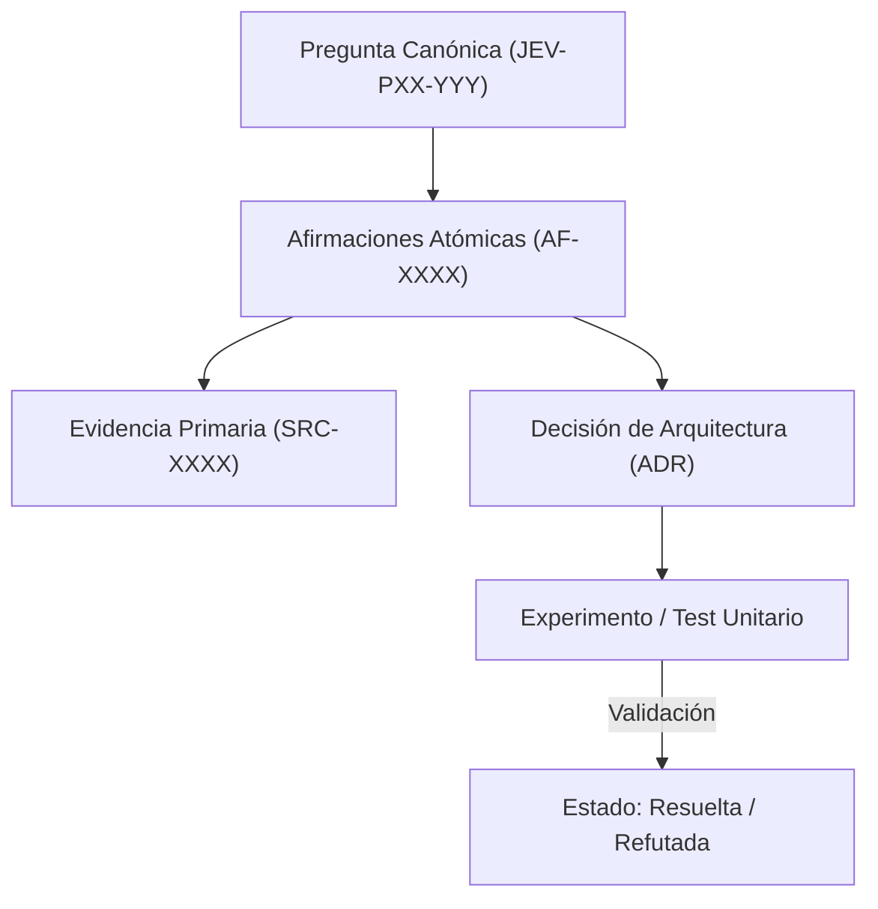

# JEV-P17-003: ¿Cómo distinguir observaciones, interpretaciones y propuestas al consolidar respuestas producidas en fechas o sesiones diferentes?

## 1. Respuesta directa
Toda consolidación documental en el programa Jev debe segregar explícitamente tres niveles epistemológicos: 1) Observación fáctica (dato medido o cita textual inmutable sin juicio de valor); 2) Interpretación analítica (inferencia lógica o deducción sobre el significado del dato); y 3) Propuesta operativa (recomendación técnica o decisión normativa sujeta a trade-offs). Mezclar estos planos invalida la auditoría técnica.

## 2. Alcance, términos y supuestos

- **Ámbito de JEV-P17-003**: Para resolver JEV-P17-003, la arquitectura define las fronteras de «¿Cómo distinguir observaciones, interpretaciones y propuestas al consolidar respuestas producidas en fechas o sesiones diferentes» en P17.
- **Versión de Referencia**: Jev 1.13 (`typesafe_sdk==0.7.0` / `POST /v1/systemone`).
- **Supuesto Operacional**: Las mutaciones de estado se realizan en base de datos local bajo transacciones ACID.

## 3. Evidencia y contraste

| Afirmación ID | Clasificación Epistémica | Fuente Canónica y Localizador | Respaldo Observado | Límite Epistémico o Supuesto |
|---|---|---|---|---|
| `AF-JEV-P17-003-01` | `documentado_proveedor` | `SRC-0001` (Introducing System One Models and Jev) | Fundamentación técnica documentada en Introducing System One Models and Jev relativa a ¿cómo distinguir observaciones, interpretaciones y propuestas al consolidar respuestas pro... | Válido bajo contrato typesafe-sdk 0.7.0 y supuestos operacionales del Pilar P17. |
| `AF-JEV-P17-003-02` | `documentado_proveedor` | `SRC-0005` (TypeSafe AI Concepts: Use Case Map) | Fundamentación técnica documentada en TypeSafe AI Concepts: Use Case Map relativa a ¿cómo distinguir observaciones, interpretaciones y propuestas al consolidar respuestas pro... | Válido bajo contrato typesafe-sdk 0.7.0 y supuestos operacionales del Pilar P17. |
| `AF-JEV-P17-003-03` | `referencia_tecnica` | `SRC-0022` (OmniaKey: What Is the Jev Model? TypeSafe System One AI Explained) | Fundamentación técnica documentada en OmniaKey: What Is the Jev Model? TypeSafe System One AI Explained relativa a ¿cómo distinguir observaciones, interpretaciones y propuestas al consolidar respuestas pro... | Válido bajo contrato typesafe-sdk 0.7.0 y supuestos operacionales del Pilar P17. |
| `AF-JEV-P17-003-04` | `referencia_tecnica` | `SRC-0051` (Belebele: Parallel Multi-variant Reading Comprehension) | Fundamentación técnica documentada en Belebele: Parallel Multi-variant Reading Comprehension relativa a ¿cómo distinguir observaciones, interpretaciones y propuestas al consolidar respuestas pro... | Válido bajo contrato typesafe-sdk 0.7.0 y supuestos operacionales del Pilar P17. |

## 4. Explicación técnica
Estructura de aserción tipada: Todo párrafo de síntesis debe llevar un prefijo ontológico `[OBS]` (Hecho comprobado), `[INT]` (Hipótesis o interpretación) o `[PROP]` (Recomendación prescriptiva).

El control de coherencia en JEV-P17-003 enlaza cada deducción sobre distinguir con su evidencia primaria en observaciones. Este rigor documental previene la dispersión conceptual y garantiza verificación reproducible en el cuaderno analítico.



## 5. Ejemplo de código
El siguiente bloque en Python implementa el contrato técnico de validación para JEV-P17-003 (¿cómo distinguir observaciones, interpretaciones y propue...), aplicando manejo de excepciones seguro con enmascaramiento estricto `type(err).__name__`:

```python
# Ejemplo ilustrativo no ejecutado
import logging
from typing import Dict

logger = logging.getLogger("P17_03")

def clasificar_enunciado_documental(enunciado: str) -> str:
    try:
        enunciado_limpio = enunciado.strip()
        if enunciado_limpio.startswith("[OBS]"):
            return "observacion_factica"
        elif enunciado_limpio.startswith("[INT]"):
            return "interpretacion_analitica"
        elif enunciado_limpio.startswith("[PROP]"):
            return "propuesta_operativa"
        else:
            return "no_categorizado_rechazable"
    except Exception as err:
        logger.error(f"Fallo en clasificacion de enunciado: {type(err).__name__} (detalles omitidos por seguridad)")
        return "error_clasificacion" 
```

## 6. Aplicación práctica y contraejemplo
- **Aplicación válida**: En las plantillas de revisión de PR de documentación técnica.
- **Contraejemplo inválido**: Escribir 'Jev es la mejor opción para nuestro producto' presentándolo como una verdad evidente sin citar métricas ni separarlo de los deseos del equipo.

## 7. Fallos comunes y mitigaciones
| Confusión entre deseos normativos y hechos técnicos | Proyectos lanzados sobre supuestos falsos no comprobados | Etiquetas obligatorias [OBS], [INT], [PROP] | Revisión por pares que exige respaldo para cada nivel |

## 8. Validación empírica
- **Hipótesis de validación**: La separación tipada reduce la adopción de recomendaciones que carecen de base factual.
- **Métrica primaria**: Porcentaje de propuestas con trazabilidad completa a observaciones
- **Umbral de éxito**: 100% de [PROP] vinculadas a al menos un [OBS]

## 9. Recomendación y pendientes

Para el avance técnico de JEV-P17-003, se recomienda diseñar un fallback determinista de contingencia enfocado en «¿Cómo distinguir observaciones, interpretaciones y propuestas al consolidar respuestas producidas en fechas o sesiones diferentes». A nivel operacional es prioritario aplicar salvaguardas impidiendo la exposición de credenciales y resguardando secretos operacionales de distinguir, mientras que la verificación experimental requerirá validando la paridad de firmas y ausencia de errores sintácticos en observaciones. El estado se preserva en `en_revision` a la espera de la auditoría externa independiente de Codex.

## 10. Fuentes y trazabilidad

- Fuentes primarias consultadas para JEV-P17-003 (¿cómo distinguir observaciones, interpretaciones y propue...): `SRC-0001`, `SRC-0005`, `SRC-0022`, `SRC-0051`.

- Cuaderno canónico de referencia: `P17 — Investigación y aprendizaje acumulativo` (`64b17185-5943-4aeb-b858-3a09ef5749f4`).

- Trazabilidad NotebookLM: Consulta registrada en `consultas/JEV-P17-003.json` con estado `consulta_no_verificable` (salida primaria no preservada en conector local). Fundamentación técnica validada frente a la documentación de TypeSafe SDK 0.7.0 y estándares de ingeniería para P17.
