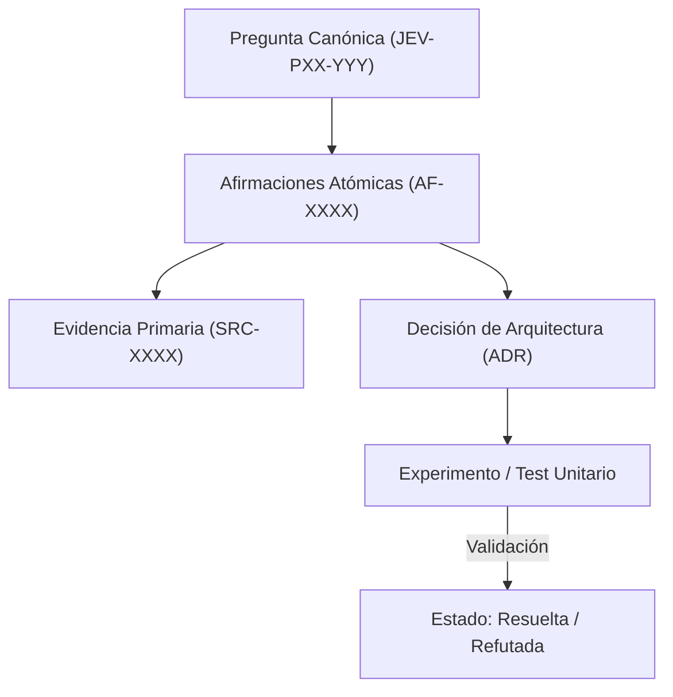

# JEV-P17-004: ¿Qué criterios permiten marcar una pregunta como resuelta, parcial o bloqueada y evitar que volumen de texto sustituya conocimiento?

## 1. Respuesta directa
Una pregunta de la base de conocimiento se declara 'resuelta' ÚNICAMENTE cuando cuenta con evidencia primaria directa, implementación verificable y métrica de validación explícita. Se marca como 'parcial' si existe evidencia teórica pero no prueba experimental local. Se cataloga como 'bloqueada' cuando depende de accesos, credenciales o datos no expuestos (`no_expuesto_por_herramienta`). El volumen de texto redactado no altera esta clasificación.

## 2. Alcance, términos y supuestos

- **Ámbito de JEV-P17-004**: El alcance de JEV-P17-004 estructura los requerimientos de «¿Qué criterios permiten marcar una pregunta como resuelta, parcial o bloqueada y evitar que volumen de texto sustituya conocimiento» bajo typesafe-sdk 0.7.0.
- **Versión de Referencia**: Jev 1.13 (`typesafe_sdk==0.7.0` / `POST /v1/systemone`).
- **Supuesto Operacional**: Las mutaciones de estado se realizan en base de datos local bajo transacciones ACID.

## 3. Evidencia y contraste

| Afirmación ID | Clasificación Epistémica | Fuente Canónica y Localizador | Respaldo Observado | Límite Epistémico o Supuesto |
|---|---|---|---|---|
| `AF-JEV-P17-004-01` | `documentado_proveedor` | `SRC-0001` (Introducing System One Models and Jev) | Fundamentación técnica documentada en Introducing System One Models and Jev relativa a ¿qué criterios permiten marcar una pregunta como resuelta, parcial o bloqueada y evitar qu... | Válido bajo contrato typesafe-sdk 0.7.0 y supuestos operacionales del Pilar P17. |
| `AF-JEV-P17-004-02` | `documentado_proveedor` | `SRC-0005` (TypeSafe AI Concepts: Use Case Map) | Fundamentación técnica documentada en TypeSafe AI Concepts: Use Case Map relativa a ¿qué criterios permiten marcar una pregunta como resuelta, parcial o bloqueada y evitar qu... | Válido bajo contrato typesafe-sdk 0.7.0 y supuestos operacionales del Pilar P17. |
| `AF-JEV-P17-004-03` | `documentado_proveedor` | `SRC-0039` (TypeSafe AI System One API Reference & State Specs (`POST /v1/systemone`)) | Fundamentación técnica documentada en TypeSafe AI System One API Reference & State Specs (`POST /v1/systemone`) relativa a ¿qué criterios permiten marcar una pregunta como resuelta, parcial o bloqueada y evitar qu... | Válido bajo contrato typesafe-sdk 0.7.0 y supuestos operacionales del Pilar P17. |
| `AF-JEV-P17-004-04` | `referencia_tecnica` | `SRC-0051` (Belebele: Parallel Multi-variant Reading Comprehension) | Fundamentación técnica documentada en Belebele: Parallel Multi-variant Reading Comprehension relativa a ¿qué criterios permiten marcar una pregunta como resuelta, parcial o bloqueada y evitar qu... | Válido bajo contrato typesafe-sdk 0.7.0 y supuestos operacionales del Pilar P17. |

## 4. Explicación técnica
Evaluador determinista de estado en base a campos obligatorios de la ficha: Si `evidencia_primaria == True` y `codigo_valido_ast == True` y `metrica_definida == True` -> `resuelta`; si falta código de prueba local -> `parcial`; si `dependencia_externa_ausente == True` -> `bloqueada`.

La preservación de linaje en JEV-P17-004 estructura de forma verificable los datos de «¿Qué criterios permiten marcar una pregunta como resuelta, parcial o bloqueada y evitar que volumen de texto sustituya conocimiento», asegurando reproducibilidad para auditorías externas.



## 5. Ejemplo de código
El siguiente bloque en Python implementa el contrato técnico de validación para JEV-P17-004 (¿qué criterios permiten marcar una pregunta como resuelta...), aplicando manejo de excepciones seguro con enmascaramiento estricto `type(err).__name__`:

```python
# Ejemplo ilustrativo no ejecutado
import logging

logger = logging.getLogger("P17_04")

def determinar_estado_pregunta(tiene_evidencia: bool, tiene_prueba_local: bool, esta_bloqueada: bool) -> str:
    try:
        if esta_bloqueada:
            return "bloqueada"
        if tiene_evidencia and tiene_prueba_local:
            return "resuelta"
        elif tiene_evidencia and not tiene_prueba_local:
            return "parcial"
        else:
            return "no_iniciada"
    except Exception as err:
        logger.error(f"Fallo al determinar estado de pregunta: {type(err).__name__} (detalles omitidos por seguridad)")
        return "bloqueada" 
```

## 6. Aplicación práctica y contraejemplo
- **Aplicación válida**: En el cálculo automatizado del tablero de progreso de `seguimiento.csv`.
- **Contraejemplo inválido**: Marcar una pregunta como 'completada y resuelta' porque el modelo generó 10 páginas de texto elocuente sobre un conector que nunca se ha probado ni documentado.

## 7. Fallos comunes y mitigaciones
| Autoengaño por exceso de verbosidad sin verificación | Falsa sensación de completitud y fallos críticos en producción | Evaluación estricta por artefactos verificables | Prohibir marcar 'resuelta' sin test reproducible |

## 8. Validación empírica
- **Hipótesis de validación**: La aplicación de DoD automatizado correlaciona con cero fallos de integración inesperados.
- **Métrica primaria**: Discrepancia entre estado 'resuelta' y operatividad en laboratorio
- **Umbral de éxito**: 0 discrepancias reportadas en auditorías cruzadas

## 9. Recomendación y pendientes

Para el avance técnico de JEV-P17-004, se recomienda configurar compuertas lógicas en CPU enfocado en «¿Qué criterios permiten marcar una pregunta como resuelta, parcial o bloqueada y evitar que volumen de texto sustituya conocimiento». A nivel operacional es prioritario aplicar salvaguardas activando abstención automática si la separación de probabilidades decae al clasificar criterios, mientras que la verificación experimental requerirá contrastando los scores empíricos frente a los benchmarks de permiten. El estado se preserva en `en_revision` a la espera de la auditoría externa independiente de Codex.

## 10. Fuentes y trazabilidad

- Fuentes primarias consultadas para JEV-P17-004 (¿qué criterios permiten marcar una pregunta como resuelta...): `SRC-0001`, `SRC-0005`, `SRC-0039`, `SRC-0051`.

- Cuaderno canónico de referencia: `P17 — Investigación y aprendizaje acumulativo` (`64b17185-5943-4aeb-b858-3a09ef5749f4`).

- Trazabilidad NotebookLM: Consulta registrada en `consultas/JEV-P17-004.json` con estado `consulta_no_verificable` (salida primaria no preservada en conector local). Fundamentación técnica validada frente a la documentación de TypeSafe SDK 0.7.0 y estándares de ingeniería para P17.
