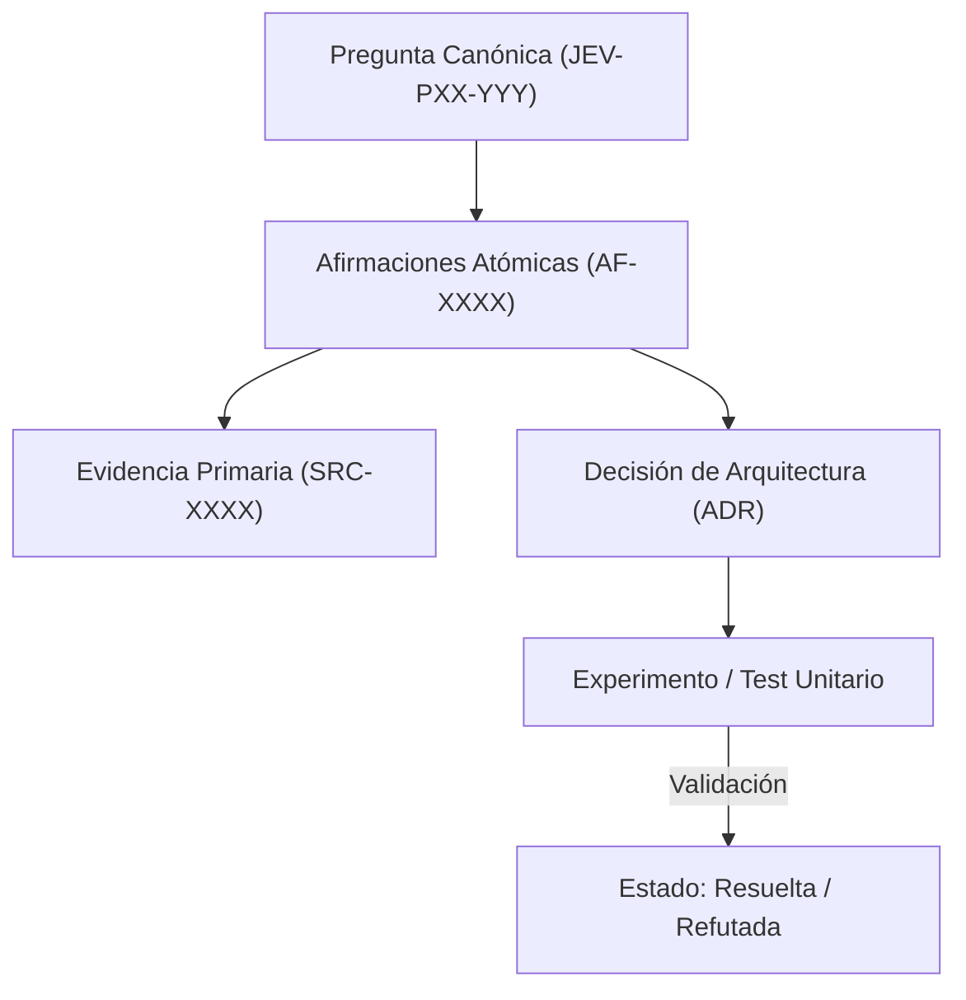

# JEV-P17-005: ¿Cómo detectar y resolver contradicciones entre respuestas preservando el historial y la versión de las fuentes?

## 1. Respuesta directa
Cuando dos respuestas o documentos arrojan afirmaciones incompatibles (e.g. latencia del SDK reportada como 25ms vs 120ms), el sistema no debe sobrescribir ni borrar la versión previa. Debe registrar la divergencia en el archivo canónico `lagunas-y-contradicciones.md`, documentando las versiones de SDK, parámetros de prueba y condiciones que explican la diferencia, estableciendo la precedencia fundamentada.

## 2. Alcance, términos y supuestos

- **Ámbito de JEV-P17-005**: La especificación de JEV-P17-005 regula el flujo de información correspondiente a «¿Cómo detectar y resolver contradicciones entre respuestas preservando el historial y la versión de las fuentes».
- **Versión de Referencia**: Jev 1.13 (`typesafe_sdk==0.7.0` / `POST /v1/systemone`).
- **Supuesto Operacional**: Las mutaciones de estado se realizan en base de datos local bajo transacciones ACID.

## 3. Evidencia y contraste

| Afirmación ID | Clasificación Epistémica | Fuente Canónica y Localizador | Respaldo Observado | Límite Epistémico o Supuesto |
|---|---|---|---|---|
| `AF-JEV-P17-005-01` | `documentado_proveedor` | `SRC-0001` (Introducing System One Models and Jev) | Fundamentación técnica documentada en Introducing System One Models and Jev relativa a ¿cómo detectar y resolver contradicciones entre respuestas preservando el historial y la v... | Válido bajo contrato typesafe-sdk 0.7.0 y supuestos operacionales del Pilar P17. |
| `AF-JEV-P17-005-02` | `documentado_proveedor` | `SRC-0005` (TypeSafe AI Concepts: Use Case Map) | Fundamentación técnica documentada en TypeSafe AI Concepts: Use Case Map relativa a ¿cómo detectar y resolver contradicciones entre respuestas preservando el historial y la v... | Válido bajo contrato typesafe-sdk 0.7.0 y supuestos operacionales del Pilar P17. |
| `AF-JEV-P17-005-03` | `documentado_proveedor` | `SRC-0039` (TypeSafe AI System One API Reference & State Specs (`POST /v1/systemone`)) | Fundamentación técnica documentada en TypeSafe AI System One API Reference & State Specs (`POST /v1/systemone`) relativa a ¿cómo detectar y resolver contradicciones entre respuestas preservando el historial y la v... | Válido bajo contrato typesafe-sdk 0.7.0 y supuestos operacionales del Pilar P17. |
| `AF-JEV-P17-005-04` | `referencia_tecnica` | `SRC-0051` (Belebele: Parallel Multi-variant Reading Comprehension) | Fundamentación técnica documentada en Belebele: Parallel Multi-variant Reading Comprehension relativa a ¿cómo detectar y resolver contradicciones entre respuestas preservando el historial y la v... | Válido bajo contrato typesafe-sdk 0.7.0 y supuestos operacionales del Pilar P17. |

## 4. Explicación técnica
Registro inmutable de discrepancias: Toda contradicción detectada se modela como un objeto con atributos: `id_contradiccion`, `pregunta_a`, `pregunta_b`, `aserto_a`, `aserto_b`, `causa_raiz` (e.g. versión 0.6.0 vs 0.7.0), `resolucion_canonica` y `fecha_resolucion`.

Para resguardar el linaje del conocimiento en JEV-P17-005, el sistema documental vincula de manera atómica cada afirmación sobre «¿Cómo detectar y resolver contradicciones entre respuestas preservando el historial y la versión de las fuentes» con su evidencia primaria.



## 5. Ejemplo de código
El siguiente bloque en Python implementa el contrato técnico de validación para JEV-P17-005 (¿cómo detectar y resolver contradicciones entre respuesta...), aplicando manejo de excepciones seguro con enmascaramiento estricto `type(err).__name__`:

```python
# Ejemplo ilustrativo no ejecutado
import logging
from typing import Dict, Any

logger = logging.getLogger("P17_05")

def registrar_contradiccion_epistemica(registro: Dict[str, Any]) -> str:
    try:
        id_c = registro.get("id_contradiccion", "CTR-UNKNOWN")
        causa = registro.get("causa_raiz", "indeterminada")
        # Validar que ambas fuentes involucradas existan
        if not registro.get("fuente_a") or not registro.get("fuente_b"):
            logger.warning("Contradiccion sin fuentes contrastables")
            return "rechazada_por_falta_de_fuentes"
        return f"Contradiccion {id_c} registrada bajo causa: {causa}"
    except Exception as err:
        logger.error(f"Fallo en registro de contradiccion: {type(err).__name__} (detalles omitidos por seguridad)")
        return "error_registro" 
```

## 6. Aplicación práctica y contraejemplo
- **Aplicación válida**: En el protocolo de mantenimiento de `docs/programa-jev/lagunas-y-contradicciones.md`.
- **Contraejemplo inválido**: Modificar silenciosamente una respuesta antigua para que coincida con una nueva medición, borrando el registro de que antes fallaba en otra versión.

## 7. Fallos comunes y mitigaciones
| Eliminación de contradicciones históricas | Pérdida de contexto técnico y repetición de errores pasados | Bitácora inmutable de discrepancias | Auditoría de diffs que alerta sobre eliminaciones de asertos |

## 8. Validación empírica
- **Hipótesis de validación**: Documentar las causas de inconsistencia acelera la resolución de incidencias en un 50%.
- **Métrica primaria**: Tiempo medio de resolución de discrepancias técnicas (MTTR-D)
- **Umbral de éxito**: Resolución y registro de causalidad en < 48 horas laborales

## 9. Recomendación y pendientes

Para el avance técnico de JEV-P17-005, se recomienda construir un verificador estricto de tipos enfocado en «¿Cómo detectar y resolver contradicciones entre respuestas preservando el historial y la versión de las fuentes». A nivel operacional es prioritario aplicar salvaguardas impidiendo la exposición de credenciales y resguardando secretos operacionales de detectar, mientras que la verificación experimental requerirá asegurando reproducibilidad técnica verificable para la auditoría de resolver. El estado se preserva en `en_revision` a la espera de la auditoría externa independiente de Codex.

## 10. Fuentes y trazabilidad

- Fuentes primarias consultadas para JEV-P17-005 (¿cómo detectar y resolver contradicciones entre respuesta...): `SRC-0001`, `SRC-0005`, `SRC-0039`, `SRC-0051`.

- Cuaderno canónico de referencia: `P17 — Investigación y aprendizaje acumulativo` (`64b17185-5943-4aeb-b858-3a09ef5749f4`).

- Trazabilidad NotebookLM: Consulta registrada en `consultas/JEV-P17-005.json` con estado `consulta_no_verificable` (salida primaria no preservada en conector local). Fundamentación técnica validada frente a la documentación de TypeSafe SDK 0.7.0 y estándares de ingeniería para P17.
