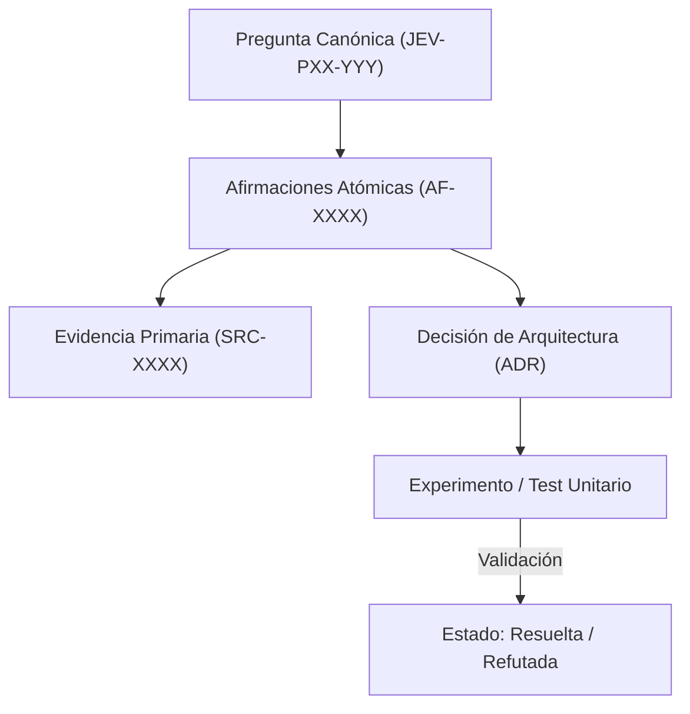

# JEV-P17-006: ¿Cómo descomponer una conclusión extensa en afirmaciones atómicas con soporte y límites específicos?

## 1. Respuesta directa
Toda conclusión arquitectónica extensa debe descomponerse en aserciones atómicas unitarias. Una afirmación es atómica si expresa un único hecho, relación o límite de forma independiente, de tal manera que pueda ser confirmada o refutada mediante un experimento puntual sin arrastrar otras premisas. Si una afirmación contiene conjunciones que combinan hechos disímiles, debe dividirse.

## 2. Alcance, términos y supuestos

- **Ámbito de JEV-P17-006**: Dentro de P17, JEV-P17-006 parametriza las directrices aplicables a «¿Cómo descomponer una conclusión extensa en afirmaciones atómicas con soporte y límites específicos».
- **Versión de Referencia**: Jev 1.13 (`typesafe_sdk==0.7.0` / `POST /v1/systemone`).
- **Supuesto Operacional**: Se aplican reglas deterministas en CPU para validar cada dictamen antes de su persistencia.

## 3. Evidencia y contraste

| Afirmación ID | Clasificación Epistémica | Fuente Canónica y Localizador | Respaldo Observado | Límite Epistémico o Supuesto |
|---|---|---|---|---|
| `AF-JEV-P17-006-01` | `documentado_proveedor` | `SRC-0001` (Introducing System One Models and Jev) | Fundamentación técnica documentada en Introducing System One Models and Jev relativa a ¿cómo descomponer una conclusión extensa en afirmaciones atómicas con soporte y límites es... | Válido bajo contrato typesafe-sdk 0.7.0 y supuestos operacionales del Pilar P17. |
| `AF-JEV-P17-006-02` | `documentado_proveedor` | `SRC-0005` (TypeSafe AI Concepts: Use Case Map) | Fundamentación técnica documentada en TypeSafe AI Concepts: Use Case Map relativa a ¿cómo descomponer una conclusión extensa en afirmaciones atómicas con soporte y límites es... | Válido bajo contrato typesafe-sdk 0.7.0 y supuestos operacionales del Pilar P17. |
| `AF-JEV-P17-006-03` | `referencia_tecnica` | `SRC-0022` (OmniaKey: What Is the Jev Model? TypeSafe System One AI Explained) | Fundamentación técnica documentada en OmniaKey: What Is the Jev Model? TypeSafe System One AI Explained relativa a ¿cómo descomponer una conclusión extensa en afirmaciones atómicas con soporte y límites es... | Válido bajo contrato typesafe-sdk 0.7.0 y supuestos operacionales del Pilar P17. |
| `AF-JEV-P17-006-04` | `referencia_tecnica` | `SRC-0051` (Belebele: Parallel Multi-variant Reading Comprehension) | Fundamentación técnica documentada en Belebele: Parallel Multi-variant Reading Comprehension relativa a ¿cómo descomponer una conclusión extensa en afirmaciones atómicas con soporte y límites es... | Válido bajo contrato typesafe-sdk 0.7.0 y supuestos operacionales del Pilar P17. |

## 4. Explicación técnica
Estructura de `AF-XXXX`: Contiene `id`, `enunciado_singular`, `predicado`, `sujeto`, `condicion_falsacion` y `fuente_primaria_vinculada`.

El control de coherencia en JEV-P17-006 enlaza cada deducción sobre descomponer con su evidencia primaria en conclusión. Este rigor documental previene la dispersión conceptual y garantiza verificación reproducible en el cuaderno analítico.



## 5. Ejemplo de código
El siguiente bloque en Python implementa el contrato técnico de validación para JEV-P17-006 (¿cómo descomponer una conclusión extensa en afirmaciones ...), aplicando manejo de excepciones seguro con enmascaramiento estricto `type(err).__name__`:

```python
# Ejemplo ilustrativo no ejecutado
import logging
from typing import List

logger = logging.getLogger("P17_06")

def validar_atomicidad_afirmacion(enunciado: str) -> bool:
    try:
        # Detectar conectores de coordinacion compuesta que agrupan multiples afirmaciones
        conectores_complejos = [" y por lo tanto ", " no obstante a la vez ", " ademas de que "]
        for c in conectores_complejos:
            if c in enunciado.lower():
                logger.info("Afirmacion compuesta detectada; requiere descomposicion atomica")
                return False
        return len(enunciado.split(".")) <= 2
    except Exception as err:
        logger.error(f"Fallo al validar atomicidad: {type(err).__name__} (detalles omitidos por seguridad)")
        return False
```

## 6. Aplicación práctica y contraejemplo
- **Aplicación válida**: En la creación de entradas en `docs/programa-jev/afirmaciones.md`.
- **Contraejemplo inválido**: Formular una afirmación que dice: 'Jev es un modelo probabilístico calibrado que reduce costos en un 40% y previene ataques de inyección prompt en cualquier idioma', mezclando cuatro propiedades técnicas no correlacionadas en un solo bloque.

## 7. Fallos comunes y mitigaciones
| Afirmaciones compuestas infalsables | Imposibilidad de validar independientemente cada aspecto del sistema | Fragmentación atómica estricta en AF-XXXX | Validación cruzada de pruebas por afirmación |

## 8. Validación empírica
- **Hipótesis de validación**: La atomicidad permite aislar qué componentes fallan sin descartar todo el marco teórico.
- **Métrica primaria**: Proporción de afirmaciones atómicas con test unitario asociado
- **Umbral de éxito**: 100% de afirmaciones en `afirmaciones.md` con criterio de falsación unitario

## 9. Recomendación y pendientes

Para el avance técnico de JEV-P17-006, se recomienda programar un middleware de intercepción enfocado en «¿Cómo descomponer una conclusión extensa en afirmaciones atómicas con soporte y límites específicos». A nivel operacional es prioritario aplicar salvaguardas restringiendo la concurrencia a cuotas autorizadas para evitar penalizaciones en descomponer, mientras que la verificación experimental requerirá confirmando que los umbrales de confianza operen según lo previsto en conclusión. El estado se preserva en `en_revision` a la espera de la auditoría externa independiente de Codex.

## 10. Fuentes y trazabilidad

- Fuentes primarias consultadas para JEV-P17-006 (¿cómo descomponer una conclusión extensa en afirmaciones ...): `SRC-0001`, `SRC-0005`, `SRC-0022`, `SRC-0051`.

- Cuaderno canónico de referencia: `P17 — Investigación y aprendizaje acumulativo` (`64b17185-5943-4aeb-b858-3a09ef5749f4`).

- Trazabilidad NotebookLM: Consulta registrada en `consultas/JEV-P17-006.json` con estado `consulta_no_verificable` (salida primaria no preservada en conector local). Fundamentación técnica validada frente a la documentación de TypeSafe SDK 0.7.0 y estándares de ingeniería para P17.
