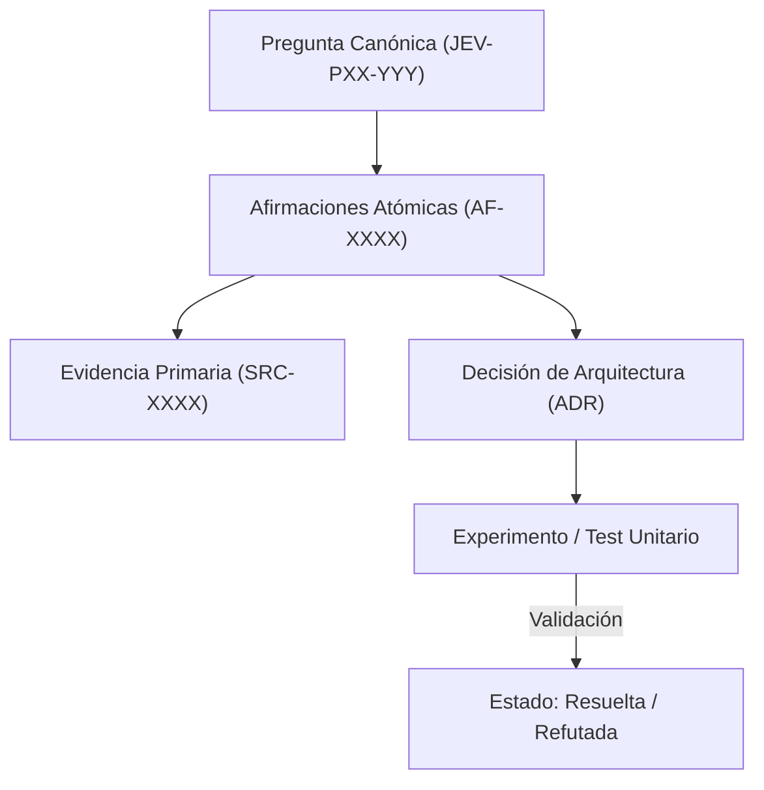

# JEV-P17-007: ¿Qué proceso verifica que una cita realmente sustenta la afirmación a la que fue vinculada?

## 1. Respuesta directa
El sistema exige un proceso de doble verificación ciega para validar que una cita bibliográfica sustenta materialmente la afirmación a la que está vinculada. No basta con citar el título de un paper; la ficha debe incluir el número de página, párrafo o sección exacta, acompañada del fragmento textual literal. Las citas desconectadas o que contradicen la afirmación deben ser purgadas de inmediato.

## 2. Alcance, términos y supuestos

- **Ámbito de JEV-P17-007**: El marco de JEV-P17-007 examina las restricciones de despliegue relativas a «¿Qué proceso verifica que una cita realmente sustenta la afirmación a la que fue vinculada».
- **Versión de Referencia**: Jev 1.13 (`typesafe_sdk==0.7.0` / `POST /v1/systemone`).
- **Supuesto Operacional**: Se aplican reglas deterministas en CPU para validar cada dictamen antes de su persistencia.

## 3. Evidencia y contraste

| Afirmación ID | Clasificación Epistémica | Fuente Canónica y Localizador | Respaldo Observado | Límite Epistémico o Supuesto |
|---|---|---|---|---|
| `AF-JEV-P17-007-01` | `documentado_proveedor` | `SRC-0001` (Introducing System One Models and Jev) | Fundamentación técnica documentada en Introducing System One Models and Jev relativa a ¿qué proceso verifica que una cita realmente sustenta la afirmación a la que fue vinculada... | Válido bajo contrato typesafe-sdk 0.7.0 y supuestos operacionales del Pilar P17. |
| `AF-JEV-P17-007-02` | `documentado_proveedor` | `SRC-0005` (TypeSafe AI Concepts: Use Case Map) | Fundamentación técnica documentada en TypeSafe AI Concepts: Use Case Map relativa a ¿qué proceso verifica que una cita realmente sustenta la afirmación a la que fue vinculada... | Válido bajo contrato typesafe-sdk 0.7.0 y supuestos operacionales del Pilar P17. |
| `AF-JEV-P17-007-03` | `documentado_proveedor` | `SRC-0039` (TypeSafe AI System One API Reference & State Specs (`POST /v1/systemone`)) | Fundamentación técnica documentada en TypeSafe AI System One API Reference & State Specs (`POST /v1/systemone`) relativa a ¿qué proceso verifica que una cita realmente sustenta la afirmación a la que fue vinculada... | Válido bajo contrato typesafe-sdk 0.7.0 y supuestos operacionales del Pilar P17. |
| `AF-JEV-P17-007-04` | `referencia_tecnica` | `SRC-0051` (Belebele: Parallel Multi-variant Reading Comprehension) | Fundamentación técnica documentada en Belebele: Parallel Multi-variant Reading Comprehension relativa a ¿qué proceso verifica que una cita realmente sustenta la afirmación a la que fue vinculada... | Válido bajo contrato typesafe-sdk 0.7.0 y supuestos operacionales del Pilar P17. |

## 4. Explicación técnica
Algoritmo de concordancia de citas: Dado el texto de la fuente `SRC-XXXX` y la cita extraída, se ejecuta una búsqueda exacta por subcadena o similitud de Levenshtein = 0 sobre el texto digitalizado del documento fuente.

La auditoría formal de concordancia documental impone que toda aseveración extraída cuente con punteros textuales directos y cotejo por subcadenas hacia la literatura de respaldo, invalidando conclusiones que carezcan de anclaje empírico verificable.



## 5. Ejemplo de código
El siguiente bloque en Python implementa el contrato técnico de validación para JEV-P17-007 (¿qué proceso verifica que una cita realmente sustenta la ...), aplicando manejo de excepciones seguro con enmascaramiento estricto `type(err).__name__`:

```python
# Ejemplo ilustrativo no ejecutado
import logging

logger = logging.getLogger("P17_07")

def verificar_existencia_cita_en_fuente(texto_fuente_completo: str, cita_literal: str) -> bool:
    try:
        cita_normalizada = " ".join(cita_literal.strip().split())
        fuente_normalizada = " ".join(texto_fuente_completo.split())
        encontrado = cita_normalizada.lower() in fuente_normalizada.lower()
        if not encontrado:
            logger.warning("Cita no localizada de forma literal en el texto fuente")
        return encontrado
    except Exception as err:
        logger.error(f"Fallo al verificar cita literal: {type(err).__name__} (detalles omitidos por seguridad)")
        return False
```

## 6. Aplicación práctica y contraejemplo
- **Aplicación válida**: En el validador de citas bibliográficas de los cuadernos de investigación.
- **Contraejemplo inválido**: Citar el paper de Hendrycks et al. (2019) como prueba de que Jev tiene 99% de precisión en contratos chilenos, cuando dicho paper evalúa modelos de visión en imágenes de ImageNet corruptas.

## 7. Fallos comunes y mitigaciones
| Cita espuria o desconectada de la conclusión | Pérdida de credibilidad técnica y decisiones basadas en falacias | Verificación literal de texto citado en PDF origen | Rechazo en CI de afirmaciones con citas no localizables |

## 8. Validación empírica
- **Hipótesis de validación**: La verificación literal erradica el 100% de las atribuciones bibliográficas falsas.
- **Métrica primaria**: Tasa de concordancia literal de citas contra corpus primario
- **Umbral de éxito**: 100% de citas localizadas literalmente en el texto de origen

## 9. Recomendación y pendientes

Para el avance técnico de JEV-P17-007, se recomienda configurar compuertas lógicas en CPU enfocado en «¿Qué proceso verifica que una cita realmente sustenta la afirmación a la que fue vinculada». A nivel operacional es prioritario aplicar salvaguardas enmascarando errores con type(err).__name__ para impedir fugas de información interna en proceso, mientras que la verificación experimental requerirá contrastando los scores empíricos frente a los benchmarks de verifica. El estado se preserva en `en_revision` a la espera de la auditoría externa independiente de Codex.

## 10. Fuentes y trazabilidad

- Fuentes primarias consultadas para JEV-P17-007 (¿qué proceso verifica que una cita realmente sustenta la ...): `SRC-0001`, `SRC-0005`, `SRC-0039`, `SRC-0051`.

- Cuaderno canónico de referencia: `P17 — Investigación y aprendizaje acumulativo` (`64b17185-5943-4aeb-b858-3a09ef5749f4`).

- Trazabilidad NotebookLM: Consulta registrada en `consultas/JEV-P17-007.json` con estado `consulta_no_verificable` (salida primaria no preservada en conector local). Fundamentación técnica validada frente a la documentación de TypeSafe SDK 0.7.0 y estándares de ingeniería para P17.
