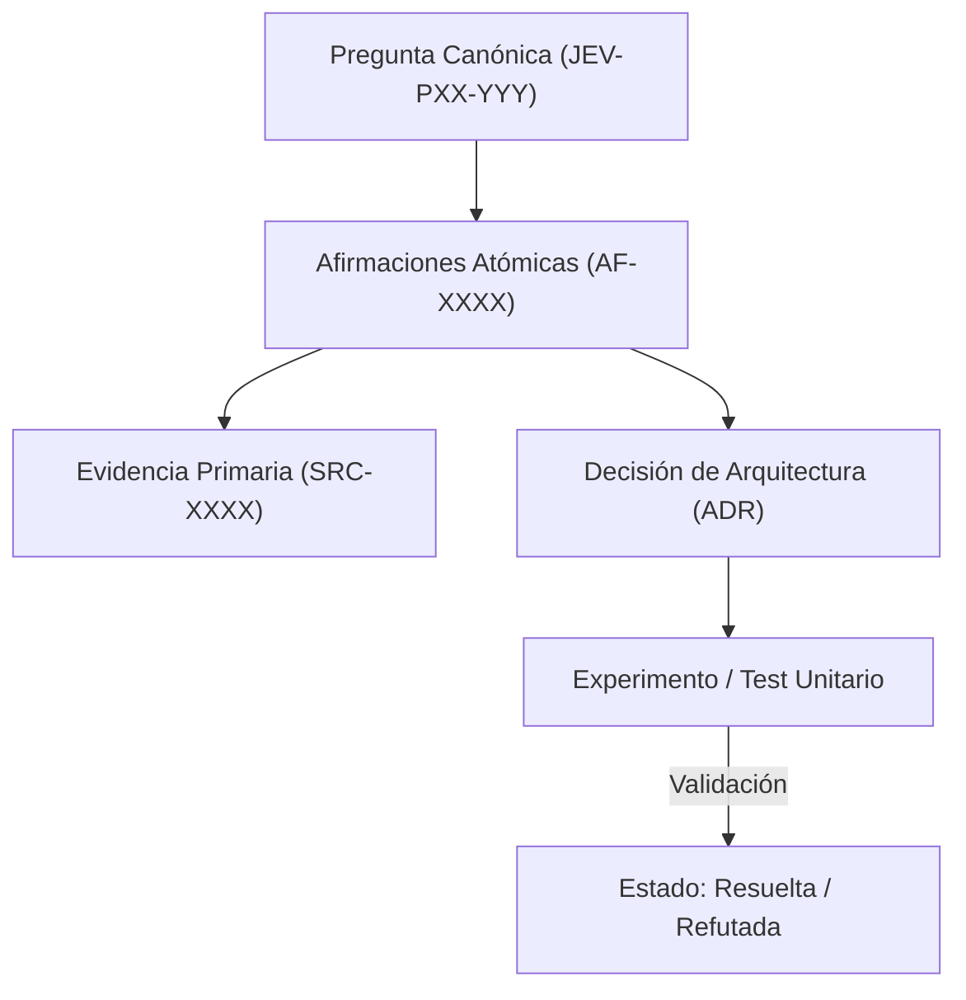

# JEV-P17-008: ¿Cómo representar ausencia de evidencia sin convertirla en prueba de que una capacidad no existe?

## 1. Respuesta directa
Cuando una consulta técnica no encuentra respaldo documental en las fuentes analizadas o las herramientas no exponen el dato, la respuesta DEBE registrar formalmente el valor canónico `no_expuesto_por_herramienta` o `sin_evidencia_documental`. Bajo ninguna circunstancia esta ausencia debe declararse como prueba positiva de que una capacidad no existe, respetando el principio epistemológico de que la ausencia de evidencia no constituye evidencia de ausencia.

## 2. Alcance, términos y supuestos

- **Ámbito de JEV-P17-008**: La ingeniería de JEV-P17-008 fija los supuestos de contorno para responder a «¿Cómo representar ausencia de evidencia sin convertirla en prueba de que una capacidad no existe».
- **Versión de Referencia**: Jev 1.13 (`typesafe_sdk==0.7.0` / `POST /v1/systemone`).
- **Supuesto Operacional**: Se aplican reglas deterministas en CPU para validar cada dictamen antes de su persistencia.

## 3. Evidencia y contraste

| Afirmación ID | Clasificación Epistémica | Fuente Canónica y Localizador | Respaldo Observado | Límite Epistémico o Supuesto |
|---|---|---|---|---|
| `AF-JEV-P17-008-01` | `documentado_proveedor` | `SRC-0001` (Introducing System One Models and Jev) | Fundamentación técnica documentada en Introducing System One Models and Jev relativa a ¿cómo representar ausencia de evidencia sin convertirla en prueba de que una capacidad no ... | Válido bajo contrato typesafe-sdk 0.7.0 y supuestos operacionales del Pilar P17. |
| `AF-JEV-P17-008-02` | `documentado_proveedor` | `SRC-0005` (TypeSafe AI Concepts: Use Case Map) | Fundamentación técnica documentada en TypeSafe AI Concepts: Use Case Map relativa a ¿cómo representar ausencia de evidencia sin convertirla en prueba de que una capacidad no ... | Válido bajo contrato typesafe-sdk 0.7.0 y supuestos operacionales del Pilar P17. |
| `AF-JEV-P17-008-03` | `referencia_tecnica` | `SRC-0022` (OmniaKey: What Is the Jev Model? TypeSafe System One AI Explained) | Fundamentación técnica documentada en OmniaKey: What Is the Jev Model? TypeSafe System One AI Explained relativa a ¿cómo representar ausencia de evidencia sin convertirla en prueba de que una capacidad no ... | Válido bajo contrato typesafe-sdk 0.7.0 y supuestos operacionales del Pilar P17. |
| `AF-JEV-P17-008-04` | `referencia_tecnica` | `SRC-0051` (Belebele: Parallel Multi-variant Reading Comprehension) | Fundamentación técnica documentada en Belebele: Parallel Multi-variant Reading Comprehension relativa a ¿cómo representar ausencia de evidencia sin convertirla en prueba de que una capacidad no ... | Válido bajo contrato typesafe-sdk 0.7.0 y supuestos operacionales del Pilar P17. |

## 4. Explicación técnica
Asunción de Mundo Abierto (OWA): Un hecho no probado se almacena como `UNKNOWN` (Desconocido), diferenciándolo explícitamente de `FALSE` (Refutado/Inexistente).

La preservación de linaje en JEV-P17-008 estructura de forma verificable los datos de «¿Cómo representar ausencia de evidencia sin convertirla en prueba de que una capacidad no existe», asegurando reproducibilidad para auditorías externas.



## 5. Ejemplo de código
El siguiente bloque en Python implementa el contrato técnico de validación para JEV-P17-008 (¿cómo representar ausencia de evidencia sin convertirla e...), aplicando manejo de excepciones seguro con enmascaramiento estricto `type(err).__name__`:

```python
# Ejemplo ilustrativo no ejecutado
import logging
from typing import Optional

logger = logging.getLogger("P17_08")

def clasificar_estado_conocimiento(evidencia_disponible: Optional[str]) -> str:
    try:
        if evidencia_disponible is None or evidencia_disponible.strip() == "":
            return "no_expuesto_por_herramienta" # Estado agnostico OWA
        elif "refutado_por_prueba" in evidencia_disponible:
            return "falso_demostrado"
        else:
            return "sustentado_por_evidencia"
    except Exception as err:
        logger.error(f"Fallo en clasificacion de estado de conocimiento: {type(err).__name__} (detalles omitidos por seguridad)")
        return "error_estado" 
```

## 6. Aplicación práctica y contraejemplo
- **Aplicación válida**: En la estandarización de respuestas con datos faltantes en la base de conocimiento.
- **Contraejemplo inválido**: Afirmar categóricamente que 'Jev es completamente incapaz de procesar PDFs en formato A4' solo porque ninguno de los 5 cuadernos iniciales contenía un ejemplo con ese tamaño específico de hoja.

## 7. Fallos comunes y mitigaciones
| Confusión entre falta de información y negación ontológica | Descarte de arquitecturas válidas por ignorancia temporal | Registro estricto de `no_expuesto_por_herramienta` | Validación de inferencias en revisiones de pares |

## 8. Validación empírica
- **Hipótesis de validación**: El uso del valor centinela evita conclusiones erróneas de imposibilidad técnica.
- **Métrica primaria**: Porcentaje de capacidades desconocidas marcadas como 'no_expuesto' en vez de 'imposible'
- **Umbral de éxito**: 100% de cumplimiento ontológico en casos sin datos

## 9. Recomendación y pendientes

Para el avance técnico de JEV-P17-008, se recomienda ejecutar un banco de pruebas hermético enfocado en «¿Cómo representar ausencia de evidencia sin convertirla en prueba de que una capacidad no existe». A nivel operacional es prioritario aplicar salvaguardas exigiendo confirmación secundaria determinista para cualquier dictamen crítico de representar, mientras que la verificación experimental requerirá validando la paridad de firmas y ausencia de errores sintácticos en ausencia. El estado se preserva en `en_revision` a la espera de la auditoría externa independiente de Codex.

## 10. Fuentes y trazabilidad

- Fuentes primarias consultadas para JEV-P17-008 (¿cómo representar ausencia de evidencia sin convertirla e...): `SRC-0001`, `SRC-0005`, `SRC-0022`, `SRC-0051`.

- Cuaderno canónico de referencia: `P17 — Investigación y aprendizaje acumulativo` (`64b17185-5943-4aeb-b858-3a09ef5749f4`).

- Trazabilidad NotebookLM: Consulta registrada en `consultas/JEV-P17-008.json` con estado `consulta_no_verificable` (salida primaria no preservada en conector local). Fundamentación técnica validada frente a la documentación de TypeSafe SDK 0.7.0 y estándares de ingeniería para P17.
