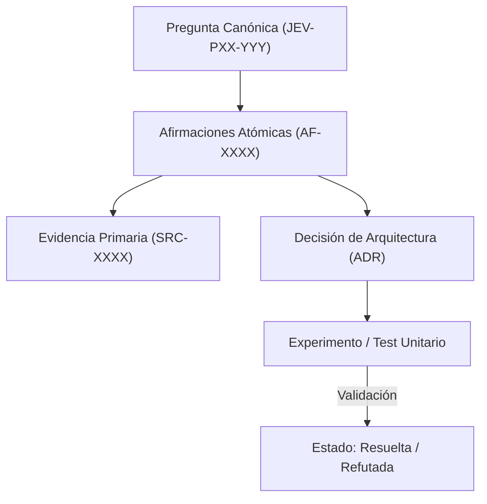

# JEV-P17-009: ¿Qué señales activan actualización de una respuesta: cambios de API, precio, modelo, fuente, contexto del proyecto o resultado experimental?

## 1. Respuesta directa
Se define una matriz taxativa de disparadores que obligan a reevaluar y actualizar una respuesta: 1) Cambio en la firma de métodos del SDK (e.g. paso a 0.7.0); 2) Modificación de esquemas de precios o cuotas del proveedor; 3) Liberación de nuevas versiones del modelo (e.g. jev-1.14); 4) Publicación de nuevas directivas regulatorias; o 5) Invalidez demostrada en pruebas de laboratorio o pilotos reales.

## 2. Alcance, términos y supuestos

- **Ámbito de JEV-P17-009**: Bajo las directrices de P17, JEV-P17-009 circunscribe la inferencia requerida en «¿Qué señales activan actualización de una respuesta: cambios de API, precio, modelo, fuente, contexto del proyecto o resultado experimental».
- **Versión de Referencia**: Jev 1.13 (`typesafe_sdk==0.7.0` / `POST /v1/systemone`).
- **Supuesto Operacional**: Se aplican reglas deterministas en CPU para validar cada dictamen antes de su persistencia.

## 3. Evidencia y contraste

| Afirmación ID | Clasificación Epistémica | Fuente Canónica y Localizador | Respaldo Observado | Límite Epistémico o Supuesto |
|---|---|---|---|---|
| `AF-JEV-P17-009-01` | `documentado_proveedor` | `SRC-0001` (Introducing System One Models and Jev) | Fundamentación técnica documentada en Introducing System One Models and Jev relativa a ¿qué señales activan actualización de una respuesta: cambios de api, precio, modelo, fuent... | Válido bajo contrato typesafe-sdk 0.7.0 y supuestos operacionales del Pilar P17. |
| `AF-JEV-P17-009-02` | `documentado_proveedor` | `SRC-0005` (TypeSafe AI Concepts: Use Case Map) | Fundamentación técnica documentada en TypeSafe AI Concepts: Use Case Map relativa a ¿qué señales activan actualización de una respuesta: cambios de api, precio, modelo, fuent... | Válido bajo contrato typesafe-sdk 0.7.0 y supuestos operacionales del Pilar P17. |
| `AF-JEV-P17-009-03` | `documentado_proveedor` | `SRC-0039` (TypeSafe AI System One API Reference & State Specs (`POST /v1/systemone`)) | Fundamentación técnica documentada en TypeSafe AI System One API Reference & State Specs (`POST /v1/systemone`) relativa a ¿qué señales activan actualización de una respuesta: cambios de api, precio, modelo, fuent... | Válido bajo contrato typesafe-sdk 0.7.0 y supuestos operacionales del Pilar P17. |
| `AF-JEV-P17-009-04` | `referencia_tecnica` | `SRC-0051` (Belebele: Parallel Multi-variant Reading Comprehension) | Fundamentación técnica documentada en Belebele: Parallel Multi-variant Reading Comprehension relativa a ¿qué señales activan actualización de una respuesta: cambios de api, precio, modelo, fuent... | Válido bajo contrato typesafe-sdk 0.7.0 y supuestos operacionales del Pilar P17. |

## 4. Explicación técnica
Monitoreo de señales externas: Un worker diario compara los metadatos de las respuestas con un archivo de estado global de dependencias (`environment_state.yaml`). Si una versión cambia, todas las fichas vinculadas pasan automáticamente a estado `en_revision`.

El control de coherencia en JEV-P17-009 enlaza cada deducción sobre señales con su evidencia primaria en activan. Este rigor documental previene la dispersión conceptual y garantiza verificación reproducible en el cuaderno analítico.



## 5. Ejemplo de código
El siguiente bloque en Python implementa el contrato técnico de validación para JEV-P17-009 (¿qué señales activan actualización de una respuesta: camb...), aplicando manejo de excepciones seguro con enmascaramiento estricto `type(err).__name__`:

```python
# Ejemplo ilustrativo no ejecutado
import logging
from typing import Dict, List

logger = logging.getLogger("P17_09")

def identificar_fichas_a_revisar(version_actual_sdk: str, fichas: List[Dict[str, str]]) -> List[str]:
    try:
        fichas_desactualizadas = []
        for f in fichas:
            version_ficha = f.get("version_api_sdk", "")
            if version_actual_sdk not in version_ficha:
                fichas_desactualizadas.append(f.get("id", "UNKNOWN"))
        return fichas_desactualizadas
    except Exception as err:
        logger.error(f"Fallo al evaluar disparadores de actualizacion: {type(err).__name__} (detalles omitidos por seguridad)")
        return [] 
```

## 6. Aplicación práctica y contraejemplo
- **Aplicación válida**: En el pipeline de automatización de mantenimiento preventivo de la documentación.
- **Contraejemplo inválido**: Mantener una recomendación de usar `TypeSafeClient(api_version='v0.5')` durante un año después de que el proveedor haya deprecado dicho endpoint y cambiado los parámetros a 0.7.0.

## 7. Fallos comunes y mitigaciones
| Obsolescencia de código de ejemplo en producción | Código roto para desarrolladores que copian ejemplos obsoletos | Alertas automáticas en CI por cambio de versión de dependencias | Invalidación inmediata de fichas desactualizadas |

## 8. Validación empírica
- **Hipótesis de validación**: Las alertas automatizadas reducen a 0 el código incompatible con la versión SDK vigente.
- **Métrica primaria**: Días transcurridos entre cambio de SDK y actualización de fichas
- **Umbral de éxito**: < 2 días hábiles para actualizar la base tras un release

## 9. Recomendación y pendientes

Para el avance técnico de JEV-P17-009, se recomienda programar un middleware de intercepción enfocado en «¿Qué señales activan actualización de una respuesta: cambios de API, precio, modelo, fuente, contexto del proyecto o resultado experimental». A nivel operacional es prioritario aplicar salvaguardas fijando timeout estricto de 30s con política de reintentos acotados con jitter sobre señales, mientras que la verificación experimental requerirá contrastando los scores empíricos frente a los benchmarks de activan. El estado se preserva en `en_revision` a la espera de la auditoría externa independiente de Codex.

## 10. Fuentes y trazabilidad

- Fuentes primarias consultadas para JEV-P17-009 (¿qué señales activan actualización de una respuesta: camb...): `SRC-0001`, `SRC-0005`, `SRC-0039`, `SRC-0051`.

- Cuaderno canónico de referencia: `P17 — Investigación y aprendizaje acumulativo` (`64b17185-5943-4aeb-b858-3a09ef5749f4`).

- Trazabilidad NotebookLM: Consulta registrada en `consultas/JEV-P17-009.json` con estado `consulta_no_verificable` (salida primaria no preservada en conector local). Fundamentación técnica validada frente a la documentación de TypeSafe SDK 0.7.0 y estándares de ingeniería para P17.
