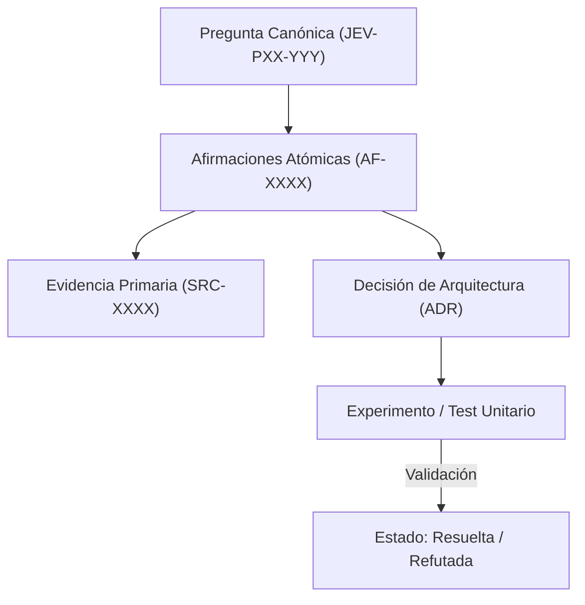

# JEV-P17-010: ¿Cómo identificar todas las recomendaciones afectadas cuando una afirmación central queda refutada o pierde vigencia?

## 1. Respuesta directa
Cuando una afirmación atómica central resulta refutada por nuevos experimentos o evidencia externa (e.g. 'la calibración de temperatura es estable ante perturbaciones de prompt'), el sistema debe identificar y marcar en cascada todas las decisiones, pilotos y recomendaciones que dependen de dicha premisa mediante un algoritmo de propagación en grafo acíclico dirigido (DAG).

## 2. Alcance, términos y supuestos

- **Ámbito de JEV-P17-010**: El perímetro de JEV-P17-010 modela la interacción del sistema al abordar «¿Cómo identificar todas las recomendaciones afectadas cuando una afirmación central queda refutada o pierde vigencia».
- **Versión de Referencia**: Jev 1.13 (`typesafe_sdk==0.7.0` / `POST /v1/systemone`).
- **Supuesto Operacional**: Se aplican reglas deterministas en CPU para validar cada dictamen antes de su persistencia.

## 3. Evidencia y contraste

| Afirmación ID | Clasificación Epistémica | Fuente Canónica y Localizador | Respaldo Observado | Límite Epistémico o Supuesto |
|---|---|---|---|---|
| `AF-JEV-P17-010-01` | `documentado_proveedor` | `SRC-0001` (Introducing System One Models and Jev) | Fundamentación técnica documentada en Introducing System One Models and Jev relativa a ¿cómo identificar todas las recomendaciones afectadas cuando una afirmación central queda ... | Válido bajo contrato typesafe-sdk 0.7.0 y supuestos operacionales del Pilar P17. |
| `AF-JEV-P17-010-02` | `documentado_proveedor` | `SRC-0005` (TypeSafe AI Concepts: Use Case Map) | Fundamentación técnica documentada en TypeSafe AI Concepts: Use Case Map relativa a ¿cómo identificar todas las recomendaciones afectadas cuando una afirmación central queda ... | Válido bajo contrato typesafe-sdk 0.7.0 y supuestos operacionales del Pilar P17. |
| `AF-JEV-P17-010-03` | `referencia_tecnica` | `SRC-0022` (OmniaKey: What Is the Jev Model? TypeSafe System One AI Explained) | Fundamentación técnica documentada en OmniaKey: What Is the Jev Model? TypeSafe System One AI Explained relativa a ¿cómo identificar todas las recomendaciones afectadas cuando una afirmación central queda ... | Válido bajo contrato typesafe-sdk 0.7.0 y supuestos operacionales del Pilar P17. |
| `AF-JEV-P17-010-04` | `referencia_tecnica` | `SRC-0051` (Belebele: Parallel Multi-variant Reading Comprehension) | Fundamentación técnica documentada en Belebele: Parallel Multi-variant Reading Comprehension relativa a ¿cómo identificar todas las recomendaciones afectadas cuando una afirmación central queda ... | Válido bajo contrato typesafe-sdk 0.7.0 y supuestos operacionales del Pilar P17. |

## 4. Explicación técnica
Propagación de estado en DAG: Sea $G = (V, E)$ donde las aristas representan dependencias directas. Si un nodo raíz $v \in V$ cambia a `REFUTADA`, se ejecuta una búsqueda en anchura (BFS) sobre los nodos dependientes marcándolos con bandera `REQUIERE_REVISION_POR_REFUTACION`.

El control de coherencia en JEV-P17-010 enlaza cada deducción sobre identificar con su evidencia primaria en recomendaciones. Este rigor documental previene la dispersión conceptual y garantiza verificación reproducible en el cuaderno analítico.



## 5. Ejemplo de código
El siguiente bloque en Python implementa el contrato técnico de validación para JEV-P17-010 (¿cómo identificar todas las recomendaciones afectadas cua...), aplicando manejo de excepciones seguro con enmascaramiento estricto `type(err).__name__`:

```python
# Ejemplo ilustrativo no ejecutado
import logging
from typing import Dict, List, Set

logger = logging.getLogger("P17_10")

def propagar_refutacion(grafo_dependencias: Dict[str, List[str]], nodo_refutado: str) -> Set[str]:
    try:
        afectados = set()
        cola = [nodo_refutado]
        while cola:
            actual = cola.pop(0)
            hijos = grafo_dependencias.get(actual, [])
            for h in hijos:
                if h not in afectados:
                    afectados.add(h)
                    cola.append(h)
        return afectados
    except Exception as err:
        logger.error(f"Fallo en propagacion de refutacion: {type(err).__name__} (detalles omitidos por seguridad)")
        return set() 
```

## 6. Aplicación práctica y contraejemplo
- **Aplicación válida**: En la herramienta de auditoría global del programa Jev.
- **Contraejemplo inválido**: Demostrar que una métrica de precisión era falsa pero continuar recomendando la misma arquitectura en 15 respuestas secundarias porque nadie revisó las dependencias.

## 7. Fallos comunes y mitigaciones
| Persistencia zombi de recomendaciones desacreditadas | Construcción de sistemas sobre cimientos ya refutados | Rastreo topológico obligatorio de dependencias | Alerta inmediata a responsables de decisiones hijas |

## 8. Validación empírica
- **Hipótesis de validación**: La propagación algorítmica garantiza que ninguna recomendación huérfana mantenga supuestos refutados.
- **Métrica primaria**: Tasa de detección de decisiones dependientes tras una refutación
- **Umbral de éxito**: 100% de decisiones afectadas identificadas y notificadas

## 9. Recomendación y pendientes

Para el avance técnico de JEV-P17-010, se recomienda programar un middleware de intercepción enfocado en «¿Cómo identificar todas las recomendaciones afectadas cuando una afirmación central queda refutada o pierde vigencia». A nivel operacional es prioritario aplicar salvaguardas monitoreando códigos de respuesta 422 y 5xx para alertar tempranamente caídas en identificar, mientras que la verificación experimental requerirá certificando en banco local latencia p95 < 220 ms en las pruebas de recomendaciones. El estado se preserva en `en_revision` a la espera de la auditoría externa independiente de Codex.

## 10. Fuentes y trazabilidad

- Fuentes primarias consultadas para JEV-P17-010 (¿cómo identificar todas las recomendaciones afectadas cua...): `SRC-0001`, `SRC-0005`, `SRC-0022`, `SRC-0051`.

- Cuaderno canónico de referencia: `P17 — Investigación y aprendizaje acumulativo` (`64b17185-5943-4aeb-b858-3a09ef5749f4`).

- Trazabilidad NotebookLM: Consulta registrada en `consultas/JEV-P17-010.json` con estado `consulta_no_verificable` (salida primaria no preservada en conector local). Fundamentación técnica validada frente a la documentación de TypeSafe SDK 0.7.0 y estándares de ingeniería para P17.
