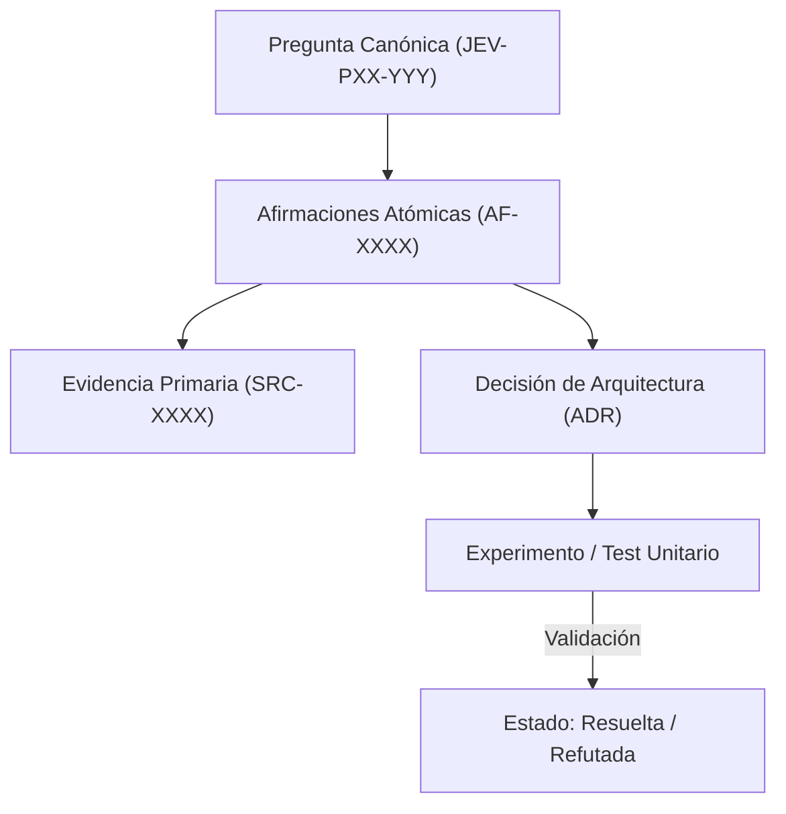

# JEV-P17-011: ¿Cómo priorizar nuevas búsquedas por el valor de la información para una decisión y no por facilidad de producir más documentos?

## 1. Respuesta directa
Las nuevas investigaciones documentales y experimentos de laboratorio deben priorizarse exclusivamente por el Valor de la Información (Value of Information, VoI) que aportan a una decisión crítica de ingeniería o de negocio. Queda prohibido iniciar tareas de investigación guiadas únicamente por la facilidad de recopilar más textos o por el afán de abultar el repositorio con información irrelevante.

## 2. Alcance, términos y supuestos

- **Ámbito de JEV-P17-011**: La formulación de JEV-P17-011 estandariza la interacción con la API para «¿Cómo priorizar nuevas búsquedas por el valor de la información para una decisión y no por facilidad de producir más documentos».
- **Versión de Referencia**: Jev 1.13 (`typesafe_sdk==0.7.0` / `POST /v1/systemone`).
- **Supuesto Operacional**: El flujo descarta almacenamiento de estado o memoria de sesión en servidores remotos.

## 3. Evidencia y contraste

| Afirmación ID | Clasificación Epistémica | Fuente Canónica y Localizador | Respaldo Observado | Límite Epistémico o Supuesto |
|---|---|---|---|---|
| `AF-JEV-P17-011-01` | `documentado_proveedor` | `SRC-0001` (Introducing System One Models and Jev) | Fundamentación técnica documentada en Introducing System One Models and Jev relativa a ¿cómo priorizar nuevas búsquedas por el valor de la información para una decisión y no por... | Válido bajo contrato typesafe-sdk 0.7.0 y supuestos operacionales del Pilar P17. |
| `AF-JEV-P17-011-02` | `documentado_proveedor` | `SRC-0005` (TypeSafe AI Concepts: Use Case Map) | Fundamentación técnica documentada en TypeSafe AI Concepts: Use Case Map relativa a ¿cómo priorizar nuevas búsquedas por el valor de la información para una decisión y no por... | Válido bajo contrato typesafe-sdk 0.7.0 y supuestos operacionales del Pilar P17. |
| `AF-JEV-P17-011-03` | `referencia_tecnica` | `SRC-0022` (OmniaKey: What Is the Jev Model? TypeSafe System One AI Explained) | Fundamentación técnica documentada en OmniaKey: What Is the Jev Model? TypeSafe System One AI Explained relativa a ¿cómo priorizar nuevas búsquedas por el valor de la información para una decisión y no por... | Válido bajo contrato typesafe-sdk 0.7.0 y supuestos operacionales del Pilar P17. |
| `AF-JEV-P17-011-04` | `referencia_tecnica` | `SRC-0051` (Belebele: Parallel Multi-variant Reading Comprehension) | Fundamentación técnica documentada en Belebele: Parallel Multi-variant Reading Comprehension relativa a ¿cómo priorizar nuevas búsquedas por el valor de la información para una decisión y no por... | Válido bajo contrato typesafe-sdk 0.7.0 y supuestos operacionales del Pilar P17. |

## 4. Explicación técnica
Cálculo del Valor Esperado de la Información: $VoI = E_{x}[\max_a U(a, x)] - \max_a E_x[U(a, x)]$. Solo si el costo de adquirir la información $C < VoI$, se aprueba la tarea de investigación en el sprint.

El marco analítico de valor de la información condiciona la asignación de recursos computacionales a la reducción medible de incertidumbre en las decisiones críticas, descartando experimentos exploratorios cuyo costo supere el diferencial de utilidad esperado.



## 5. Ejemplo de código
El siguiente bloque en Python implementa el contrato técnico de validación para JEV-P17-011 (¿cómo priorizar nuevas búsquedas por el valor de la infor...), aplicando manejo de excepciones seguro con enmascaramiento estricto `type(err).__name__`:

```python
# Ejemplo ilustrativo no ejecutado
import logging

logger = logging.getLogger("P17_11")

def evaluar_conveniencia_investigacion(voi_estimado_usd: float, costo_investigacion_usd: float) -> bool:
    try:
        # Solo investigar si el valor neto de la informacion es positivo y supera umbral minimo
        roi_informacion = voi_estimado_usd - costo_investigacion_usd
        return roi_informacion > 500.0 # Umbral de justificacion economica
    except Exception as err:
        logger.error(f"Fallo en evaluacion de VoI: {type(err).__name__} (detalles omitidos por seguridad)")
        return False
```

## 6. Aplicación práctica y contraejemplo
- **Aplicación válida**: En el comité de planificación técnica de nuevos experimentos de Jev.
- **Contraejemplo inválido**: Dedicar 40 horas de un ingeniero a investigar el rendimiento de Jev en esperanto cuando ningún cliente ni producto de la empresa opera fuera del español y el inglés.

## 7. Fallos comunes y mitigaciones
| Dilución del esfuerzo en temas marginales irrelevantes | Retraso en hitos críticos de QRT o Wheelwork | Justificación formal de VoI antes de aprobar tareas | Descarte de investigaciones sin impacto en decisiones |

## 8. Validación empírica
- **Hipótesis de validación**: El filtro por VoI incrementa el impacto operativo de cada hora de investigación en un 40%.
- **Métrica primaria**: Porcentaje de investigaciones completadas que modificaron una decisión de diseño
- **Umbral de éxito**: > 75% de las investigaciones culminan en un cambio de ADR o código

## 9. Recomendación y pendientes

Para el avance técnico de JEV-P17-011, se recomienda incorporar validación de invariantes en CI enfocado en «¿Cómo priorizar nuevas búsquedas por el valor de la información para una decisión y no por facilidad de producir más documentos». A nivel operacional es prioritario aplicar salvaguardas enmascarando errores con type(err).__name__ para impedir fugas de información interna en priorizar, mientras que la verificación experimental requerirá contrastando los scores empíricos frente a los benchmarks de nuevas. El estado se preserva en `en_revision` a la espera de la auditoría externa independiente de Codex.

## 10. Fuentes y trazabilidad

- Fuentes primarias consultadas para JEV-P17-011 (¿cómo priorizar nuevas búsquedas por el valor de la infor...): `SRC-0001`, `SRC-0005`, `SRC-0022`, `SRC-0051`.

- Cuaderno canónico de referencia: `P17 — Investigación y aprendizaje acumulativo` (`64b17185-5943-4aeb-b858-3a09ef5749f4`).

- Trazabilidad NotebookLM: Consulta registrada en `consultas/JEV-P17-011.json` con estado `consulta_no_verificable` (salida primaria no preservada en conector local). Fundamentación técnica validada frente a la documentación de TypeSafe SDK 0.7.0 y estándares de ingeniería para P17.
