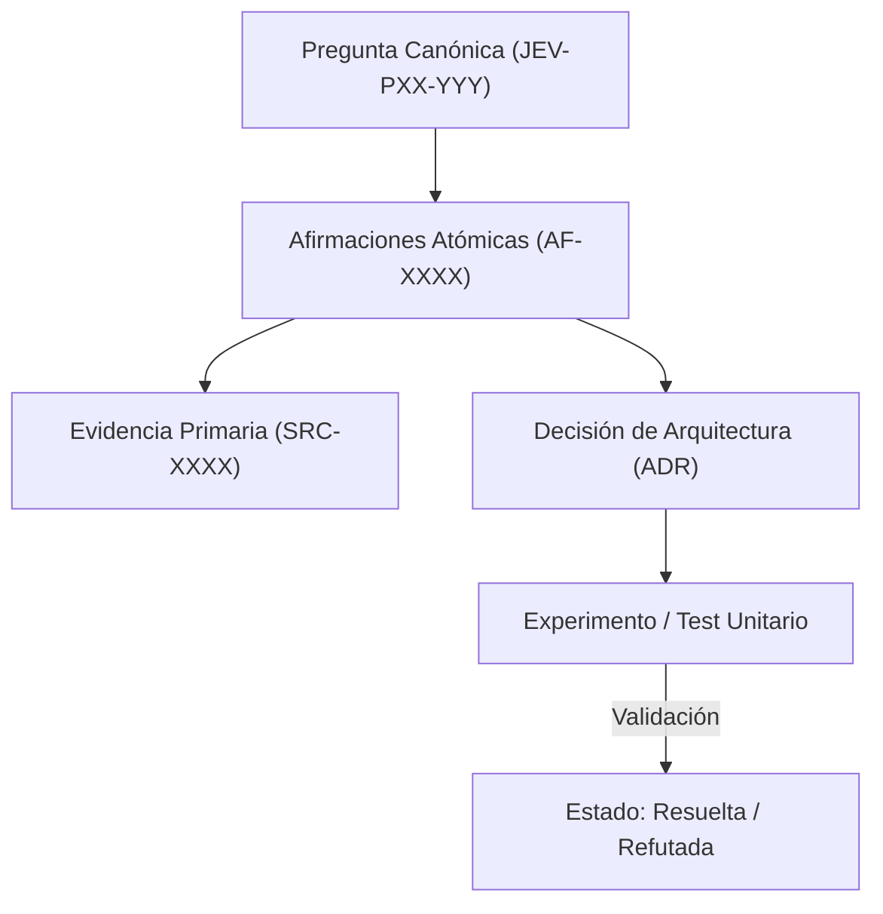

# JEV-P17-012: ¿Cómo usar desacuerdos y casos difíciles para elegir qué etiquetar o investigar después sin contaminar la evaluación final?

## 1. Respuesta directa
Las muestras donde el modelo muestra máxima incertidumbre ($p \approx 0.50$) o donde discrepa fuertemente con expertos humanos deben aislarse para nutrir el backlog de aprendizaje activo y depuración de prompts. Sin embargo, para evitar el sobreajuste y la contaminación de la evaluación final, estas muestras NUNCA deben añadirse al conjunto de prueba dorado (Golden Test Set), el cual debe permanecer sellado e inmutable.

## 2. Alcance, términos y supuestos

- **Ámbito de JEV-P17-012**: En el contexto de P17, JEV-P17-012 audita los contratos necesarios para «¿Cómo usar desacuerdos y casos difíciles para elegir qué etiquetar o investigar después sin contaminar la evaluación final».
- **Versión de Referencia**: Jev 1.13 (`typesafe_sdk==0.7.0` / `POST /v1/systemone`).
- **Supuesto Operacional**: El flujo descarta almacenamiento de estado o memoria de sesión en servidores remotos.

## 3. Evidencia y contraste

| Afirmación ID | Clasificación Epistémica | Fuente Canónica y Localizador | Respaldo Observado | Límite Epistémico o Supuesto |
|---|---|---|---|---|
| `AF-JEV-P17-012-01` | `documentado_proveedor` | `SRC-0001` (Introducing System One Models and Jev) | Fundamentación técnica documentada en Introducing System One Models and Jev relativa a ¿cómo usar desacuerdos y casos difíciles para elegir qué etiquetar o investigar después si... | Válido bajo contrato typesafe-sdk 0.7.0 y supuestos operacionales del Pilar P17. |
| `AF-JEV-P17-012-02` | `documentado_proveedor` | `SRC-0005` (TypeSafe AI Concepts: Use Case Map) | Fundamentación técnica documentada en TypeSafe AI Concepts: Use Case Map relativa a ¿cómo usar desacuerdos y casos difíciles para elegir qué etiquetar o investigar después si... | Válido bajo contrato typesafe-sdk 0.7.0 y supuestos operacionales del Pilar P17. |
| `AF-JEV-P17-012-03` | `referencia_tecnica` | `SRC-0022` (OmniaKey: What Is the Jev Model? TypeSafe System One AI Explained) | Fundamentación técnica documentada en OmniaKey: What Is the Jev Model? TypeSafe System One AI Explained relativa a ¿cómo usar desacuerdos y casos difíciles para elegir qué etiquetar o investigar después si... | Válido bajo contrato typesafe-sdk 0.7.0 y supuestos operacionales del Pilar P17. |
| `AF-JEV-P17-012-04` | `referencia_tecnica` | `SRC-0051` (Belebele: Parallel Multi-variant Reading Comprehension) | Fundamentación técnica documentada en Belebele: Parallel Multi-variant Reading Comprehension relativa a ¿cómo usar desacuerdos y casos difíciles para elegir qué etiquetar o investigar después si... | Válido bajo contrato typesafe-sdk 0.7.0 y supuestos operacionales del Pilar P17. |

## 4. Explicación técnica
Estrategia de aislamiento de datos: Flujo de clasificación: Muestra con $0.40 \le p \le 0.60$ -> Enrutar a `pool_aprendizaje_activo`; Muestra con etiqueta humana validada -> Enrutar a `fine_tuning_o_few_shot_dataset`. Las métricas de reporte se calculan estrictamente sobre el `golden_benchmark_blind_v1` congelado.

La preservación de linaje en JEV-P17-012 estructura de forma verificable los datos de «¿Cómo usar desacuerdos y casos difíciles para elegir qué etiquetar o investigar después sin contaminar la evaluación final», asegurando reproducibilidad para auditorías externas.



## 5. Ejemplo de código
El siguiente bloque en Python implementa el contrato técnico de validación para JEV-P17-012 (¿cómo usar desacuerdos y casos difíciles para elegir qué ...), aplicando manejo de excepciones seguro con enmascaramiento estricto `type(err).__name__`:

```python
# Ejemplo ilustrativo no ejecutado
import logging
from typing import Dict, Any

logger = logging.getLogger("P17_12")

def clasificar_muestra_para_aprendizaje(p_valor: float, es_caso_dorado: bool) -> str:
    try:
        if es_caso_dorado:
            return "bloqueado_evaluacion_dorada_inmutable"
        incertidumbre = abs(p_valor - 0.5)
        if incertidumbre <= 0.10: # Casos borde de alta incertidumbre
            return "candidato_aprendizaje_activo"
        return "caso_resuelto_estándar"
    except Exception as err:
        logger.error(f"Fallo al clasificar muestra: {type(err).__name__} (detalles omitidos por seguridad)")
        return "error_clasificacion" 
```

## 6. Aplicación práctica y contraejemplo
- **Aplicación válida**: En la infraestructura de gestión de datasets de prueba y calibración.
- **Contraejemplo inválido**: Tomar los 20 contratos donde Jev se equivocó en el piloto, agregarlos al test suite de evaluación y reportar 100% de precisión al reejecutar el test suite sobre los mismos datos.

## 7. Fallos comunes y mitigaciones
| Contaminación de conjuntos de prueba con casos de entrenamiento | Falsa confianza en modelos que fallarán masivamente en datos reales | Sellado criptográfico de particiones de test | Auditoría de fuga de datos (Data Leakage) periódica |

## 8. Validación empírica
- **Hipótesis de validación**: El aislamiento estricto de conjuntos de prueba garantiza que la precisión reportada no sufra optimismo inflado.
- **Métrica primaria**: Diferencia de rendimiento entre Golden Test Suite y producción real
- **Umbral de éxito**: Divergencia de precisión < 3% entre laboratorio ciego y campo

## 9. Recomendación y pendientes

Para el avance técnico de JEV-P17-012, se recomienda calibrar la matriz de costos y abstención enfocado en «¿Cómo usar desacuerdos y casos difíciles para elegir qué etiquetar o investigar después sin contaminar la evaluación final». A nivel operacional es prioritario aplicar salvaguardas restringiendo la concurrencia a cuotas autorizadas para evitar penalizaciones en usar, mientras que la verificación experimental requerirá contrastando los scores empíricos frente a los benchmarks de desacuerdos. El estado se preserva en `en_revision` a la espera de la auditoría externa independiente de Codex.

## 10. Fuentes y trazabilidad

- Fuentes primarias consultadas para JEV-P17-012 (¿cómo usar desacuerdos y casos difíciles para elegir qué ...): `SRC-0001`, `SRC-0005`, `SRC-0022`, `SRC-0051`.

- Cuaderno canónico de referencia: `P17 — Investigación y aprendizaje acumulativo` (`64b17185-5943-4aeb-b858-3a09ef5749f4`).

- Trazabilidad NotebookLM: Consulta registrada en `consultas/JEV-P17-012.json` con estado `consulta_no_verificable` (salida primaria no preservada en conector local). Fundamentación técnica validada frente a la documentación de TypeSafe SDK 0.7.0 y estándares de ingeniería para P17.
