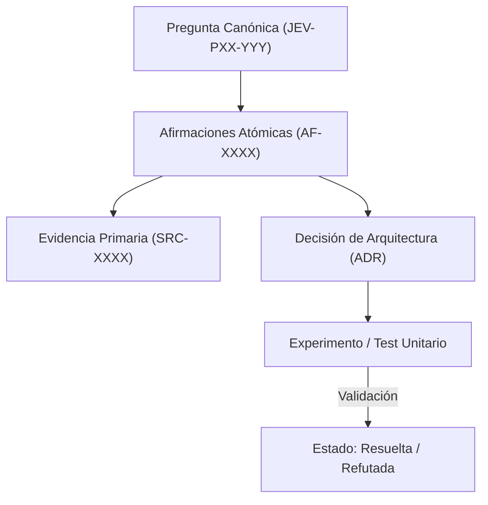

# JEV-P17-013: ¿Cómo integrar retroalimentación de pilotos conservando la diferencia entre un caso anecdótico y evidencia generalizable?

## 1. Respuesta directa
El feedback obtenido de los 6 pilotos canónicos (QRT-01, QRT-02, WW-01, WW-02, FP-01, NP-01) debe integrarse a la base de conocimiento bajo estrictos criterios estadísticos. Una queja o felicitación aislada de un usuario se clasifica como 'Caso Anecdótico ($N=1$)' y no autoriza cambios arquitectónicos globales. Solo patrones agregados con significancia estadística ($N \ge 100$, $p < 0.05$) fundamentan nuevas directrices generales.

## 2. Alcance, términos y supuestos

- **Ámbito de JEV-P17-013**: El análisis técnico de JEV-P17-013 formaliza el tratamiento de «¿Cómo integrar retroalimentación de pilotos conservando la diferencia entre un caso anecdótico y evidencia generalizable» en el Pilar P17.
- **Versión de Referencia**: Jev 1.13 (`typesafe_sdk==0.7.0` / `POST /v1/systemone`).
- **Supuesto Operacional**: El flujo descarta almacenamiento de estado o memoria de sesión en servidores remotos.

## 3. Evidencia y contraste

| Afirmación ID | Clasificación Epistémica | Fuente Canónica y Localizador | Respaldo Observado | Límite Epistémico o Supuesto |
|---|---|---|---|---|
| `AF-JEV-P17-013-01` | `documentado_proveedor` | `SRC-0001` (Introducing System One Models and Jev) | Fundamentación técnica documentada en Introducing System One Models and Jev relativa a ¿cómo integrar retroalimentación de pilotos conservando la diferencia entre un caso anecdó... | Válido bajo contrato typesafe-sdk 0.7.0 y supuestos operacionales del Pilar P17. |
| `AF-JEV-P17-013-02` | `documentado_proveedor` | `SRC-0005` (TypeSafe AI Concepts: Use Case Map) | Fundamentación técnica documentada en TypeSafe AI Concepts: Use Case Map relativa a ¿cómo integrar retroalimentación de pilotos conservando la diferencia entre un caso anecdó... | Válido bajo contrato typesafe-sdk 0.7.0 y supuestos operacionales del Pilar P17. |
| `AF-JEV-P17-013-03` | `referencia_tecnica` | `SRC-0022` (OmniaKey: What Is the Jev Model? TypeSafe System One AI Explained) | Fundamentación técnica documentada en OmniaKey: What Is the Jev Model? TypeSafe System One AI Explained relativa a ¿cómo integrar retroalimentación de pilotos conservando la diferencia entre un caso anecdó... | Válido bajo contrato typesafe-sdk 0.7.0 y supuestos operacionales del Pilar P17. |
| `AF-JEV-P17-013-04` | `referencia_tecnica` | `SRC-0051` (Belebele: Parallel Multi-variant Reading Comprehension) | Fundamentación técnica documentada en Belebele: Parallel Multi-variant Reading Comprehension relativa a ¿cómo integrar retroalimentación de pilotos conservando la diferencia entre un caso anecdó... | Válido bajo contrato typesafe-sdk 0.7.0 y supuestos operacionales del Pilar P17. |

## 4. Explicación técnica
Filtro de ingestión de telemetría: Toda retroalimentación se estructura en una tupla: `(id_piloto, tipo_evento, N_muestras, p_valor, intervalo_confianza)`. Si $N < 100$, se etiqueta como `telemetria_cualitativa_exploratoria`; si $N \ge 100$ con significancia demostrada, se promueve a `evidencia_empirica_generalizable`.

Para resguardar el linaje del conocimiento en JEV-P17-013, el sistema documental vincula de manera atómica cada afirmación sobre «¿Cómo integrar retroalimentación de pilotos conservando la diferencia entre un caso anecdótico y evidencia generalizable» con su evidencia primaria.



## 5. Ejemplo de código
El siguiente bloque en Python implementa el contrato técnico de validación para JEV-P17-013 (¿cómo integrar retroalimentación de pilotos conservando l...), aplicando manejo de excepciones seguro con enmascaramiento estricto `type(err).__name__`:

```python
# Ejemplo ilustrativo no ejecutado
import logging

logger = logging.getLogger("P17_13")

def calificar_evidencia_piloto(n_muestras: int, p_valor: float) -> str:
    try:
        if n_muestras < 100:
            return "caso_anecdotico_no_generalizable"
        if p_valor <= 0.05:
            return "evidencia_estadistica_robusta"
        return "evidencia_no_concluyente"
    except Exception as err:
        logger.error(f"Fallo en calificacion de evidencia de piloto: {type(err).__name__} (detalles omitidos por seguridad)")
        return "error_calificacion" 
```

## 6. Aplicación práctica y contraejemplo
- **Aplicación válida**: En el procesamiento de logs de retroalimentación de los pilotos en ejecución.
- **Contraejemplo inválido**: Reescribir todo el prompt de triaje laboral de Wheelwork porque un reclutador comentó en un pasillo que 'no le gustó cómo resumió a un contador'.

## 7. Fallos comunes y mitigaciones
| Modificaciones reactivas de código basadas en quejas aisladas | Degeneración de casos esquina previamente calibrados y regresión | Exigencia de $N \ge 100$ antes de alterar reglas | Canalización de feedback cualitativo hacia backlog de análisis |

## 8. Validación empírica
- **Hipótesis de validación**: Filtrar por significancia estadística previene oscilaciones destructivas en los prompts.
- **Métrica primaria**: Tasa de regresión en benchmarks globales tras incorporar feedback de pilotos
- **Umbral de éxito**: < 1% de regresiones tras ajustes de prompts fundamentados en telemetría

## 9. Recomendación y pendientes

Para el avance técnico de JEV-P17-013, se recomienda configurar compuertas lógicas en CPU enfocado en «¿Cómo integrar retroalimentación de pilotos conservando la diferencia entre un caso anecdótico y evidencia generalizable». A nivel operacional es prioritario aplicar salvaguardas exigiendo confirmación secundaria determinista para cualquier dictamen crítico de integrar, mientras que la verificación experimental requerirá contrastando los scores empíricos frente a los benchmarks de retroalimentación. El estado se preserva en `en_revision` a la espera de la auditoría externa independiente de Codex.

## 10. Fuentes y trazabilidad

- Fuentes primarias consultadas para JEV-P17-013 (¿cómo integrar retroalimentación de pilotos conservando l...): `SRC-0001`, `SRC-0005`, `SRC-0022`, `SRC-0051`.

- Cuaderno canónico de referencia: `P17 — Investigación y aprendizaje acumulativo` (`64b17185-5943-4aeb-b858-3a09ef5749f4`).

- Trazabilidad NotebookLM: Consulta registrada en `consultas/JEV-P17-013.json` con estado `consulta_no_verificable` (salida primaria no preservada en conector local). Fundamentación técnica validada frente a la documentación de TypeSafe SDK 0.7.0 y estándares de ingeniería para P17.
