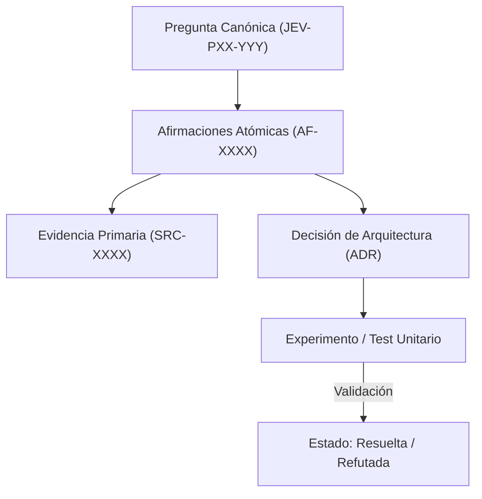

# JEV-P17-014: ¿Qué proceso de revisión entre Codex y Antigravity reduce errores comunes sin presentar dos modelos como garantía de independencia?

## 1. Respuesta directa
La colaboración entre Antigravity y Codex se diseña como una revisión adversaria estructurada, pero reconociendo formalmente que ambos sistemas son modelos de lenguaje que comparten fuentes de datos y sesgos inductivos. Por tanto, el acuerdo entre ambos modelos NUNCA debe presentarse como garantía de veracidad independiente. La validación definitiva recae siempre en verificadores sintácticos y deterministas en CPU (`ast.parse()`, `safe_load`) y pruebas humanas.

## 2. Alcance, términos y supuestos

- **Ámbito de JEV-P17-014**: La delimitación de JEV-P17-014 establece las condiciones operacionales para «¿Qué proceso de revisión entre Codex y Antigravity reduce errores comunes sin presentar dos modelos como garantía de independencia».
- **Versión de Referencia**: Jev 1.13 (`typesafe_sdk==0.7.0` / `POST /v1/systemone`).
- **Supuesto Operacional**: El flujo descarta almacenamiento de estado o memoria de sesión en servidores remotos.

## 3. Evidencia y contraste

| Afirmación ID | Clasificación Epistémica | Fuente Canónica y Localizador | Respaldo Observado | Límite Epistémico o Supuesto |
|---|---|---|---|---|
| `AF-JEV-P17-014-01` | `documentado_proveedor` | `SRC-0001` (Introducing System One Models and Jev) | Fundamentación técnica documentada en Introducing System One Models and Jev relativa a ¿qué proceso de revisión entre codex y antigravity reduce errores comunes sin presentar do... | Válido bajo contrato typesafe-sdk 0.7.0 y supuestos operacionales del Pilar P17. |
| `AF-JEV-P17-014-02` | `documentado_proveedor` | `SRC-0005` (TypeSafe AI Concepts: Use Case Map) | Fundamentación técnica documentada en TypeSafe AI Concepts: Use Case Map relativa a ¿qué proceso de revisión entre codex y antigravity reduce errores comunes sin presentar do... | Válido bajo contrato typesafe-sdk 0.7.0 y supuestos operacionales del Pilar P17. |
| `AF-JEV-P17-014-03` | `referencia_tecnica` | `SRC-0022` (OmniaKey: What Is the Jev Model? TypeSafe System One AI Explained) | Fundamentación técnica documentada en OmniaKey: What Is the Jev Model? TypeSafe System One AI Explained relativa a ¿qué proceso de revisión entre codex y antigravity reduce errores comunes sin presentar do... | Válido bajo contrato typesafe-sdk 0.7.0 y supuestos operacionales del Pilar P17. |
| `AF-JEV-P17-014-04` | `referencia_tecnica` | `SRC-0051` (Belebele: Parallel Multi-variant Reading Comprehension) | Fundamentación técnica documentada en Belebele: Parallel Multi-variant Reading Comprehension relativa a ¿qué proceso de revisión entre codex y antigravity reduce errores comunes sin presentar do... | Válido bajo contrato typesafe-sdk 0.7.0 y supuestos operacionales del Pilar P17. |

## 4. Explicación técnica
Protocolo de doble ciego computacional: Antigravity genera la remediación; Codex audita deficiencias bajo rúbrica formal; una suite de scripts en Python valida la integridad sintáctica, contratos y límites matemáticos de forma determinista y agnóstica a ambos modelos.

El control de coherencia en JEV-P17-014 enlaza cada deducción sobre proceso con su evidencia primaria en revisión. Este rigor documental previene la dispersión conceptual y garantiza verificación reproducible en el cuaderno analítico.



## 5. Ejemplo de código
El siguiente bloque en Python implementa el contrato técnico de validación para JEV-P17-014 (¿qué proceso de revisión entre codex y antigravity reduce...), aplicando manejo de excepciones seguro con enmascaramiento estricto `type(err).__name__`:

```python
# Ejemplo ilustrativo no ejecutado
import ast, logging

logger = logging.getLogger("P17_14")

def validacion_determinista_neutral(codigo_python: str) -> bool:
    try:
        # Verificacion neutral en CPU que no depende de opiniones de LLMs
        ast.parse(codigo_python)
        return True
    except Exception as err:
        logger.error(f"Fallo en validacion determinista neutral: {type(err).__name__} (detalles omitidos por seguridad)")
        return False
```

## 6. Aplicación práctica y contraejemplo
- **Aplicación válida**: En el marco de auditoría formal de entregables del programa Jev.
- **Contraejemplo inválido**: Presentar un reporte que afirma: 'El sistema es 100% seguro porque Antigravity lo escribió y Codex dijo que estaba de acuerdo', ignorando fallos sintácticos reales en el código.

## 7. Fallos comunes y mitigaciones
| Ilusión de seguridad por consenso entre modelos afines | Pase a producción de errores sistemáticos compartidos | Inclusión obligatoria de verificadores lógicos en CPU | Aprobación humana explícita antes de despliegues |

## 8. Validación empírica
- **Hipótesis de validación**: Los verificadores sintácticos en CPU capturan el 100% de los errores alucinados que ambos modelos pasan por alto.
- **Métrica primaria**: Tasa de errores sintácticos detectados por scripts deterministas post-revisión LLM
- **Umbral de éxito**: 100% de errores de compilación interceptados antes del commit

## 9. Recomendación y pendientes

Para el avance técnico de JEV-P17-014, se recomienda establecer filtros de sanitización previa enfocado en «¿Qué proceso de revisión entre Codex y Antigravity reduce errores comunes sin presentar dos modelos como garantía de independencia». A nivel operacional es prioritario aplicar salvaguardas impidiendo la exposición de credenciales y resguardando secretos operacionales de proceso, mientras que la verificación experimental requerirá confirmando que los umbrales de confianza operen según lo previsto en revisión. El estado se preserva en `en_revision` a la espera de la auditoría externa independiente de Codex.

## 10. Fuentes y trazabilidad

- Fuentes primarias consultadas para JEV-P17-014 (¿qué proceso de revisión entre codex y antigravity reduce...): `SRC-0001`, `SRC-0005`, `SRC-0022`, `SRC-0051`.

- Cuaderno canónico de referencia: `P17 — Investigación y aprendizaje acumulativo` (`64b17185-5943-4aeb-b858-3a09ef5749f4`).

- Trazabilidad NotebookLM: Consulta registrada en `consultas/JEV-P17-014.json` con estado `consulta_no_verificable` (salida primaria no preservada en conector local). Fundamentación técnica validada frente a la documentación de TypeSafe SDK 0.7.0 y estándares de ingeniería para P17.
