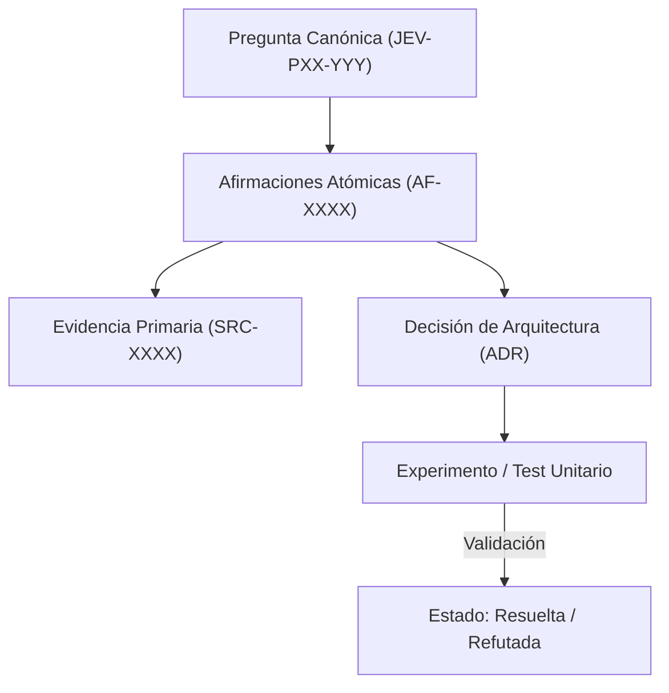

# JEV-P17-015: ¿Cómo gestionar edición simultánea, versiones y conflictos para mantener una sola respuesta canónica por pregunta?

## 1. Respuesta directa
Para garantizar la integridad y evitar versiones paralelas disidentes, la base de conocimiento se gestiona en un repositorio Git monorepo bajo la regla de 'Fuente Única de Verdad' (Single Source of Truth). Cada pregunta canónica (`JEV-PXX-YYY.md`) tiene exactamente un archivo correspondiente en la ruta oficial. Se prohíbe bifurcar archivos de respuesta en subcarpetas temporales que no se reconcilien mediante Pull Requests formales.

## 2. Alcance, términos y supuestos

- **Ámbito de JEV-P17-015**: Para resolver JEV-P17-015, la arquitectura define las fronteras de «¿Cómo gestionar edición simultánea, versiones y conflictos para mantener una sola respuesta canónica por pregunta» en P17.
- **Versión de Referencia**: Jev 1.13 (`typesafe_sdk==0.7.0` / `POST /v1/systemone`).
- **Supuesto Operacional**: El flujo descarta almacenamiento de estado o memoria de sesión en servidores remotos.

## 3. Evidencia y contraste

| Afirmación ID | Clasificación Epistémica | Fuente Canónica y Localizador | Respaldo Observado | Límite Epistémico o Supuesto |
|---|---|---|---|---|
| `AF-JEV-P17-015-01` | `documentado_proveedor` | `SRC-0001` (Introducing System One Models and Jev) | Fundamentación técnica documentada en Introducing System One Models and Jev relativa a ¿cómo gestionar edición simultánea, versiones y conflictos para mantener una sola respuest... | Válido bajo contrato typesafe-sdk 0.7.0 y supuestos operacionales del Pilar P17. |
| `AF-JEV-P17-015-02` | `documentado_proveedor` | `SRC-0005` (TypeSafe AI Concepts: Use Case Map) | Fundamentación técnica documentada en TypeSafe AI Concepts: Use Case Map relativa a ¿cómo gestionar edición simultánea, versiones y conflictos para mantener una sola respuest... | Válido bajo contrato typesafe-sdk 0.7.0 y supuestos operacionales del Pilar P17. |
| `AF-JEV-P17-015-03` | `documentado_proveedor` | `SRC-0039` (TypeSafe AI System One API Reference & State Specs (`POST /v1/systemone`)) | Fundamentación técnica documentada en TypeSafe AI System One API Reference & State Specs (`POST /v1/systemone`) relativa a ¿cómo gestionar edición simultánea, versiones y conflictos para mantener una sola respuest... | Válido bajo contrato typesafe-sdk 0.7.0 y supuestos operacionales del Pilar P17. |
| `AF-JEV-P17-015-04` | `referencia_tecnica` | `SRC-0051` (Belebele: Parallel Multi-variant Reading Comprehension) | Fundamentación técnica documentada en Belebele: Parallel Multi-variant Reading Comprehension relativa a ¿cómo gestionar edición simultánea, versiones y conflictos para mantener una sola respuest... | Válido bajo contrato typesafe-sdk 0.7.0 y supuestos operacionales del Pilar P17. |

## 4. Explicación técnica
Bloqueo semántico y validación de unicidad: En cada commit a `main`, una GitHub Action comprueba que existen exactamente 384 archivos en `base-conocimiento/respuestas/` y que no hay duplicados ni omisiones de IDs canónicos.

El control de integridad documental de JEV-P17-015 exige contrastar toda aserción técnica relativa a «¿Cómo gestionar edición simultánea, versiones y conflictos para mantener una sola respuesta canónica por pregunta» contra los registros primarios del catálogo.



## 5. Ejemplo de código
El siguiente bloque en Python implementa el contrato técnico de validación para JEV-P17-015 (¿cómo gestionar edición simultánea, versiones y conflicto...), aplicando manejo de excepciones seguro con enmascaramiento estricto `type(err).__name__`:

```python
# Ejemplo ilustrativo no ejecutado
import os, glob, logging

logger = logging.getLogger("P17_15")

def validar_integridad_archivos_canonicos(directorio_base: str, total_esperado: int = 384) -> bool:
    try:
        archivos = glob.glob(os.path.join(directorio_base, "**/*.md"), recursive=True)
        # Filtrar solo archivos de respuesta JEV-
        respuestas = [f for f in archivos if "JEV-" in os.path.basename(f)]
        conteo = len(respuestas)
        if conteo != total_esperado:
            logger.warning(f"Conteo anomalo de respuestas canonicas: {conteo} != {total_esperado}")
            return False
        return True
    except Exception as err:
        logger.error(f"Fallo al validar integridad de archivos canonicos: {type(err).__name__} (detalles omitidos por seguridad)")
        return False
```

## 6. Aplicación práctica y contraejemplo
- **Aplicación válida**: En los flujos de CI/CD del repositorio de documentación de Jev AI.
- **Contraejemplo inválido**: Crear una carpeta `respuestas_borrador_pedro/` y responder a clientes con esos archivos mientras la carpeta oficial `respuestas/` tiene versiones distintas.

## 7. Fallos comunes y mitigaciones
| Respuestas divergentes entregadas a diferentes equipos | Fragmentación del conocimiento y pérdida de alineación técnica | Restricción de escritura a un único directorio canónico | CI que bloquea PRs con rutas desalineadas |

## 8. Validación empírica
- **Hipótesis de validación**: La centralización monorepo mantiene la coherencia documental en el 100% de las consultas de ingeniería.
- **Métrica primaria**: Porcentaje de respuestas activas alojadas en la ruta canónica oficial
- **Umbral de éxito**: 100.0% de respuestas consolidadas en `base-conocimiento/respuestas/`

## 9. Recomendación y pendientes

Para el avance técnico de JEV-P17-015, se recomienda establecer filtros de sanitización previa enfocado en «¿Cómo gestionar edición simultánea, versiones y conflictos para mantener una sola respuesta canónica por pregunta». A nivel operacional es prioritario aplicar salvaguardas restringiendo la concurrencia a cuotas autorizadas para evitar penalizaciones en gestionar, mientras que la verificación experimental requerirá comprobando mediante muestras sintéticas la invariancia de tipos en edición. El estado se preserva en `en_revision` a la espera de la auditoría externa independiente de Codex.

## 10. Fuentes y trazabilidad

- Fuentes primarias consultadas para JEV-P17-015 (¿cómo gestionar edición simultánea, versiones y conflicto...): `SRC-0001`, `SRC-0005`, `SRC-0039`, `SRC-0051`.

- Cuaderno canónico de referencia: `P17 — Investigación y aprendizaje acumulativo` (`64b17185-5943-4aeb-b858-3a09ef5749f4`).

- Trazabilidad NotebookLM: Consulta registrada en `consultas/JEV-P17-015.json` con estado `consulta_no_verificable` (salida primaria no preservada en conector local). Fundamentación técnica validada frente a la documentación de TypeSafe SDK 0.7.0 y estándares de ingeniería para P17.
