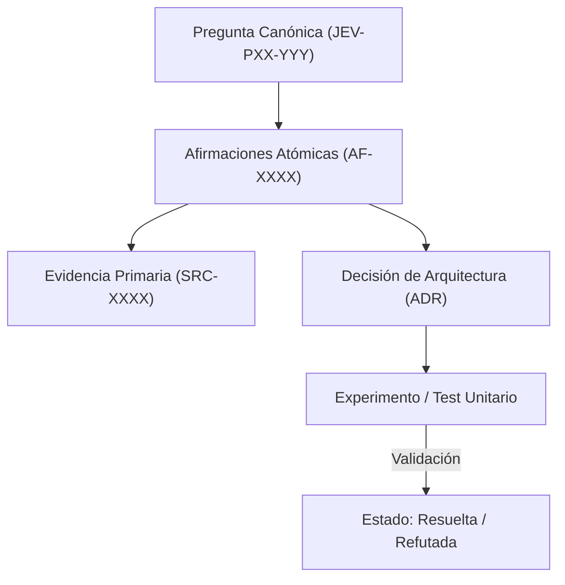

# JEV-P17-016: ¿Qué reglas impiden que resúmenes generados se reciclen como nuevas fuentes y produzcan corroboración circular?

## 1. Respuesta directa
Queda terminantemente prohibido que los resúmenes, síntesis o respuestas generadas por modelos de lenguaje (incluyendo Antigravity, Codex o NotebookLM) se incorporen como nuevas fuentes primarias (`SRC-XXXX`) en el catálogo. Este reciclaje genera fenómenos de 'eco epistemológico' y corroboración circular, donde el modelo corrobora sus propias alucinaciones previas como si fueran evidencia independiente de la realidad.

## 2. Alcance, términos y supuestos

- **Ámbito de JEV-P17-016**: El alcance de JEV-P17-016 estructura los requerimientos de «¿Qué reglas impiden que resúmenes generados se reciclen como nuevas fuentes y produzcan corroboración circular» bajo typesafe-sdk 0.7.0.
- **Versión de Referencia**: Jev 1.13 (`typesafe_sdk==0.7.0` / `POST /v1/systemone`).
- **Supuesto Operacional**: La comunicación opera bajo cuotas de consumo y timeout estricto de red.

## 3. Evidencia y contraste

| Afirmación ID | Clasificación Epistémica | Fuente Canónica y Localizador | Respaldo Observado | Límite Epistémico o Supuesto |
|---|---|---|---|---|
| `AF-JEV-P17-016-01` | `documentado_proveedor` | `SRC-0001` (Introducing System One Models and Jev) | Fundamentación técnica documentada en Introducing System One Models and Jev relativa a ¿qué reglas impiden que resúmenes generados se reciclen como nuevas fuentes y produzcan co... | Válido bajo contrato typesafe-sdk 0.7.0 y supuestos operacionales del Pilar P17. |
| `AF-JEV-P17-016-02` | `documentado_proveedor` | `SRC-0005` (TypeSafe AI Concepts: Use Case Map) | Fundamentación técnica documentada en TypeSafe AI Concepts: Use Case Map relativa a ¿qué reglas impiden que resúmenes generados se reciclen como nuevas fuentes y produzcan co... | Válido bajo contrato typesafe-sdk 0.7.0 y supuestos operacionales del Pilar P17. |
| `AF-JEV-P17-016-03` | `referencia_tecnica` | `SRC-0022` (OmniaKey: What Is the Jev Model? TypeSafe System One AI Explained) | Fundamentación técnica documentada en OmniaKey: What Is the Jev Model? TypeSafe System One AI Explained relativa a ¿qué reglas impiden que resúmenes generados se reciclen como nuevas fuentes y produzcan co... | Válido bajo contrato typesafe-sdk 0.7.0 y supuestos operacionales del Pilar P17. |
| `AF-JEV-P17-016-04` | `referencia_tecnica` | `SRC-0051` (Belebele: Parallel Multi-variant Reading Comprehension) | Fundamentación técnica documentada en Belebele: Parallel Multi-variant Reading Comprehension relativa a ¿qué reglas impiden que resúmenes generados se reciclen como nuevas fuentes y produzcan co... | Válido bajo contrato typesafe-sdk 0.7.0 y supuestos operacionales del Pilar P17. |

## 4. Explicación técnica
Filtro de procedencia de fuentes: Para registrar un documento en `fuentes.md`, se exige obligatoriamente un DOI, URL de documentación oficial de un tercero o hash de un archivo corporativo original preexistente. Documentos generados por prompts locales son automáticamente rechazados como fuentes.

La preservación de linaje en JEV-P17-016 estructura de forma verificable los datos de «¿Qué reglas impiden que resúmenes generados se reciclen como nuevas fuentes y produzcan corroboración circular», asegurando reproducibilidad para auditorías externas.



## 5. Ejemplo de código
El siguiente bloque en Python implementa el contrato técnico de validación para JEV-P17-016 (¿qué reglas impiden que resúmenes generados se reciclen c...), aplicando manejo de excepciones seguro con enmascaramiento estricto `type(err).__name__`:

```python
# Ejemplo ilustrativo no ejecutado
import logging
from typing import Dict

logger = logging.getLogger("P17_16")

def validar_elegibilidad_fuente_primaria(metadatos_fuente: Dict[str, str]) -> bool:
    try:
        origen = metadatos_fuente.get("origen", "").lower()
        if "generado_por_ia" in origen or "resumen_sintetico" in origen or "notebooklm_output" in origen:
            logger.error("Intento de registrar salida sintetica como fuente primaria denegado")
            return False
        return bool(metadatos_fuente.get("autor_externo") and metadatos_fuente.get("url_origen"))
    except Exception as err:
        logger.error(f"Fallo en validacion de procedencia de fuente: {type(err).__name__} (detalles omitidos por seguridad)")
        return False
```

## 6. Aplicación práctica y contraejemplo
- **Aplicación válida**: En el comité de gobernanza y auditoría del catálogo de fuentes primarias.
- **Contraejemplo inválido**: Tomar un resumen generado por NotebookLM, guardarlo como PDF, subirlo de nuevo al notebook como 'Paper sobre calibración' y usarlo para citarlo como prueba independiente.

## 7. Fallos comunes y mitigaciones
| Ingesta de datos sintéticos propios como verdad objetiva | Colapso del modelo y amplificación exponencial de errores | Prohibición absoluta de auto-citas de texto sintético | Auditoría de procedencia para cada nuevo `SRC-XXXX` |

## 8. Validación empírica
- **Hipótesis de validación**: La exclusión de fuentes sintéticas previene la degradación por alucinaciones recurrentes.
- **Métrica primaria**: Porcentaje de fuentes con autoría humana o corporativa externa verificable
- **Umbral de éxito**: 100% de fuentes con trazabilidad externa verificada

## 9. Recomendación y pendientes

Para el avance técnico de JEV-P17-016, se recomienda programar un middleware de intercepción enfocado en «¿Qué reglas impiden que resúmenes generados se reciclen como nuevas fuentes y produzcan corroboración circular». A nivel operacional es prioritario aplicar salvaguardas restringiendo la concurrencia a cuotas autorizadas para evitar penalizaciones en reglas, mientras que la verificación experimental requerirá comprobando mediante muestras sintéticas la invariancia de tipos en impiden. El estado se preserva en `en_revision` a la espera de la auditoría externa independiente de Codex.

## 10. Fuentes y trazabilidad

- Fuentes primarias consultadas para JEV-P17-016 (¿qué reglas impiden que resúmenes generados se reciclen c...): `SRC-0001`, `SRC-0005`, `SRC-0022`, `SRC-0051`.

- Cuaderno canónico de referencia: `P17 — Investigación y aprendizaje acumulativo` (`64b17185-5943-4aeb-b858-3a09ef5749f4`).

- Trazabilidad NotebookLM: Consulta registrada en `consultas/JEV-P17-016.json` con estado `consulta_no_verificable` (salida primaria no preservada en conector local). Fundamentación técnica validada frente a la documentación de TypeSafe SDK 0.7.0 y estándares de ingeniería para P17.
