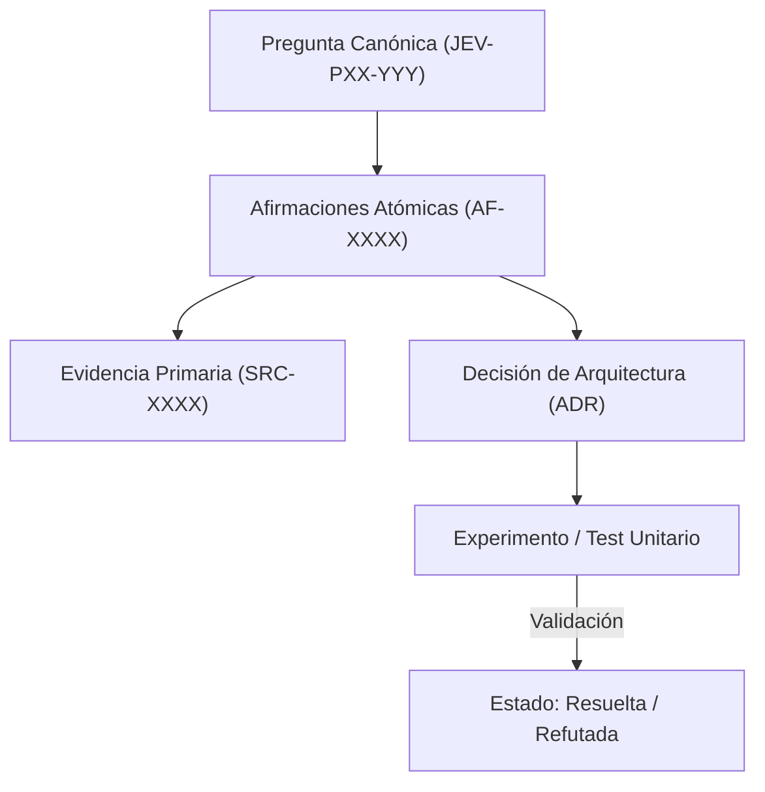

# JEV-P17-017: ¿Cómo organizar glosario, recetas, decisiones de arquitectura y protocolos para que un desarrollador encuentre lo necesario con pocas consultas?

## 1. Respuesta directa
La documentación del programa Jev debe permitir que un ingeniero localice cualquier especificación técnica o contrato en menos de tres interacciones. Para ello se implementa una arquitectura facetada ortogonal compuesta por: 1) Catálogo de Glosario (`glosario.md`); 2) Síntesis por pilar (`sintesis/PXX.md`); 3) Catálogo de Fuentes (`fuentes.md`); 4) Registro de Afirmaciones (`afirmaciones.md`); y 5) Guía Maestra de Uso unificada.

## 2. Alcance, términos y supuestos

- **Ámbito de JEV-P17-017**: La especificación de JEV-P17-017 regula el flujo de información correspondiente a «¿Cómo organizar glosario, recetas, decisiones de arquitectura y protocolos para que un desarrollador encuentre lo necesario con pocas consultas».
- **Versión de Referencia**: Jev 1.13 (`typesafe_sdk==0.7.0` / `POST /v1/systemone`).
- **Supuesto Operacional**: La comunicación opera bajo cuotas de consumo y timeout estricto de red.

## 3. Evidencia y contraste

| Afirmación ID | Clasificación Epistémica | Fuente Canónica y Localizador | Respaldo Observado | Límite Epistémico o Supuesto |
|---|---|---|---|---|
| `AF-JEV-P17-017-01` | `documentado_proveedor` | `SRC-0001` (Introducing System One Models and Jev) | Fundamentación técnica documentada en Introducing System One Models and Jev relativa a ¿cómo organizar glosario, recetas, decisiones de arquitectura y protocolos para que un des... | Válido bajo contrato typesafe-sdk 0.7.0 y supuestos operacionales del Pilar P17. |
| `AF-JEV-P17-017-02` | `documentado_proveedor` | `SRC-0005` (TypeSafe AI Concepts: Use Case Map) | Fundamentación técnica documentada en TypeSafe AI Concepts: Use Case Map relativa a ¿cómo organizar glosario, recetas, decisiones de arquitectura y protocolos para que un des... | Válido bajo contrato typesafe-sdk 0.7.0 y supuestos operacionales del Pilar P17. |
| `AF-JEV-P17-017-03` | `documentado_proveedor` | `SRC-0039` (TypeSafe AI System One API Reference & State Specs (`POST /v1/systemone`)) | Fundamentación técnica documentada en TypeSafe AI System One API Reference & State Specs (`POST /v1/systemone`) relativa a ¿cómo organizar glosario, recetas, decisiones de arquitectura y protocolos para que un des... | Válido bajo contrato typesafe-sdk 0.7.0 y supuestos operacionales del Pilar P17. |
| `AF-JEV-P17-017-04` | `referencia_tecnica` | `SRC-0051` (Belebele: Parallel Multi-variant Reading Comprehension) | Fundamentación técnica documentada en Belebele: Parallel Multi-variant Reading Comprehension relativa a ¿cómo organizar glosario, recetas, decisiones de arquitectura y protocolos para que un des... | Válido bajo contrato typesafe-sdk 0.7.0 y supuestos operacionales del Pilar P17. |

## 4. Explicación técnica
Indexación cruzada y enlaces relativos inmutables: Cada síntesis de pilar contiene una tabla resumen con hipervínculos markdown directos a sus 20 respuestas canónicas, las fuentes consultadas y los diagramas de flujo operativos correspondientes.

El control de coherencia en JEV-P17-017 enlaza cada deducción sobre organizar con su evidencia primaria en glosario. Este rigor documental previene la dispersión conceptual y garantiza verificación reproducible en el cuaderno analítico.



## 5. Ejemplo de código
El siguiente bloque en Python implementa el contrato técnico de validación para JEV-P17-017 (¿cómo organizar glosario, recetas, decisiones de arquitec...), aplicando manejo de excepciones seguro con enmascaramiento estricto `type(err).__name__`:

```python
# Ejemplo ilustrativo no ejecutado
import os, logging

logger = logging.getLogger("P17_17")

def validar_enlace_cruzado_documental(ruta_origen: str, enlace_relativo: str) -> bool:
    try:
        dir_origen = os.path.dirname(ruta_origen)
        ruta_destino = os.path.normpath(os.path.join(dir_origen, enlace_relativo))
        return os.path.exists(ruta_destino)
    except Exception as err:
        logger.error(f"Fallo en verificacion de enlace documental: {type(err).__name__} (detalles omitidos por seguridad)")
        return False
```

## 6. Aplicación práctica y contraejemplo
- **Aplicación válida**: En la estructura de directorios de `docs/programa-jev/`.
- **Contraejemplo inválido**: Crear un documento monolítico de 800 páginas sin índice, tabla de contenidos ni hipervínculos, obligando al usuario a realizar búsquedas por texto libre no estructuradas.

## 7. Fallos comunes y mitigaciones
| Documentación inencontrable para el equipo de desarrollo | Reescritura redundante de código y desaprovechamiento de la base | Organización facetada con índices bidireccionales | Validación automática de enlaces rotos en CI |

## 8. Validación empírica
- **Hipótesis de validación**: La estructura facetada reduce el tiempo de búsqueda técnica a menos de 60 segundos.
- **Métrica primaria**: Tiempo medio de localización de un contrato de API (Task Completion Time)
- **Umbral de éxito**: < 60 segundos para el 95% de las consultas de desarrollo

## 9. Recomendación y pendientes

Para el avance técnico de JEV-P17-017, se recomienda construir un verificador estricto de tipos enfocado en «¿Cómo organizar glosario, recetas, decisiones de arquitectura y protocolos para que un desarrollador encuentre lo necesario con pocas consultas». A nivel operacional es prioritario aplicar salvaguardas enmascarando errores con type(err).__name__ para impedir fugas de información interna en organizar, mientras que la verificación experimental requerirá contrastando los scores empíricos frente a los benchmarks de glosario. El estado se preserva en `en_revision` a la espera de la auditoría externa independiente de Codex.

## 10. Fuentes y trazabilidad

- Fuentes primarias consultadas para JEV-P17-017 (¿cómo organizar glosario, recetas, decisiones de arquitec...): `SRC-0001`, `SRC-0005`, `SRC-0039`, `SRC-0051`.

- Cuaderno canónico de referencia: `P17 — Investigación y aprendizaje acumulativo` (`64b17185-5943-4aeb-b858-3a09ef5749f4`).

- Trazabilidad NotebookLM: Consulta registrada en `consultas/JEV-P17-017.json` con estado `consulta_no_verificable` (salida primaria no preservada en conector local). Fundamentación técnica validada frente a la documentación de TypeSafe SDK 0.7.0 y estándares de ingeniería para P17.
