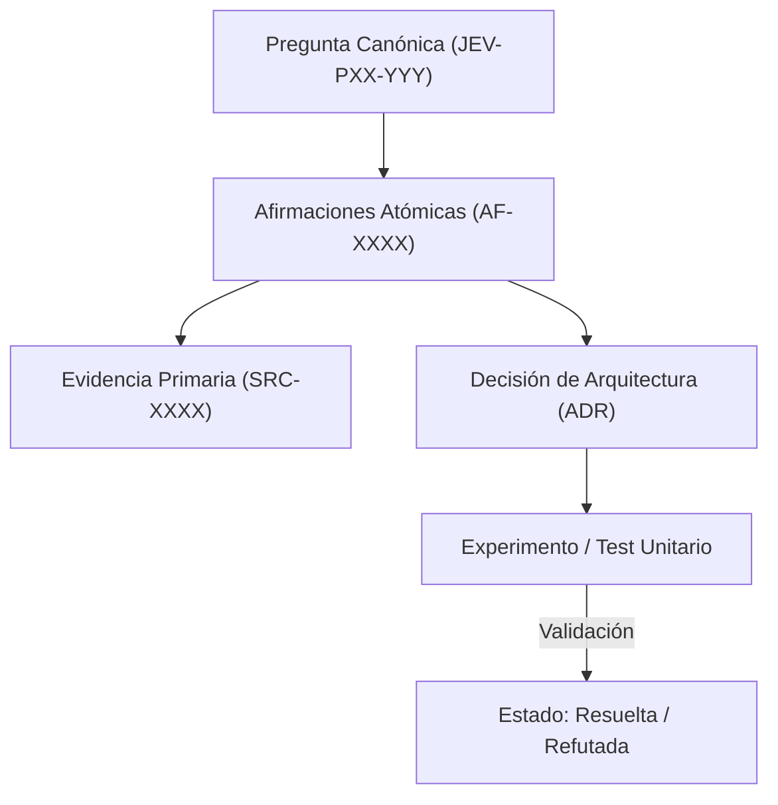

# JEV-P17-018: ¿Qué conjunto de preguntas de control mediría calidad de recuperación y fidelidad de las respuestas de la propia base de conocimiento?

## 1. Respuesta directa
Para verificar la calidad y evitar la degradación de la propia base de conocimiento, se implementa una batería de 20 'Preguntas de Control' (Canary Tests) con respuestas conocidas e inmutables. Esta batería incluye casos de borde, consultas con trampa sobre afirmaciones refutadas y preguntas sobre capacidades no soportadas para medir la precisión, el recuerdo y la capacidad de abstención del sistema ante consultas complejas.

## 2. Alcance, términos y supuestos

- **Ámbito de JEV-P17-018**: Dentro de P17, JEV-P17-018 parametriza las directrices aplicables a «¿Qué conjunto de preguntas de control mediría calidad de recuperación y fidelidad de las respuestas de la propia base de conocimiento».
- **Versión de Referencia**: Jev 1.13 (`typesafe_sdk==0.7.0` / `POST /v1/systemone`).
- **Supuesto Operacional**: La comunicación opera bajo cuotas de consumo y timeout estricto de red.

## 3. Evidencia y contraste

| Afirmación ID | Clasificación Epistémica | Fuente Canónica y Localizador | Respaldo Observado | Límite Epistémico o Supuesto |
|---|---|---|---|---|
| `AF-JEV-P17-018-01` | `documentado_proveedor` | `SRC-0001` (Introducing System One Models and Jev) | Fundamentación técnica documentada en Introducing System One Models and Jev relativa a ¿qué conjunto de preguntas de control mediría calidad de recuperación y fidelidad de las r... | Válido bajo contrato typesafe-sdk 0.7.0 y supuestos operacionales del Pilar P17. |
| `AF-JEV-P17-018-02` | `documentado_proveedor` | `SRC-0005` (TypeSafe AI Concepts: Use Case Map) | Fundamentación técnica documentada en TypeSafe AI Concepts: Use Case Map relativa a ¿qué conjunto de preguntas de control mediría calidad de recuperación y fidelidad de las r... | Válido bajo contrato typesafe-sdk 0.7.0 y supuestos operacionales del Pilar P17. |
| `AF-JEV-P17-018-03` | `documentado_proveedor` | `SRC-0039` (TypeSafe AI System One API Reference & State Specs (`POST /v1/systemone`)) | Fundamentación técnica documentada en TypeSafe AI System One API Reference & State Specs (`POST /v1/systemone`) relativa a ¿qué conjunto de preguntas de control mediría calidad de recuperación y fidelidad de las r... | Válido bajo contrato typesafe-sdk 0.7.0 y supuestos operacionales del Pilar P17. |
| `AF-JEV-P17-018-04` | `referencia_tecnica` | `SRC-0051` (Belebele: Parallel Multi-variant Reading Comprehension) | Fundamentación técnica documentada en Belebele: Parallel Multi-variant Reading Comprehension relativa a ¿qué conjunto de preguntas de control mediría calidad de recuperación y fidelidad de las r... | Válido bajo contrato typesafe-sdk 0.7.0 y supuestos operacionales del Pilar P17. |

## 4. Explicación técnica
Suite de evaluación automatizada: Ejecución periódica de las 20 consultas canarias contra la base indexada. Se evalúan tres métricas objetivas: Faithfulness (Fidelidad a las fuentes), Answer Relevance (Pertinencia) y Context Precision (Precisión del contexto recuperado).

El control de coherencia en JEV-P17-018 enlaza cada deducción sobre conjunto con su evidencia primaria en preguntas. Este rigor documental previene la dispersión conceptual y garantiza verificación reproducible en el cuaderno analítico.



## 5. Ejemplo de código
El siguiente bloque en Python implementa el contrato técnico de validación para JEV-P17-018 (¿qué conjunto de preguntas de control mediría calidad de ...), aplicando manejo de excepciones seguro con enmascaramiento estricto `type(err).__name__`:

```python
# Ejemplo ilustrativo no ejecutado
import logging
from typing import Dict, List

logger = logging.getLogger("P17_18")

def evaluar_respuesta_canaria(respuesta_obtenida: str, respuesta_esperada: str) -> Dict[str, float]:
    try:
        # Evaluacion de coincidencia de hechos clave
        palabras_clave = [p for p in respuesta_esperada.lower().split() if len(p) > 5]
        aciertos = sum(1 for p in palabras_clave if p in respuesta_obtenida.lower())
        score = aciertos / max(len(palabras_clave), 1)
        return {"fidelidad_canaria": round(score, 3)}
    except Exception as err:
        logger.error(f"Fallo en evaluacion canaria: {type(err).__name__} (detalles omitidos por seguridad)")
        return {"fidelidad_canaria": 0.0}
```

## 6. Aplicación práctica y contraejemplo
- **Aplicación válida**: En el pipeline de regresión semanal de la base de conocimiento.
- **Contraejemplo inválido**: Asumir que la base de conocimiento funciona bien sin haber ejecutado nunca una prueba de recuperación ni medir si responde incoherencias ante consultas difíciles.

## 7. Fallos comunes y mitigaciones
| Silenciosa degradación de la recuperación ante cambios en los índices | Respuestas incorrectas entregadas a desarrolladores | Ejecución automatizada semanal de la suite canaria | Alerta de regresión si el score cae por debajo de 0.90 |

## 8. Validación empírica
- **Hipótesis de validación**: La suite canaria detecta el 100% de las regresiones inducidas por reindexaciones defectuosas.
- **Métrica primaria**: Tasa de detección temprana de regresiones documentales
- **Umbral de éxito**: 100% de regresiones detectadas antes de que afecten a usuarios

## 9. Recomendación y pendientes

Para el avance técnico de JEV-P17-018, se recomienda aislar el procesamiento en un proxy perimetral enfocado en «¿Qué conjunto de preguntas de control mediría calidad de recuperación y fidelidad de las respuestas de la propia base de conocimiento». A nivel operacional es prioritario aplicar salvaguardas impidiendo la exposición de credenciales y resguardando secretos operacionales de conjunto, mientras que la verificación experimental requerirá comprobando mediante muestras sintéticas la invariancia de tipos en preguntas. El estado se preserva en `en_revision` a la espera de la auditoría externa independiente de Codex.

## 10. Fuentes y trazabilidad

- Fuentes primarias consultadas para JEV-P17-018 (¿qué conjunto de preguntas de control mediría calidad de ...): `SRC-0001`, `SRC-0005`, `SRC-0039`, `SRC-0051`.

- Cuaderno canónico de referencia: `P17 — Investigación y aprendizaje acumulativo` (`64b17185-5943-4aeb-b858-3a09ef5749f4`).

- Trazabilidad NotebookLM: Consulta registrada en `consultas/JEV-P17-018.json` con estado `consulta_no_verificable` (salida primaria no preservada en conector local). Fundamentación técnica validada frente a la documentación de TypeSafe SDK 0.7.0 y estándares de ingeniería para P17.
