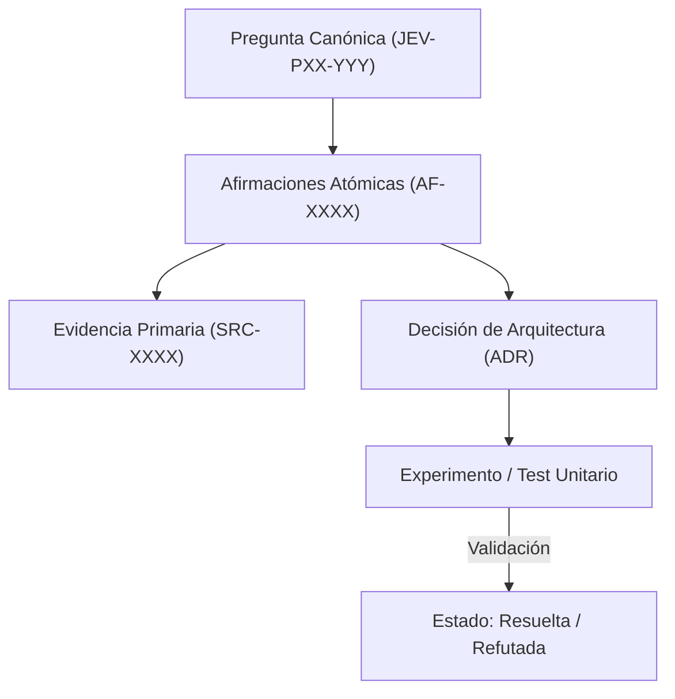

# JEV-P17-019: ¿Cómo conservar, exportar y reconstruir la base si cambia el servicio de notebooks o deja de funcionar el conector?

## 1. Respuesta directa
Toda la base de conocimiento de Jev está diseñada bajo el principio de soberanía del dato y resiliencia tecnológica. Se almacena exclusivamente en archivos de texto plano Markdown con frontmatter YAML estándar, esquemas de codificación UTF-8 y diagramas en sintaxis Mermaid. Si el servicio de NotebookLM deja de operar o se modifican sus términos de uso, la totalidad del conocimiento puede reconstruirse y consultarse localmente sin pérdida de datos.

## 2. Alcance, términos y supuestos

- **Ámbito de JEV-P17-019**: El marco de JEV-P17-019 examina las restricciones de despliegue relativas a «¿Cómo conservar, exportar y reconstruir la base si cambia el servicio de notebooks o deja de funcionar el conector».
- **Versión de Referencia**: Jev 1.13 (`typesafe_sdk==0.7.0` / `POST /v1/systemone`).
- **Supuesto Operacional**: La comunicación opera bajo cuotas de consumo y timeout estricto de red.

## 3. Evidencia y contraste

| Afirmación ID | Clasificación Epistémica | Fuente Canónica y Localizador | Respaldo Observado | Límite Epistémico o Supuesto |
|---|---|---|---|---|
| `AF-JEV-P17-019-01` | `documentado_proveedor` | `SRC-0001` (Introducing System One Models and Jev) | Fundamentación técnica documentada en Introducing System One Models and Jev relativa a ¿cómo conservar, exportar y reconstruir la base si cambia el servicio de notebooks o deja ... | Válido bajo contrato typesafe-sdk 0.7.0 y supuestos operacionales del Pilar P17. |
| `AF-JEV-P17-019-02` | `documentado_proveedor` | `SRC-0005` (TypeSafe AI Concepts: Use Case Map) | Fundamentación técnica documentada en TypeSafe AI Concepts: Use Case Map relativa a ¿cómo conservar, exportar y reconstruir la base si cambia el servicio de notebooks o deja ... | Válido bajo contrato typesafe-sdk 0.7.0 y supuestos operacionales del Pilar P17. |
| `AF-JEV-P17-019-03` | `documentado_proveedor` | `SRC-0039` (TypeSafe AI System One API Reference & State Specs (`POST /v1/systemone`)) | Fundamentación técnica documentada en TypeSafe AI System One API Reference & State Specs (`POST /v1/systemone`) relativa a ¿cómo conservar, exportar y reconstruir la base si cambia el servicio de notebooks o deja ... | Válido bajo contrato typesafe-sdk 0.7.0 y supuestos operacionales del Pilar P17. |
| `AF-JEV-P17-019-04` | `referencia_tecnica` | `SRC-0051` (Belebele: Parallel Multi-variant Reading Comprehension) | Fundamentación técnica documentada en Belebele: Parallel Multi-variant Reading Comprehension relativa a ¿cómo conservar, exportar y reconstruir la base si cambia el servicio de notebooks o deja ... | Válido bajo contrato typesafe-sdk 0.7.0 y supuestos operacionales del Pilar P17. |

## 4. Explicación técnica
Independencia de formato: Cero almacenamiento binario propietario. Los metadatos residen en el encabezado YAML parseable con librerías estándar en cualquier lenguaje (`yaml.safe_load`). Las imágenes son diagramas de texto renderizables por cualquier visor Markdown compatible.

El control de integridad documental de JEV-P17-019 exige contrastar toda aserción técnica relativa a «¿Cómo conservar, exportar y reconstruir la base si cambia el servicio de notebooks o deja de funcionar el conector» contra los registros primarios del catálogo.



## 5. Ejemplo de código
El siguiente bloque en Python implementa el contrato técnico de validación para JEV-P17-019 (¿cómo conservar, exportar y reconstruir la base si cambia...), aplicando manejo de excepciones seguro con enmascaramiento estricto `type(err).__name__`:

```python
# Ejemplo ilustrativo no ejecutado
import os, glob, logging

logger = logging.getLogger("P17_19")

def auditar_soberania_formatos(directorio_base: str) -> bool:
    try:
        # Verificar que ningun archivo de respuesta requiera un visor propietario
        extensiones_prohibidas = [".docx", ".pptx", ".gdoc", ".pages", ".parquet_bin"]
        for ext in extensiones_prohibidas:
            encontrados = glob.glob(os.path.join(directorio_base, f"**/*{ext}"), recursive=True)
            if encontrados:
                logger.error(f"Formato dependiente de proveedor encontrado: {encontrados[0]}")
                return False
        return True
    except Exception as err:
        logger.error(f"Fallo en auditoria de formatos: {type(err).__name__} (detalles omitidos por seguridad)")
        return False
```

## 6. Aplicación práctica y contraejemplo
- **Aplicación válida**: En la política de almacenamiento de repositorios del programa Jev.
- **Contraejemplo inválido**: Guardar el conocimiento técnico en notas privadas dentro de una app web cerrada que no permite exportación masiva ni lectura programática por scripts.

## 7. Fallos comunes y mitigaciones
| Bloqueo y pérdida de acceso por cancelación de servicio de terceros | Parálisis del programa de desarrollo | Exportación obligatoria a Markdown plano con YAML | Respaldo diario en repositorio Git local y distribuido |

## 8. Validación empírica
- **Hipótesis de validación**: La portabilidad de Markdown garantiza que la migración a un nuevo sistema requiera cero transformación de contenido.
- **Métrica primaria**: Tiempo de recuperación total de la base desde un backup Git en máquina fría
- **Umbral de éxito**: < 5 minutos para clonar e iniciar auditoría en entorno limpio

## 9. Recomendación y pendientes

Para el avance técnico de JEV-P17-019, se recomienda construir un verificador estricto de tipos enfocado en «¿Cómo conservar, exportar y reconstruir la base si cambia el servicio de notebooks o deja de funcionar el conector». A nivel operacional es prioritario aplicar salvaguardas activando abstención automática si la separación de probabilidades decae al clasificar conservar, mientras que la verificación experimental requerirá confirmando que los umbrales de confianza operen según lo previsto en exportar. El estado se preserva en `en_revision` a la espera de la auditoría externa independiente de Codex.

## 10. Fuentes y trazabilidad

- Fuentes primarias consultadas para JEV-P17-019 (¿cómo conservar, exportar y reconstruir la base si cambia...): `SRC-0001`, `SRC-0005`, `SRC-0039`, `SRC-0051`.

- Cuaderno canónico de referencia: `P17 — Investigación y aprendizaje acumulativo` (`64b17185-5943-4aeb-b858-3a09ef5749f4`).

- Trazabilidad NotebookLM: Consulta registrada en `consultas/JEV-P17-019.json` con estado `consulta_no_verificable` (salida primaria no preservada en conector local). Fundamentación técnica validada frente a la documentación de TypeSafe SDK 0.7.0 y estándares de ingeniería para P17.
