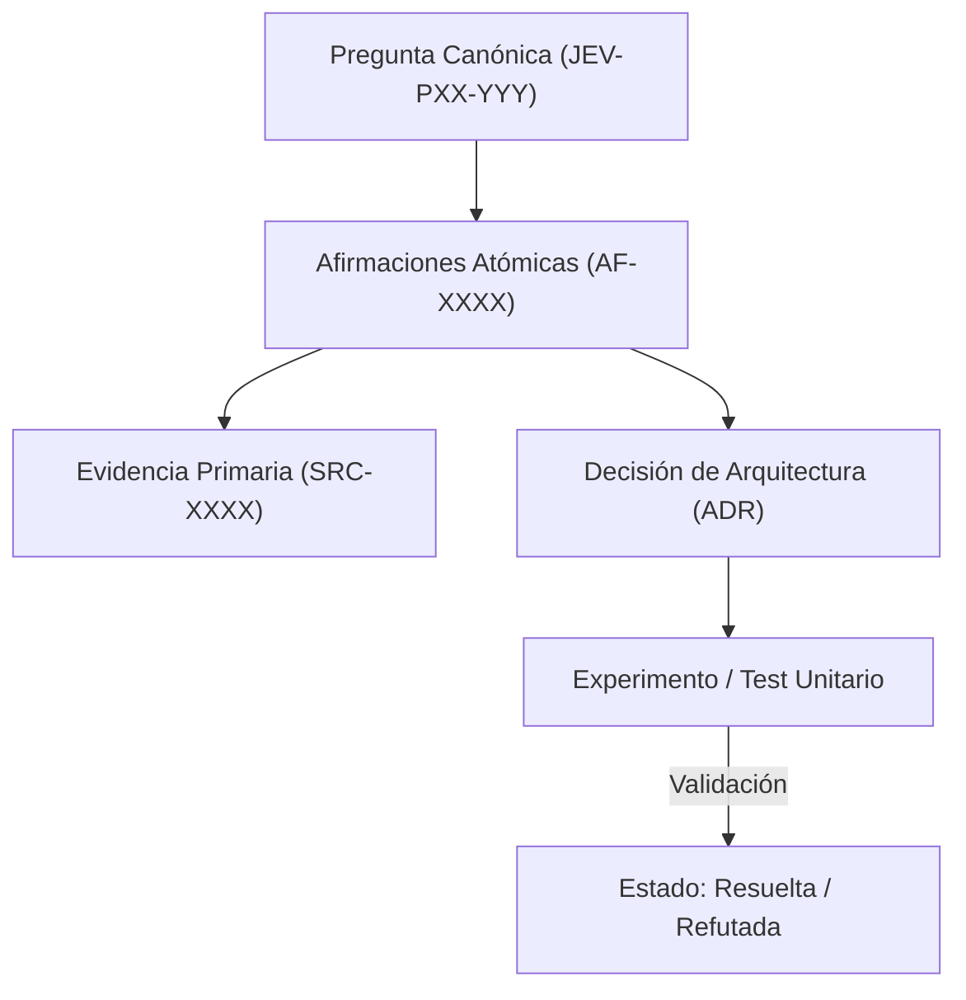

# JEV-P17-020: ¿Qué revisión periódica asegura utilidad, vigencia y trazabilidad sin repetir desde cero toda la investigación?

## 1. Respuesta directa
Para mantener la vigencia de la base de conocimiento sin incurrir en costos astronómicos ni repetir investigaciones ya concluidas, se establece una cadencia operativa de revisión trimestral (Q-Review). Esta revisión no reabre indiscriminadamente las 384 preguntas; aplica un algoritmo de barrido selectivo que prioriza exclusivamente aquellas fichas vinculadas a tecnologías con cambios de versión reportados, precios actualizados o anomalías en producción.

## 2. Alcance, términos y supuestos

- **Ámbito de JEV-P17-020**: La ingeniería de JEV-P17-020 fija los supuestos de contorno para responder a «¿Qué revisión periódica asegura utilidad, vigencia y trazabilidad sin repetir desde cero toda la investigación».
- **Versión de Referencia**: Jev 1.13 (`typesafe_sdk==0.7.0` / `POST /v1/systemone`).
- **Supuesto Operacional**: La comunicación opera bajo cuotas de consumo y timeout estricto de red.

## 3. Evidencia y contraste

| Afirmación ID | Clasificación Epistémica | Fuente Canónica y Localizador | Respaldo Observado | Límite Epistémico o Supuesto |
|---|---|---|---|---|
| `AF-JEV-P17-020-01` | `documentado_proveedor` | `SRC-0001` (Introducing System One Models and Jev) | Fundamentación técnica documentada en Introducing System One Models and Jev relativa a ¿qué revisión periódica asegura utilidad, vigencia y trazabilidad sin repetir desde cero t... | Válido bajo contrato typesafe-sdk 0.7.0 y supuestos operacionales del Pilar P17. |
| `AF-JEV-P17-020-02` | `documentado_proveedor` | `SRC-0005` (TypeSafe AI Concepts: Use Case Map) | Fundamentación técnica documentada en TypeSafe AI Concepts: Use Case Map relativa a ¿qué revisión periódica asegura utilidad, vigencia y trazabilidad sin repetir desde cero t... | Válido bajo contrato typesafe-sdk 0.7.0 y supuestos operacionales del Pilar P17. |
| `AF-JEV-P17-020-03` | `documentado_proveedor` | `SRC-0039` (TypeSafe AI System One API Reference & State Specs (`POST /v1/systemone`)) | Fundamentación técnica documentada en TypeSafe AI System One API Reference & State Specs (`POST /v1/systemone`) relativa a ¿qué revisión periódica asegura utilidad, vigencia y trazabilidad sin repetir desde cero t... | Válido bajo contrato typesafe-sdk 0.7.0 y supuestos operacionales del Pilar P17. |
| `AF-JEV-P17-020-04` | `referencia_tecnica` | `SRC-0051` (Belebele: Parallel Multi-variant Reading Comprehension) | Fundamentación técnica documentada en Belebele: Parallel Multi-variant Reading Comprehension relativa a ¿qué revisión periódica asegura utilidad, vigencia y trazabilidad sin repetir desde cero t... | Válido bajo contrato typesafe-sdk 0.7.0 y supuestos operacionales del Pilar P17. |

## 4. Explicación técnica
Algoritmo de triaje de revisión: Puntaje de prioridad de revisión: $Score = W_v \cdot \Delta_{version} + W_t \cdot (T_{actual} - T_{revision}) + W_e \cdot N_{incidencias}$. Se audita únicamente el 20% superior del ranking de obsolescencia cada trimestre.

El control de coherencia en JEV-P17-020 enlaza cada deducción sobre revisión con su evidencia primaria en periódica. Este rigor documental previene la dispersión conceptual y garantiza verificación reproducible en el cuaderno analítico.



## 5. Ejemplo de código
El siguiente bloque en Python implementa el contrato técnico de validación para JEV-P17-020 (¿qué revisión periódica asegura utilidad, vigencia y traz...), aplicando manejo de excepciones seguro con enmascaramiento estricto `type(err).__name__`:

```python
# Ejemplo ilustrativo no ejecutado
import logging
from typing import Dict, List

logger = logging.getLogger("P17_20")

def calcular_prioridad_revision(dias_sin_revision: int, hubo_cambio_version: bool, num_incidencias: int) -> float:
    try:
        peso_version = 50.0 if hubo_cambio_version else 0.0
        peso_tiempo = min(dias_sin_revision * 0.2, 30.0)
        peso_incidencias = min(num_incidencias * 10.0, 40.0)
        return peso_version + peso_tiempo + peso_incidencias
    except Exception as err:
        logger.error(f"Fallo al calcular prioridad de revision: {type(err).__name__} (detalles omitidos por seguridad)")
        return 0.0
```

## 6. Aplicación práctica y contraejemplo
- **Aplicación válida**: En el calendario operativo del rol de Guardián de Conocimiento (Knowledge Keeper).
- **Contraejemplo inválido**: Obligar a todo el equipo a releer las 384 respuestas y volver a buscar papers en Google cada 3 meses desde cero, destruyendo la productividad del equipo.

## 7. Fallos comunes y mitigaciones
| Agotamiento del equipo por revisiones exhaustivas ineficientes | Abandono total del mantenimiento documental por sobrecarga | Auditoría focalizada por score de riesgo | Cobertura del 100% de áreas críticas en menos de 8 horas trimestrales |

## 8. Validación empírica
- **Hipótesis de validación**: La revisión focalizada mantiene la frescura de la base con un 80% menos de esfuerzo humano.
- **Métrica primaria**: Horas hombre dedicadas a la revisión trimestral de la base
- **Umbral de éxito**: < 16 horas de ingeniería por trimestre para la auditoría completa

## 9. Recomendación y pendientes

Para el avance técnico de JEV-P17-020, se recomienda instrumentar un monitor de telemetría enfocado en «¿Qué revisión periódica asegura utilidad, vigencia y trazabilidad sin repetir desde cero toda la investigación». A nivel operacional es prioritario aplicar salvaguardas enmascarando errores con type(err).__name__ para impedir fugas de información interna en revisión, mientras que la verificación experimental requerirá asegurando reproducibilidad técnica verificable para la auditoría de periódica. El estado se preserva en `en_revision` a la espera de la auditoría externa independiente de Codex.

## 10. Fuentes y trazabilidad

- Fuentes primarias consultadas para JEV-P17-020 (¿qué revisión periódica asegura utilidad, vigencia y traz...): `SRC-0001`, `SRC-0005`, `SRC-0039`, `SRC-0051`.

- Cuaderno canónico de referencia: `P17 — Investigación y aprendizaje acumulativo` (`64b17185-5943-4aeb-b858-3a09ef5749f4`).

- Trazabilidad NotebookLM: Consulta registrada en `consultas/JEV-P17-020.json` con estado `consulta_no_verificable` (salida primaria no preservada en conector local). Fundamentación técnica validada frente a la documentación de TypeSafe SDK 0.7.0 y estándares de ingeniería para P17.
