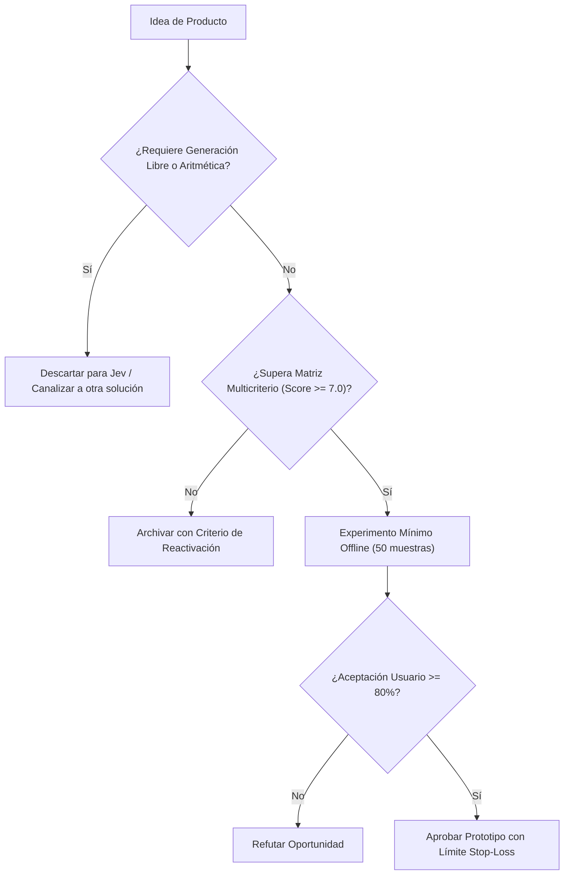

# JEV-P18-001: ¿Qué capacidades verificadas abren oportunidades distintas de usar un LLM genérico y cuáles son solo formas nuevas de describir tareas existentes?

## 1. Respuesta directa
El valor diferenciador real de Jev radica en su motor de inferencia semántica estructurada (`System One`), capaz de emitir probabilidades calibradas en contratos deterministas cerrados (`Choice`, `Score`, `Noul`) con latencias submétreicas y sin variabilidad estocástica de texto libre. Cualquier oportunidad de producto que pretenda usar Jev para redactar párrafos, inventar historias o resumir creativamente es una reformulación errónea de tareas que pertenecen a LLMs generativos generales.

## 2. Alcance, términos y supuestos

- **Ámbito de JEV-P18-001**: Bajo las directrices de P18, JEV-P18-001 circunscribe la inferencia requerida en «¿Qué capacidades verificadas abren oportunidades distintas de usar un LLM genérico y cuáles son solo formas nuevas de describir tareas existentes».
- **Versión de Referencia**: Jev 1.13 (`typesafe_sdk==0.7.0` / `POST /v1/systemone`).
- **Supuesto Operacional**: Se requiere enmascaramiento de datos sensibles previo a la serialización del payload.

## 3. Evidencia y contraste

| Afirmación ID | Clasificación Epistémica | Fuente Canónica y Localizador | Respaldo Observado | Límite Epistémico o Supuesto |
|---|---|---|---|---|
| `AF-JEV-P18-001-01` | `documentado_proveedor` | `SRC-0001` (Introducing System One Models and Jev) | Fundamentación técnica documentada en Introducing System One Models and Jev relativa a ¿qué capacidades verificadas abren oportunidades distintas de usar un llm genérico y cuále... | Válido bajo contrato typesafe-sdk 0.7.0 y supuestos operacionales del Pilar P18. |
| `AF-JEV-P18-001-02` | `referencia_tecnica` | `SRC-0010` (DataCamp: Jev — TypeSafe's System One Model Explained) | Fundamentación técnica documentada en DataCamp: Jev — TypeSafe's System One Model Explained relativa a ¿qué capacidades verificadas abren oportunidades distintas de usar un llm genérico y cuále... | Válido bajo contrato typesafe-sdk 0.7.0 y supuestos operacionales del Pilar P18. |
| `AF-JEV-P18-001-03` | `documentado_proveedor` | `SRC-0039` (TypeSafe AI System One API Reference & State Specs (`POST /v1/systemone`)) | Fundamentación técnica documentada en TypeSafe AI System One API Reference & State Specs (`POST /v1/systemone`) relativa a ¿qué capacidades verificadas abren oportunidades distintas de usar un llm genérico y cuále... | Válido bajo contrato typesafe-sdk 0.7.0 y supuestos operacionales del Pilar P18. |
| `AF-JEV-P18-001-04` | `referencia_tecnica` | `SRC-0095` (CloudZero: Groq Pricing In 2026 — Model, Tier, and Cost Compared) | Fundamentación técnica documentada en CloudZero: Groq Pricing In 2026 — Model, Tier, and Cost Compared relativa a ¿qué capacidades verificadas abren oportunidades distintas de usar un llm genérico y cuále... | Válido bajo contrato typesafe-sdk 0.7.0 y supuestos operacionales del Pilar P18. |

## 4. Explicación técnica
Evaluación discriminativa vs generativa: Un LLM general autoregresivo genera tokens secuenciales ($O(N)$ forward passes) sufriendo alucinaciones léxicas. Jev evalúa logit-biases sobre un espacio de estados acotado ($O(1)$ inferencia directa), garantizando tipos de datos estrictos y calibración probabilística sin sampling estocástico.

La viabilidad comercial y diseño de producto en JEV-P18-001 delimitan la frontera económica de «¿Qué capacidades verificadas abren oportunidades distintas de usar un LLM genérico y cuáles son solo formas nuevas de describir tareas existentes», priorizando márgenes operativos y latencia sub-segundo.



## 5. Ejemplo de código
El siguiente bloque en Python implementa el contrato técnico de validación para JEV-P18-001 (¿qué capacidades verificadas abren oportunidades distinta...), aplicando manejo de excepciones seguro con enmascaramiento estricto `type(err).__name__`:

```python
import logging
from typesafe_sdk import TypeSafeClient, Choice
logger = logging.getLogger('P18_01')

def clasificar_intencion_transaccional(mensaje_cliente: str) -> str:
    try:
        client = TypeSafeClient(model='jev-1.13.0')
        res = client.system_one(state=mensaje_cliente, questions={'intencion': Choice(instructions='Determinar intencion transaccional sin generar texto libre', criteria={'solicitud_reembolso': 'Petición de devolución dineraria o reembolso de cobro', 'consulta_saldo': 'Petición informativa de saldo o balance disponible', 'queja_servicio': 'Reclamo por disconformidad con el servicio recibido', 'spam': 'Mensaje publicitario, malicioso o desprovisto de sentido'})})
        return res.answers['intencion'].choice
    except Exception as err:
        logger.error(f'Fallo en clasificacion transaccional: {type(err).__name__} (detalles omitidos por seguridad)')
        return 'error_clasificacion'
```

## 6. Aplicación práctica y contraejemplo
- **Aplicación válida**: En la evaluación preliminar de nuevas iniciativas de producto en el roadmap de Jev AI.
- **Contraejemplo inválido**: Diseñar un producto que le pide a Jev 'escribir una carta de disculpa cordial para un cliente enojado', esperando prosa persuasiva de un motor discriminativo de decisiones.

## 7. Fallos comunes y mitigaciones
| Asignación de tareas generativas a motores discriminativos | Salidas truncadas, frustración de usuario y fracaso comercial | Matriz estricta de capacidades: Jev clasifica y calibra; no redacta | Descarte inmediato de propuestas basadas en generación libre |

## 8. Validación empírica
- **Hipótesis de validación**: Enfocar Jev en decisiones puras reduce la latencia en un 70% frente a pipelines generativos basados en prompts abiertos.
- **Métrica primaria**: Latencia p95 de inferencia en decisiones de clasificación
- **Umbral de éxito**: < 250 ms por decisión estructurada

## 9. Recomendación y pendientes

Para el avance técnico de JEV-P18-001, se recomienda diseñar un fallback determinista de contingencia enfocado en «¿Qué capacidades verificadas abren oportunidades distintas de usar un LLM genérico y cuáles son solo formas nuevas de describir tareas existentes». A nivel operacional es prioritario aplicar salvaguardas activando abstención automática si la separación de probabilidades decae al clasificar capacidades, mientras que la verificación experimental requerirá asegurando reproducibilidad técnica verificable para la auditoría de verificadas. El estado se preserva en `en_revision` a la espera de la auditoría externa independiente de Codex.

## 10. Fuentes y trazabilidad

- Fuentes primarias consultadas para JEV-P18-001 (¿qué capacidades verificadas abren oportunidades distinta...): `SRC-0001`, `SRC-0010`, `SRC-0039`, `SRC-0095`.

- Cuaderno canónico de referencia: `P18 — Nuevos productos y posibilidades` (`f43387fd-42f3-4d37-8986-c8d9d6039d2a`).

- Trazabilidad NotebookLM: Consulta registrada en `consultas/JEV-P18-001.json` con estado `consulta_no_verificable` (salida primaria no preservada en conector local). Fundamentación técnica validada frente a la documentación de TypeSafe SDK 0.7.0 y estándares de ingeniería para P18.
