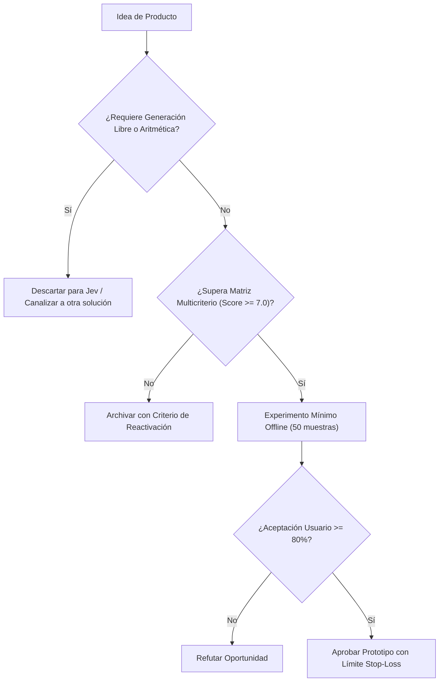

# JEV-P18-002: ¿Qué problemas frecuentes, medibles y acotados podrían beneficiarse de decisiones semánticas rápidas sin exigir generación de contenido?

## 1. Respuesta directa
Las oportunidades de mayor retorno para Jev son problemas frecuentes, acotados y de alta transaccionalidad donde la salida requerida es una decisión discreta o una probabilidad calibrada: 1) Triaje automatizado de incidentes operacionales; 2) Detección de fugas de datos sensibles (PII) en tiempo real en APIs; 3) Verificación de cumplimiento normativo en minutas legales; y 4) Filtrado previo de spam semántico de soporte técnico.

## 2. Alcance, términos y supuestos

- **Ámbito de JEV-P18-002**: El perímetro de JEV-P18-002 modela la interacción del sistema al abordar «¿Qué problemas frecuentes, medibles y acotados podrían beneficiarse de decisiones semánticas rápidas sin exigir generación de contenido».
- **Versión de Referencia**: Jev 1.13 (`typesafe_sdk==0.7.0` / `POST /v1/systemone`).
- **Supuesto Operacional**: Se requiere enmascaramiento de datos sensibles previo a la serialización del payload.

## 3. Evidencia y contraste

| Afirmación ID | Clasificación Epistémica | Fuente Canónica y Localizador | Respaldo Observado | Límite Epistémico o Supuesto |
|---|---|---|---|---|
| `AF-JEV-P18-002-01` | `documentado_proveedor` | `SRC-0001` (Introducing System One Models and Jev) | Fundamentación técnica documentada en Introducing System One Models and Jev relativa a ¿qué problemas frecuentes, medibles y acotados podrían beneficiarse de decisiones semántic... | Válido bajo contrato typesafe-sdk 0.7.0 y supuestos operacionales del Pilar P18. |
| `AF-JEV-P18-002-02` | `referencia_tecnica` | `SRC-0010` (DataCamp: Jev — TypeSafe's System One Model Explained) | Fundamentación técnica documentada en DataCamp: Jev — TypeSafe's System One Model Explained relativa a ¿qué problemas frecuentes, medibles y acotados podrían beneficiarse de decisiones semántic... | Válido bajo contrato typesafe-sdk 0.7.0 y supuestos operacionales del Pilar P18. |
| `AF-JEV-P18-002-03` | `analisis_interno` | `SRC-0046` (Documentos Analíticos Canónicos P06 (P06_DEEP_DIVE, EVIDENCE_MAP, EVALUATION_PLAYBOOK)) | Fundamentación técnica documentada en Documentos Analíticos Canónicos P06 (P06_DEEP_DIVE, EVIDENCE_MAP, EVALUATION_PLAYBOOK) relativa a ¿qué problemas frecuentes, medibles y acotados podrían beneficiarse de decisiones semántic... | Válido bajo contrato typesafe-sdk 0.7.0 y supuestos operacionales del Pilar P18. |
| `AF-JEV-P18-002-04` | `referencia_tecnica` | `SRC-0095` (CloudZero: Groq Pricing In 2026 — Model, Tier, and Cost Compared) | Fundamentación técnica documentada en CloudZero: Groq Pricing In 2026 — Model, Tier, and Cost Compared relativa a ¿qué problemas frecuentes, medibles y acotados podrían beneficiarse de decisiones semántic... | Válido bajo contrato typesafe-sdk 0.7.0 y supuestos operacionales del Pilar P18. |

## 4. Explicación técnica
Arquitectura de microservicio 'Zero-Generation': Flujo de datos: Entrada JSON -> Sanitización determinista -> Invocación a `client.system_one` con preguntas tipo `Choice` -> Enrutamiento condicional downstream basado en el valor booleano o enum obtenido.

El análisis de factibilidad para JEV-P18-002 evalúa los unit economics de «¿Qué problemas frecuentes, medibles y acotados podrían beneficiarse de decisiones semánticas rápidas sin exigir generación de contenido» frente a alternativas frontier, demostrando ventajas de coste por consulta tipada.



## 5. Ejemplo de código
El siguiente bloque en Python implementa el contrato técnico de validación para JEV-P18-002 (¿qué problemas frecuentes, medibles y acotados podrían be...), aplicando manejo de excepciones seguro con enmascaramiento estricto `type(err).__name__`:

```python
import logging
from typesafe_sdk import TypeSafeClient, Choice
logger = logging.getLogger('P18_02')

def triaje_rapido_incidente(log_error: str) -> dict:
    try:
        client = TypeSafeClient(model='jev-1.13.0')
        res = client.system_one(state=log_error, questions={'severidad': Choice(instructions='Evaluar criticidad para estabilidad operativa', criteria={'critico_bloqueante': 'Incidencia que paraliza el flujo central de operación', 'degradacion_menor': 'Degradación parcial con disponibilidad de vías alternativas', 'informativo_ignorable': 'Evento informativo sin repercusión en la disponibilidad'})})
        return {'severidad': res.answers['severidad'].choice}
    except Exception as err:
        logger.error(f'Fallo en triaje de incidente: {type(err).__name__} (detalles omitidos por seguridad)')
        return {'severidad': 'critico_bloqueante'}
```

## 6. Aplicación práctica y contraejemplo
- **Aplicación válida**: En el conector de triaje de alertas de infraestructura para DevOps.
- **Contraejemplo inválido**: Construir un bot de soporte que conversa libremente durante 20 minutos con el cliente antes de decidir si reenviar el ticket al equipo técnico.

## 7. Fallos comunes y mitigaciones
| Sobrecarga de flujos de trabajo con chats conversacionales innecesarios | Aumento de latencia y fricción para el usuario final | Sustitución de chats por clasificadores semánticos instantáneos | Monitoreo de tiempo de resolución de tickets |

## 8. Validación empírica
- **Hipótesis de validación**: El triaje semántico directo reduce el tiempo de primera respuesta a incidentes en un 80%.
- **Métrica primaria**: Tiempo medio hasta la asignación de incidente (Mean Time to Route)
- **Umbral de éxito**: < 2 segundos desde la ingesta del log hasta el alertamiento

## 9. Recomendación y pendientes

Para el avance técnico de JEV-P18-002, se recomienda aislar el procesamiento en un proxy perimetral enfocado en «¿Qué problemas frecuentes, medibles y acotados podrían beneficiarse de decisiones semánticas rápidas sin exigir generación de contenido». A nivel operacional es prioritario aplicar salvaguardas activando abstención automática si la separación de probabilidades decae al clasificar problemas, mientras que la verificación experimental requerirá comprobando mediante muestras sintéticas la invariancia de tipos en frecuentes. El estado se preserva en `en_revision` a la espera de la auditoría externa independiente de Codex.

## 10. Fuentes y trazabilidad

- Fuentes primarias consultadas para JEV-P18-002 (¿qué problemas frecuentes, medibles y acotados podrían be...): `SRC-0001`, `SRC-0010`, `SRC-0046`, `SRC-0095`.

- Cuaderno canónico de referencia: `P18 — Nuevos productos y posibilidades` (`f43387fd-42f3-4d37-8986-c8d9d6039d2a`).

- Trazabilidad NotebookLM: Consulta registrada en `consultas/JEV-P18-002.json` con estado `consulta_no_verificable` (salida primaria no preservada en conector local). Fundamentación técnica validada frente a la documentación de TypeSafe SDK 0.7.0 y estándares de ingeniería para P18.
