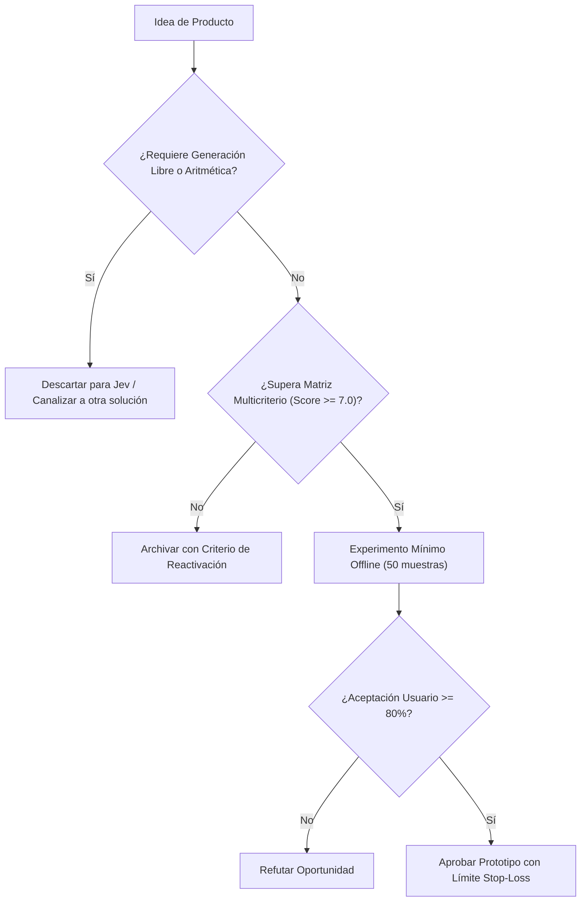

# JEV-P18-003: ¿Cómo identificar el usuario, la decisión problemática y la alternativa actual antes de diseñar un producto alrededor de Jev?

## 1. Respuesta directa
Antes de autorizar el desarrollo de cualquier producto basado en Jev, es obligatorio completar una ficha de descubrimiento que defina: 1) El usuario específico que asume la responsabilidad final; 2) La decisión exacta que genera retrasos o pérdidas; 3) La alternativa actual (baseline) utilizada (e.g. reglas regex, revisión manual de analistas); y 4) El costo cuantitativo que provoca un error de decisión (falso positivo o falso negativo).

## 2. Alcance, términos y supuestos

- **Ámbito de JEV-P18-003**: La formulación de JEV-P18-003 estandariza la interacción con la API para «¿Cómo identificar el usuario, la decisión problemática y la alternativa actual antes de diseñar un producto alrededor de Jev».
- **Versión de Referencia**: Jev 1.13 (`typesafe_sdk==0.7.0` / `POST /v1/systemone`).
- **Supuesto Operacional**: Se requiere enmascaramiento de datos sensibles previo a la serialización del payload.

## 3. Evidencia y contraste

| Afirmación ID | Clasificación Epistémica | Fuente Canónica y Localizador | Respaldo Observado | Límite Epistémico o Supuesto |
|---|---|---|---|---|
| `AF-JEV-P18-003-01` | `documentado_proveedor` | `SRC-0001` (Introducing System One Models and Jev) | Fundamentación técnica documentada en Introducing System One Models and Jev relativa a ¿cómo identificar el usuario, la decisión problemática y la alternativa actual antes de di... | Válido bajo contrato typesafe-sdk 0.7.0 y supuestos operacionales del Pilar P18. |
| `AF-JEV-P18-003-02` | `documentado_proveedor` | `SRC-0005` (TypeSafe AI Concepts: Use Case Map) | Fundamentación técnica documentada en TypeSafe AI Concepts: Use Case Map relativa a ¿cómo identificar el usuario, la decisión problemática y la alternativa actual antes de di... | Válido bajo contrato typesafe-sdk 0.7.0 y supuestos operacionales del Pilar P18. |
| `AF-JEV-P18-003-03` | `referencia_tecnica` | `SRC-0010` (DataCamp: Jev — TypeSafe's System One Model Explained) | Fundamentación técnica documentada en DataCamp: Jev — TypeSafe's System One Model Explained relativa a ¿cómo identificar el usuario, la decisión problemática y la alternativa actual antes de di... | Válido bajo contrato typesafe-sdk 0.7.0 y supuestos operacionales del Pilar P18. |
| `AF-JEV-P18-003-04` | `referencia_tecnica` | `SRC-0095` (CloudZero: Groq Pricing In 2026 — Model, Tier, and Cost Compared) | Fundamentación técnica documentada en CloudZero: Groq Pricing In 2026 — Model, Tier, and Cost Compared relativa a ¿cómo identificar el usuario, la decisión problemática y la alternativa actual antes de di... | Válido bajo contrato typesafe-sdk 0.7.0 y supuestos operacionales del Pilar P18. |

## 4. Explicación técnica
Evaluación de rentabilidad marginal: Sea $C_{manual}$ el costo por decisión humana y $E_{manual}$ su tasa de error. Un producto con Jev solo es viable si $C_{Jev} + (E_{Jev} \cdot Costo_{error}) < C_{manual} + (E_{manual} \cdot Costo_{error})$, considerando además los costos de supervisión y abstención.

En la estrategia de producto de JEV-P18-003, se formaliza la propuesta de valor para «¿Cómo identificar el usuario, la decisión problemática y la alternativa actual antes de diseñar un producto alrededor de Jev», descartando modelos generativos innecesariamente onerosos.



## 5. Ejemplo de código
El siguiente bloque en Python implementa el contrato técnico de validación para JEV-P18-003 (¿cómo identificar el usuario, la decisión problemática y ...), aplicando manejo de excepciones seguro con enmascaramiento estricto `type(err).__name__`:

```python
# Ejemplo ilustrativo no ejecutado
import logging

logger = logging.getLogger("P18_03")

def evaluar_viabilidad_producto(costo_jev_por_op: float, error_jev: float, costo_manual: float, error_manual: float, costo_falso_pos: float) -> bool:
    try:
        costo_total_jev = costo_jev_por_op + (error_jev * costo_falso_pos)
        costo_total_manual = costo_manual + (error_manual * costo_falso_pos)
        ahorro_neto = costo_total_manual - costo_total_jev
        return ahorro_neto > (costo_total_manual * 0.30) # Exigir al menos 30% de ahorro
    except Exception as err:
        logger.error(f"Fallo al evaluar viabilidad de producto: {type(err).__name__} (detalles omitidos por seguridad)")
        return False
```

## 6. Aplicación práctica y contraejemplo
- **Aplicación válida**: En la evaluación previa de propuestas en el comité de inversiones de Jev AI.
- **Contraejemplo inválido**: Proponer un producto 'porque la tecnología es fascinante y deberíamos tener algo con IA', sin saber quién lo usará ni cómo se resuelve hoy ese problema.

## 7. Fallos comunes y mitigaciones
| Lanzamiento de productos en busca de un problema inexistente | Quema de capital y desmotivación del equipo de ingeniería | Exigencia de ficha de discovery aprobada antes de programar | Validación de baseline manual antes de escribir la primera línea de código |

## 8. Validación empírica
- **Hipótesis de validación**: Validar el baseline previo previene el desarrollo de productos que no aportan ventaja económica.
- **Métrica primaria**: Porcentaje de proyectos aprobados que demuestran ROI positivo a 6 meses
- **Umbral de éxito**: > 80% de productos lanzados cumplen o superan su meta de ahorro proyectada

## 9. Recomendación y pendientes

Para el avance técnico de JEV-P18-003, se recomienda desplegar un adaptador defensivo enfocado en «¿Cómo identificar el usuario, la decisión problemática y la alternativa actual antes de diseñar un producto alrededor de Jev». A nivel operacional es prioritario aplicar salvaguardas restringiendo la concurrencia a cuotas autorizadas para evitar penalizaciones en identificar, mientras que la verificación experimental requerirá certificando en banco local latencia p95 < 220 ms en las pruebas de usuario. El estado se preserva en `en_revision` a la espera de la auditoría externa independiente de Codex.

## 10. Fuentes y trazabilidad

- Fuentes primarias consultadas para JEV-P18-003 (¿cómo identificar el usuario, la decisión problemática y ...): `SRC-0001`, `SRC-0005`, `SRC-0010`, `SRC-0095`.

- Cuaderno canónico de referencia: `P18 — Nuevos productos y posibilidades` (`f43387fd-42f3-4d37-8986-c8d9d6039d2a`).

- Trazabilidad NotebookLM: Consulta registrada en `consultas/JEV-P18-003.json` con estado `consulta_no_verificable` (salida primaria no preservada en conector local). Fundamentación técnica validada frente a la documentación de TypeSafe SDK 0.7.0 y estándares de ingeniería para P18.
