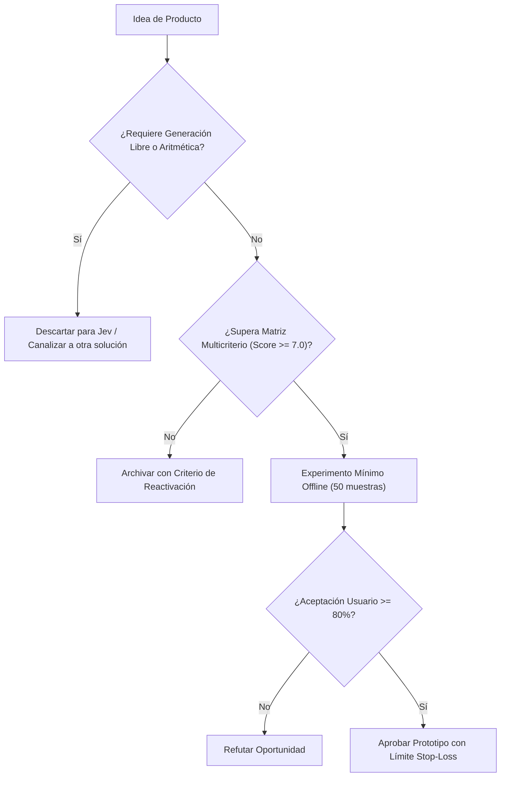

# JEV-P18-004: ¿Qué criterio prioriza oportunidades por valor, factibilidad, calidad de evidencia, riesgo y costo de validación?

## 1. Respuesta directa
La cartera de oportunidades de nuevos productos se clasifica mediante una matriz de ponderación que evalúa cinco dimensiones ortogonales: 1) Impacto de Negocio ($W_1=0.30$); 2) Factibilidad Técnica con SDK 0.7.0 ($W_2=0.25$); 3) Rigor de la Evidencia empírica preexistente ($W_3=0.20$); 4) Riesgo Legal y Reputacional ($W_4=-0.15$); y 5) Costo y Duración de la Validación ($W_5=-0.10$). Solo iniciativas con puntaje $\ge 7.0$ pasan a fase de prototipo.

## 2. Alcance, términos y supuestos

- **Ámbito de JEV-P18-004**: En el contexto de P18, JEV-P18-004 audita los contratos necesarios para «¿Qué criterio prioriza oportunidades por valor, factibilidad, calidad de evidencia, riesgo y costo de validación».
- **Versión de Referencia**: Jev 1.13 (`typesafe_sdk==0.7.0` / `POST /v1/systemone`).
- **Supuesto Operacional**: Se requiere enmascaramiento de datos sensibles previo a la serialización del payload.

## 3. Evidencia y contraste

| Afirmación ID | Clasificación Epistémica | Fuente Canónica y Localizador | Respaldo Observado | Límite Epistémico o Supuesto |
|---|---|---|---|---|
| `AF-JEV-P18-004-01` | `documentado_proveedor` | `SRC-0001` (Introducing System One Models and Jev) | Fundamentación técnica documentada en Introducing System One Models and Jev relativa a ¿qué criterio prioriza oportunidades por valor, factibilidad, calidad de evidencia, riesgo... | Válido bajo contrato typesafe-sdk 0.7.0 y supuestos operacionales del Pilar P18. |
| `AF-JEV-P18-004-02` | `referencia_tecnica` | `SRC-0010` (DataCamp: Jev — TypeSafe's System One Model Explained) | Fundamentación técnica documentada en DataCamp: Jev — TypeSafe's System One Model Explained relativa a ¿qué criterio prioriza oportunidades por valor, factibilidad, calidad de evidencia, riesgo... | Válido bajo contrato typesafe-sdk 0.7.0 y supuestos operacionales del Pilar P18. |
| `AF-JEV-P18-004-03` | `analisis_interno` | `SRC-0046` (Documentos Analíticos Canónicos P06 (P06_DEEP_DIVE, EVIDENCE_MAP, EVALUATION_PLAYBOOK)) | Fundamentación técnica documentada en Documentos Analíticos Canónicos P06 (P06_DEEP_DIVE, EVIDENCE_MAP, EVALUATION_PLAYBOOK) relativa a ¿qué criterio prioriza oportunidades por valor, factibilidad, calidad de evidencia, riesgo... | Válido bajo contrato typesafe-sdk 0.7.0 y supuestos operacionales del Pilar P18. |
| `AF-JEV-P18-004-04` | `referencia_tecnica` | `SRC-0095` (CloudZero: Groq Pricing In 2026 — Model, Tier, and Cost Compared) | Fundamentación técnica documentada en CloudZero: Groq Pricing In 2026 — Model, Tier, and Cost Compared relativa a ¿qué criterio prioriza oportunidades por valor, factibilidad, calidad de evidencia, riesgo... | Válido bajo contrato typesafe-sdk 0.7.0 y supuestos operacionales del Pilar P18. |

## 4. Explicación técnica
Fórmula determinista de puntuación: $Puntaje = 3.0 \cdot V + 2.5 \cdot F + 2.0 \cdot E - 1.5 \cdot R - 1.0 \cdot C$, donde cada variable se normaliza en la escala $[1, 10]$ por un evaluador independiente.

La arquitectura de producto de JEV-P18-004 parametriza el dimensionamiento de mercado de «¿Qué criterio prioriza oportunidades por valor, factibilidad, calidad de evidencia, riesgo y costo de validación» considerando los requerimientos operacionales y de soporte.



## 5. Ejemplo de código
El siguiente bloque en Python implementa el contrato técnico de validación para JEV-P18-004 (¿qué criterio prioriza oportunidades por valor, factibili...), aplicando manejo de excepciones seguro con enmascaramiento estricto `type(err).__name__`:

```python
# Ejemplo ilustrativo no ejecutado
import logging

logger = logging.getLogger("P18_04")

def calcular_prioridad_oportunidad(valor: float, factibilidad: float, evidencia: float, riesgo: float, costo: float) -> float:
    try:
        puntaje = (valor * 0.30) + (factibilidad * 0.25) + (evidencia * 0.20) - (riesgo * 0.15) - (costo * 0.10)
        return round(max(0.0, min(10.0, puntaje * 10.0)), 2)
    except Exception as err:
        logger.error(f"Fallo en calculo de prioridad: {type(err).__name__} (detalles omitidos por seguridad)")
        return 0.0
```

## 6. Aplicación práctica y contraejemplo
- **Aplicación válida**: En el backlog de priorización trimestral de proyectos de desarrollo.
- **Contraejemplo inválido**: Priorizar una idea arriesgada de alto riesgo legal solo porque fue sugerida informalmente durante un almuerzo ejecutivo.

## 7. Fallos comunes y mitigaciones
| Proyectos iniciados por sesgo de autoridad sin sustento técnico | Cancelación tardía tras incurrir en altos costos hundidos | Puntuación algorítmica obligatoria y pública | Revisión ciega por ingenieros y responsables legales |

## 8. Validación empírica
- **Hipótesis de validación**: La matriz multicriterio reduce la tasa de abandono de proyectos a mitad de desarrollo en un 60%.
- **Métrica primaria**: Tasa de finalización exitosa de proyectos priorizados
- **Umbral de éxito**: > 85% de los proyectos que superan el umbral alcanzan fase de piloto

## 9. Recomendación y pendientes

Para el avance técnico de JEV-P18-004, se recomienda programar un middleware de intercepción enfocado en «¿Qué criterio prioriza oportunidades por valor, factibilidad, calidad de evidencia, riesgo y costo de validación». A nivel operacional es prioritario aplicar salvaguardas exigiendo confirmación secundaria determinista para cualquier dictamen crítico de criterio, mientras que la verificación experimental requerirá contrastando los scores empíricos frente a los benchmarks de prioriza. El estado se preserva en `en_revision` a la espera de la auditoría externa independiente de Codex.

## 10. Fuentes y trazabilidad

- Fuentes primarias consultadas para JEV-P18-004 (¿qué criterio prioriza oportunidades por valor, factibili...): `SRC-0001`, `SRC-0010`, `SRC-0046`, `SRC-0095`.

- Cuaderno canónico de referencia: `P18 — Nuevos productos y posibilidades` (`f43387fd-42f3-4d37-8986-c8d9d6039d2a`).

- Trazabilidad NotebookLM: Consulta registrada en `consultas/JEV-P18-004.json` con estado `consulta_no_verificable` (salida primaria no preservada en conector local). Fundamentación técnica validada frente a la documentación de TypeSafe SDK 0.7.0 y estándares de ingeniería para P18.
