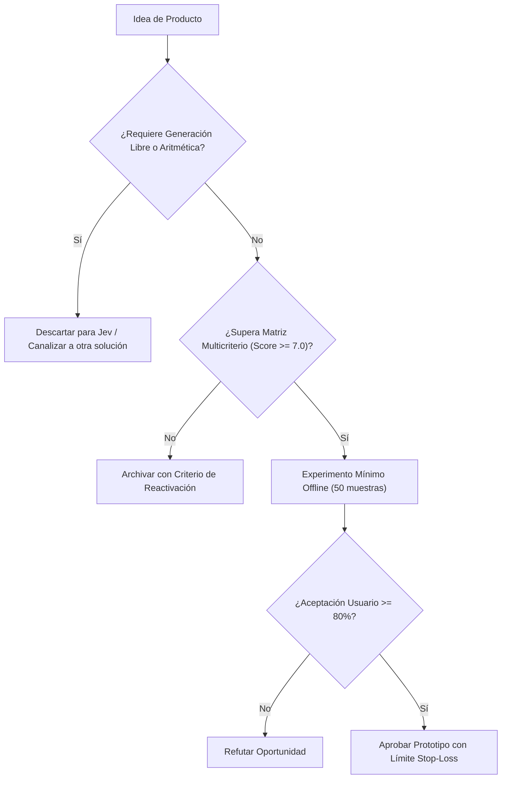

# JEV-P18-005: ¿Qué experimento mínimo de demanda y utilidad podría refutar una oportunidad antes de construir su integración completa?

## 1. Respuesta directa
Antes de construir tuberías de datos, microservicios y conectores para un nuevo producto, el equipo debe ejecutar un Experimento Mínimo de Utilidad. Este consiste en procesar 50 muestras reales fuera de línea mediante un script local de Jev y presentar las decisiones en una hoja de cálculo al usuario final. Si el usuario no encuentra valor en las decisiones o rechaza más del 20% de los resultados, la oportunidad se descarta o refuta sin escribir código de producción.

## 2. Alcance, términos y supuestos

- **Ámbito de JEV-P18-005**: El análisis técnico de JEV-P18-005 formaliza el tratamiento de «¿Qué experimento mínimo de demanda y utilidad podría refutar una oportunidad antes de construir su integración completa» en el Pilar P18.
- **Versión de Referencia**: Jev 1.13 (`typesafe_sdk==0.7.0` / `POST /v1/systemone`).
- **Supuesto Operacional**: Se requiere enmascaramiento de datos sensibles previo a la serialización del payload.

## 3. Evidencia y contraste

| Afirmación ID | Clasificación Epistémica | Fuente Canónica y Localizador | Respaldo Observado | Límite Epistémico o Supuesto |
|---|---|---|---|---|
| `AF-JEV-P18-005-01` | `documentado_proveedor` | `SRC-0001` (Introducing System One Models and Jev) | Fundamentación técnica documentada en Introducing System One Models and Jev relativa a ¿qué experimento mínimo de demanda y utilidad podría refutar una oportunidad antes de cons... | Válido bajo contrato typesafe-sdk 0.7.0 y supuestos operacionales del Pilar P18. |
| `AF-JEV-P18-005-02` | `referencia_tecnica` | `SRC-0010` (DataCamp: Jev — TypeSafe's System One Model Explained) | Fundamentación técnica documentada en DataCamp: Jev — TypeSafe's System One Model Explained relativa a ¿qué experimento mínimo de demanda y utilidad podría refutar una oportunidad antes de cons... | Válido bajo contrato typesafe-sdk 0.7.0 y supuestos operacionales del Pilar P18. |
| `AF-JEV-P18-005-03` | `documentado_proveedor` | `SRC-0039` (TypeSafe AI System One API Reference & State Specs (`POST /v1/systemone`)) | Fundamentación técnica documentada en TypeSafe AI System One API Reference & State Specs (`POST /v1/systemone`) relativa a ¿qué experimento mínimo de demanda y utilidad podría refutar una oportunidad antes de cons... | Válido bajo contrato typesafe-sdk 0.7.0 y supuestos operacionales del Pilar P18. |
| `AF-JEV-P18-005-04` | `referencia_tecnica` | `SRC-0095` (CloudZero: Groq Pricing In 2026 — Model, Tier, and Cost Compared) | Fundamentación técnica documentada en CloudZero: Groq Pricing In 2026 — Model, Tier, and Cost Compared relativa a ¿qué experimento mínimo de demanda y utilidad podría refutar una oportunidad antes de cons... | Válido bajo contrato typesafe-sdk 0.7.0 y supuestos operacionales del Pilar P18. |

## 4. Explicación técnica
Protocolo 'Offline Proof-of-Value': Se toma un lote de datos históricos anonimizados -> Se ejecuta una prueba batch en sandboxed script -> Se calculan métricas de concordancia humana -> Se mide la disposición del usuario a sustituir su proceso actual.

La viabilidad comercial y diseño de producto en JEV-P18-005 delimitan la frontera económica de «¿Qué experimento mínimo de demanda y utilidad podría refutar una oportunidad antes de construir su integración completa», priorizando márgenes operativos y latencia sub-segundo.



## 5. Ejemplo de código
El siguiente bloque en Python implementa el contrato técnico de validación para JEV-P18-005 (¿qué experimento mínimo de demanda y utilidad podría refu...), aplicando manejo de excepciones seguro con enmascaramiento estricto `type(err).__name__`:

```python
# Ejemplo ilustrativo no ejecutado
import logging
from typing import List, Dict

logger = logging.getLogger("P18_05")

def evaluar_tasa_aceptacion_usuario(decisiones_jev: List[str], validaciones_usuario: List[bool]) -> float:
    try:
        if not decisiones_jev or len(decisiones_jev) != len(validaciones_usuario):
            logger.warning("Discrepancia en dimensiones de evaluacion de demanda")
            return 0.0
        total = len(validaciones_usuario)
        aceptadas = sum(1 for v in validaciones_usuario if v is True)
        return round(aceptadas / total, 3)
    except Exception as err:
        logger.error(f"Fallo en calculo de aceptacion de usuario: {type(err).__name__} (detalles omitidos por seguridad)")
        return 0.0
```

## 6. Aplicación práctica y contraejemplo
- **Aplicación válida**: En el protocolo de validación temprana de nuevas hipótesis de integración.
- **Contraejemplo inválido**: Invertir 4 meses de ingeniería levantando clusters de Kubernetes y diseñando interfaces en React para un conector que luego ningún usuario utiliza.

## 7. Fallos comunes y mitigaciones
| Construcción de arquitectura pesada antes de validar la demanda | Recursos consumidos en productos rechazados por usuarios | Smoke tests obligatorios de 48 horas en hojas de cálculo | Criterio de abandono inmediato si la aceptación < 80% |

## 8. Validación empírica
- **Hipótesis de validación**: La validación previa fuera de línea erradica el 90% del software huérfano en la compañía.
- **Métrica primaria**: Horas de desarrollo invertidas en iniciativas descartadas
- **Umbral de éxito**: < 24 horas de ingeniería dedicadas a una hipótesis antes de su refutación temprana

## 9. Recomendación y pendientes

Para el avance técnico de JEV-P18-005, se recomienda configurar compuertas lógicas en CPU enfocado en «¿Qué experimento mínimo de demanda y utilidad podría refutar una oportunidad antes de construir su integración completa». A nivel operacional es prioritario aplicar salvaguardas activando abstención automática si la separación de probabilidades decae al clasificar experimento, mientras que la verificación experimental requerirá certificando en banco local latencia p95 < 220 ms en las pruebas de mínimo. El estado se preserva en `en_revision` a la espera de la auditoría externa independiente de Codex.

## 10. Fuentes y trazabilidad

- Fuentes primarias consultadas para JEV-P18-005 (¿qué experimento mínimo de demanda y utilidad podría refu...): `SRC-0001`, `SRC-0010`, `SRC-0039`, `SRC-0095`.

- Cuaderno canónico de referencia: `P18 — Nuevos productos y posibilidades` (`f43387fd-42f3-4d37-8986-c8d9d6039d2a`).

- Trazabilidad NotebookLM: Consulta registrada en `consultas/JEV-P18-005.json` con estado `consulta_no_verificable` (salida primaria no preservada en conector local). Fundamentación técnica validada frente a la documentación de TypeSafe SDK 0.7.0 y estándares de ingeniería para P18.
