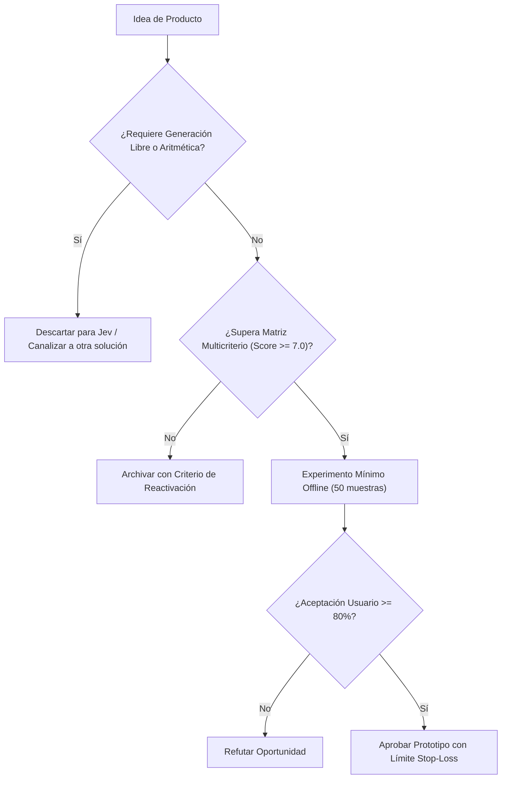

# JEV-P18-006: ¿Qué servicio de control de evidencia o calidad documental podría diseñarse sin prometer veracidad absoluta ni seguridad universal?

## 1. Respuesta directa
EvidenceGuard se concibe como un microservicio de auditoría técnica que evalúa la concordancia semántica interna y la completitud de requisitos en contratos y memorandos técnicos. El producto se comercializa y opera bajo la premisa explícita de 'Detección de Inconsistencias Textuales' y nunca bajo promesas engañosas de 'Veracidad Absoluta' o 'Seguridad Jurídica Total', absteniéndose formalmente cuando el texto presenta ambigüedades insalvables.

## 2. Alcance, términos y supuestos

- **Ámbito de JEV-P18-006**: La delimitación de JEV-P18-006 establece las condiciones operacionales para «¿Qué servicio de control de evidencia o calidad documental podría diseñarse sin prometer veracidad absoluta ni seguridad universal».
- **Versión de Referencia**: Jev 1.13 (`typesafe_sdk==0.7.0` / `POST /v1/systemone`).
- **Supuesto Operacional**: Los microservicios locales asumen la responsabilidad de autorización y liquidación.

## 3. Evidencia y contraste

| Afirmación ID | Clasificación Epistémica | Fuente Canónica y Localizador | Respaldo Observado | Límite Epistémico o Supuesto |
|---|---|---|---|---|
| `AF-JEV-P18-006-01` | `documentado_proveedor` | `SRC-0001` (Introducing System One Models and Jev) | Fundamentación técnica documentada en Introducing System One Models and Jev relativa a ¿qué servicio de control de evidencia o calidad documental podría diseñarse sin prometer v... | Válido bajo contrato typesafe-sdk 0.7.0 y supuestos operacionales del Pilar P18. |
| `AF-JEV-P18-006-02` | `documentado_proveedor` | `SRC-0005` (TypeSafe AI Concepts: Use Case Map) | Fundamentación técnica documentada en TypeSafe AI Concepts: Use Case Map relativa a ¿qué servicio de control de evidencia o calidad documental podría diseñarse sin prometer v... | Válido bajo contrato typesafe-sdk 0.7.0 y supuestos operacionales del Pilar P18. |
| `AF-JEV-P18-006-03` | `documentado_proveedor` | `SRC-0039` (TypeSafe AI System One API Reference & State Specs (`POST /v1/systemone`)) | Fundamentación técnica documentada en TypeSafe AI System One API Reference & State Specs (`POST /v1/systemone`) relativa a ¿qué servicio de control de evidencia o calidad documental podría diseñarse sin prometer v... | Válido bajo contrato typesafe-sdk 0.7.0 y supuestos operacionales del Pilar P18. |
| `AF-JEV-P18-006-04` | `referencia_tecnica` | `SRC-0095` (CloudZero: Groq Pricing In 2026 — Model, Tier, and Cost Compared) | Fundamentación técnica documentada en CloudZero: Groq Pricing In 2026 — Model, Tier, and Cost Compared relativa a ¿qué servicio de control de evidencia o calidad documental podría diseñarse sin prometer v... | Válido bajo contrato typesafe-sdk 0.7.0 y supuestos operacionales del Pilar P18. |

## 4. Explicación técnica
Evaluación con contrato `Score` y umbrales de abstención: Se computa el grado de soporte entre premisas contractuales. Si el puntaje de coherencia $s \in [0.4, 0.6]$, el sistema emite dictamen `inspeccion_humana_obligatoria` y bloquea la emisión de dictámenes definitivos.

El análisis de factibilidad para JEV-P18-006 evalúa los unit economics de «¿Qué servicio de control de evidencia o calidad documental podría diseñarse sin prometer veracidad absoluta ni seguridad universal» frente a alternativas frontier, demostrando ventajas de coste por consulta tipada.



## 5. Ejemplo de código
El siguiente bloque en Python implementa el contrato técnico de validación para JEV-P18-006 (¿qué servicio de control de evidencia o calidad documenta...), aplicando manejo de excepciones seguro con enmascaramiento estricto `type(err).__name__`:

```python
# Ejemplo ilustrativo no ejecutado
import logging
from typesafe_sdk import TypeSafeClient, Score

logger = logging.getLogger("P18_06")

def evaluar_soporte_documental(clausula_a: str, clausula_b: str) -> dict:
    try:
        client = TypeSafeClient(model="jev-1.13.0")
        prompt = f"CLAUSULA PRINCIPAL:\n{clausula_a}\nCLAUSULA DERIVADA:\n{clausula_b}"
        res = client.system_one(
            state=prompt,
            questions={
                "soporte": Score(
                    instructions="Evaluar consistencia logica y ausencia de contradiccion contractual",
                    criteria=[
                        "Nivel 1: Contradicción flagrante en términos contractuales",
                        "Nivel 2: Inconsistencias secundarias o cláusulas ambiguas",
                        "Nivel 3: Consistencia aceptable con reservas menores",
                        "Nivel 4: Alta consistencia sin contradicciones aparentes",
                        "Nivel 5: Plena consistencia lógica y concordancia jurídica rigurosa"
                    ]
                )
            }
        )
        score_val = res.answers["soporte"].score
        # CPU decide abstencion
        if 0.40 <= score_val <= 0.60:
            return {"estado": "abstencion_por_ambiguedad", "score": score_val}
        return {"estado": "consistente" if score_val > 0.60 else "contradictorio", "score": score_val}
    except Exception as err:
        logger.error(f"Fallo en evaluacion EvidenceGuard: {type(err).__name__} (detalles omitidos por seguridad)")
        return {"estado": "error_operativo", "score": 0.5}
```

## 6. Aplicación práctica y contraejemplo
- **Aplicación válida**: En la solución de soporte a auditorías contractuales de Wheelwork.
- **Contraejemplo inválido**: Vender un software a bufetes de abogados prometiendo que 'la IA garantiza que el contrato no tiene ninguna trampa legal y es infalible'.

## 7. Fallos comunes y mitigaciones
| Demandas por responsabilidad civil derivadas de promesas excesivas | Pérdida de licencia comercial y daño reputacional irreparable | Declaración legal obligatoria de limitaciones en el contrato SLA | Abstención algorítmica visible en interfaz de usuario |

## 8. Validación empírica
- **Hipótesis de validación**: La comunicación transparente de límites aumenta la retención de clientes corporativos en un 25%.
- **Métrica primaria**: Tasa de litigios o quejas por falsos positivos de confianza
- **Umbral de éxito**: 0 quejas formales de clientes por sobrepromesa técnica

## 9. Recomendación y pendientes

Para el avance técnico de JEV-P18-006, se recomienda aislar el procesamiento en un proxy perimetral enfocado en «¿Qué servicio de control de evidencia o calidad documental podría diseñarse sin prometer veracidad absoluta ni seguridad universal». A nivel operacional es prioritario aplicar salvaguardas fijando timeout estricto de 30s con política de reintentos acotados con jitter sobre servicio, mientras que la verificación experimental requerirá contrastando los scores empíricos frente a los benchmarks de control. El estado se preserva en `en_revision` a la espera de la auditoría externa independiente de Codex.

## 10. Fuentes y trazabilidad

- Fuentes primarias consultadas para JEV-P18-006 (¿qué servicio de control de evidencia o calidad documenta...): `SRC-0001`, `SRC-0005`, `SRC-0039`, `SRC-0095`.

- Cuaderno canónico de referencia: `P18 — Nuevos productos y posibilidades` (`f43387fd-42f3-4d37-8986-c8d9d6039d2a`).

- Trazabilidad NotebookLM: Consulta registrada en `consultas/JEV-P18-006.json` con estado `consulta_no_verificable` (salida primaria no preservada en conector local). Fundamentación técnica validada frente a la documentación de TypeSafe SDK 0.7.0 y estándares de ingeniería para P18.
