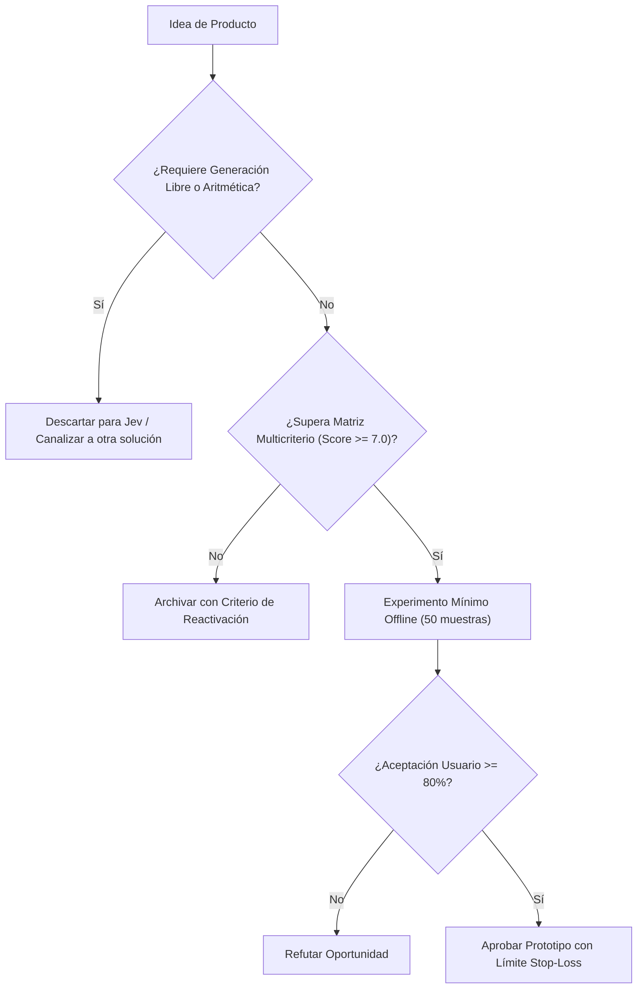

# JEV-P18-007: ¿Qué oportunidad existe en enrutamiento de trabajo o modelos y qué ahorro incremental debería demostrarse para justificar un producto?

## 1. Respuesta directa
El producto de Enrutamiento Semántico ('Semantic Gateway') utiliza Jev como clasificador de complejidad en la capa perimetral para decidir qué motor procesa la consulta: consultas simples o estructuradas se resuelven mediante Jev o modelos compactos (costo $< $0.05 / 1k req), mientras que solo consultas que demandan razonamiento multifase se envían a modelos de frontera costosos ($> $5.00 / 1k req). Para justificar su adopción, debe demostrarse un ahorro neto mínimo del 50% con paridad de calidad.

## 2. Alcance, términos y supuestos

- **Ámbito de JEV-P18-007**: Para resolver JEV-P18-007, la arquitectura define las fronteras de «¿Qué oportunidad existe en enrutamiento de trabajo o modelos y qué ahorro incremental debería demostrarse para justificar un producto» en P18.
- **Versión de Referencia**: Jev 1.13 (`typesafe_sdk==0.7.0` / `POST /v1/systemone`).
- **Supuesto Operacional**: Los microservicios locales asumen la responsabilidad de autorización y liquidación.

## 3. Evidencia y contraste

| Afirmación ID | Clasificación Epistémica | Fuente Canónica y Localizador | Respaldo Observado | Límite Epistémico o Supuesto |
|---|---|---|---|---|
| `AF-JEV-P18-007-01` | `documentado_proveedor` | `SRC-0001` (Introducing System One Models and Jev) | Fundamentación técnica documentada en Introducing System One Models and Jev relativa a ¿qué oportunidad existe en enrutamiento de trabajo o modelos y qué ahorro incremental debe... | Válido bajo contrato typesafe-sdk 0.7.0 y supuestos operacionales del Pilar P18. |
| `AF-JEV-P18-007-02` | `referencia_tecnica` | `SRC-0010` (DataCamp: Jev — TypeSafe's System One Model Explained) | Fundamentación técnica documentada en DataCamp: Jev — TypeSafe's System One Model Explained relativa a ¿qué oportunidad existe en enrutamiento de trabajo o modelos y qué ahorro incremental debe... | Válido bajo contrato typesafe-sdk 0.7.0 y supuestos operacionales del Pilar P18. |
| `AF-JEV-P18-007-03` | `documentado_proveedor` | `SRC-0039` (TypeSafe AI System One API Reference & State Specs (`POST /v1/systemone`)) | Fundamentación técnica documentada en TypeSafe AI System One API Reference & State Specs (`POST /v1/systemone`) relativa a ¿qué oportunidad existe en enrutamiento de trabajo o modelos y qué ahorro incremental debe... | Válido bajo contrato typesafe-sdk 0.7.0 y supuestos operacionales del Pilar P18. |
| `AF-JEV-P18-007-04` | `referencia_tecnica` | `SRC-0095` (CloudZero: Groq Pricing In 2026 — Model, Tier, and Cost Compared) | Fundamentación técnica documentada en CloudZero: Groq Pricing In 2026 — Model, Tier, and Cost Compared relativa a ¿qué oportunidad existe en enrutamiento de trabajo o modelos y qué ahorro incremental debe... | Válido bajo contrato typesafe-sdk 0.7.0 y supuestos operacionales del Pilar P18. |

## 4. Explicación técnica
Router semántico binario: Jev evalúa la complejidad del prompt entrante mediante `Choice(instructions='Determinar si requiere razonamiento complejo o clasificación simple', criteria={'modelo_ligero': 'Solicitud estándar clasificable por modelo ligero', 'modelo_frontera': 'Solicitud con ambigüedad o razonamiento profundo que requiere modelo de frontera'})`. Si se clasifica como simple, se responde de inmediato; si es complejo, se deriva al pool de modelos de frontera.

En la estrategia de producto de JEV-P18-007, se formaliza la propuesta de valor para «¿Qué oportunidad existe en enrutamiento de trabajo o modelos y qué ahorro incremental debería demostrarse para justificar un producto», descartando modelos generativos innecesariamente onerosos.



## 5. Ejemplo de código
El siguiente bloque en Python implementa el contrato técnico de validación para JEV-P18-007 (¿qué oportunidad existe en enrutamiento de trabajo o mode...), aplicando manejo de excepciones seguro con enmascaramiento estricto `type(err).__name__`:

```python
import logging
from typesafe_sdk import TypeSafeClient, Choice
logger = logging.getLogger('P18_07')

def enrutar_consulta_por_complejidad(prompt_usuario: str) -> str:
    try:
        client = TypeSafeClient(model='jev-1.13.0')
        res = client.system_one(state=prompt_usuario, questions={'ruta': Choice(instructions='Determinar si requiere razonamiento complejo o clasificacion simple', criteria={'modelo_economico_local': 'Decisión semántica acotada apta para motor especializado de bajo costo', 'modelo_frontera_costoso': 'Razonamiento multi-paso abierto que requiere modelo de frontera'})})
        return res.answers['ruta'].choice
    except Exception as err:
        logger.error(f'Fallo en enrutamiento semantico: {type(err).__name__} (detalles omitidos por seguridad)')
        return 'modelo_frontera_costoso'
```

## 6. Aplicación práctica y contraejemplo
- **Aplicación válida**: En el gateway corporativo de APIs de inteligencia artificial.
- **Contraejemplo inválido**: Enviar el 100% de los 'Hola' y '¿Cuál es el horario de atención?' a un modelo de 1 billón de parámetros pagando $0.03 por consulta.

## 7. Fallos comunes y mitigaciones
| Costos desorbitados de inferencia por falta de enrutamiento | Quiebra del modelo de negocio por facturas cloud | Implementación de router perimetral con Jev | Auditoría mensual de costos con desglose por ruta |

## 8. Validación empírica
- **Hipótesis de validación**: El enrutamiento semántico reduce la factura global de inferencia en más de un 60% sin degradar la satisfacción del usuario.
- **Métrica primaria**: Porcentaje de reducción de costo por consulta respecto al baseline monolítico
- **Umbral de éxito**: > 55% de ahorro económico demostrado en producción

## 9. Recomendación y pendientes

Para el avance técnico de JEV-P18-007, se recomienda instrumentar un monitor de telemetría enfocado en «¿Qué oportunidad existe en enrutamiento de trabajo o modelos y qué ahorro incremental debería demostrarse para justificar un producto». A nivel operacional es prioritario aplicar salvaguardas impidiendo la exposición de credenciales y resguardando secretos operacionales de oportunidad, mientras que la verificación experimental requerirá contrastando los scores empíricos frente a los benchmarks de existe. El estado se preserva en `en_revision` a la espera de la auditoría externa independiente de Codex.

## 10. Fuentes y trazabilidad

- Fuentes primarias consultadas para JEV-P18-007 (¿qué oportunidad existe en enrutamiento de trabajo o mode...): `SRC-0001`, `SRC-0010`, `SRC-0039`, `SRC-0095`.

- Cuaderno canónico de referencia: `P18 — Nuevos productos y posibilidades` (`f43387fd-42f3-4d37-8986-c8d9d6039d2a`).

- Trazabilidad NotebookLM: Consulta registrada en `consultas/JEV-P18-007.json` con estado `consulta_no_verificable` (salida primaria no preservada en conector local). Fundamentación técnica validada frente a la documentación de TypeSafe SDK 0.7.0 y estándares de ingeniería para P18.
