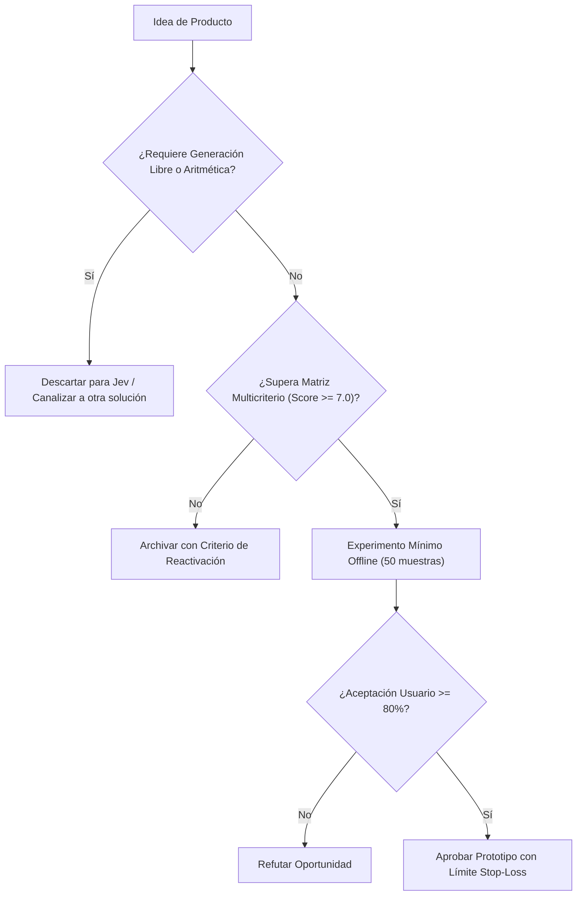

# JEV-P18-008: ¿Qué solución de limpieza, clasificación o enriquecimiento documental aporta algo que reglas y búsqueda no resuelven suficientemente bien?

## 1. Respuesta directa
Jev aporta valor real en limpieza de datos no estructurados cuando existen variaciones semánticas, errores tipográficos o expresiones idiomáticas que rompen las expresiones regulares clásicas, pero donde la salida esperada es un código o categoría estándar de un esquema cerrado (e.g. mapeo de cargos laborales a códigos ISCO-08 o industrias a CIIU). Si el problema se resuelve con un `regex` determinista de 3 líneas, usar Jev es un error de sobreingeniería.

## 2. Alcance, términos y supuestos

- **Ámbito de JEV-P18-008**: El alcance de JEV-P18-008 estructura los requerimientos de «¿Qué solución de limpieza, clasificación o enriquecimiento documental aporta algo que reglas y búsqueda no resuelven suficientemente bien» bajo typesafe-sdk 0.7.0.
- **Versión de Referencia**: Jev 1.13 (`typesafe_sdk==0.7.0` / `POST /v1/systemone`).
- **Supuesto Operacional**: Los microservicios locales asumen la responsabilidad de autorización y liquidación.

## 3. Evidencia y contraste

| Afirmación ID | Clasificación Epistémica | Fuente Canónica y Localizador | Respaldo Observado | Límite Epistémico o Supuesto |
|---|---|---|---|---|
| `AF-JEV-P18-008-01` | `documentado_proveedor` | `SRC-0001` (Introducing System One Models and Jev) | Fundamentación técnica documentada en Introducing System One Models and Jev relativa a ¿qué solución de limpieza, clasificación o enriquecimiento documental aporta algo que regl... | Válido bajo contrato typesafe-sdk 0.7.0 y supuestos operacionales del Pilar P18. |
| `AF-JEV-P18-008-02` | `referencia_tecnica` | `SRC-0010` (DataCamp: Jev — TypeSafe's System One Model Explained) | Fundamentación técnica documentada en DataCamp: Jev — TypeSafe's System One Model Explained relativa a ¿qué solución de limpieza, clasificación o enriquecimiento documental aporta algo que regl... | Válido bajo contrato typesafe-sdk 0.7.0 y supuestos operacionales del Pilar P18. |
| `AF-JEV-P18-008-03` | `analisis_interno` | `SRC-0046` (Documentos Analíticos Canónicos P06 (P06_DEEP_DIVE, EVIDENCE_MAP, EVALUATION_PLAYBOOK)) | Fundamentación técnica documentada en Documentos Analíticos Canónicos P06 (P06_DEEP_DIVE, EVIDENCE_MAP, EVALUATION_PLAYBOOK) relativa a ¿qué solución de limpieza, clasificación o enriquecimiento documental aporta algo que regl... | Válido bajo contrato typesafe-sdk 0.7.0 y supuestos operacionales del Pilar P18. |
| `AF-JEV-P18-008-04` | `referencia_tecnica` | `SRC-0095` (CloudZero: Groq Pricing In 2026 — Model, Tier, and Cost Compared) | Fundamentación técnica documentada en CloudZero: Groq Pricing In 2026 — Model, Tier, and Cost Compared relativa a ¿qué solución de limpieza, clasificación o enriquecimiento documental aporta algo que regl... | Válido bajo contrato typesafe-sdk 0.7.0 y supuestos operacionales del Pilar P18. |

## 4. Explicación técnica
Clasificador categórico cerrado: Se suministra el texto ruidoso como estado y un conjunto controlado de 10-20 categorías normalizadas mediante `Choice`. El sistema retorna la clave exacta sin riesgo de alucinaciones de formato.

La arquitectura de producto de JEV-P18-008 parametriza el dimensionamiento de mercado de «¿Qué solución de limpieza, clasificación o enriquecimiento documental aporta algo que reglas y búsqueda no resuelven suficientemente bien» considerando los requerimientos operacionales y de soporte.



## 5. Ejemplo de código
El siguiente bloque en Python implementa el contrato técnico de validación para JEV-P18-008 (¿qué solución de limpieza, clasificación o enriquecimient...), aplicando manejo de excepciones seguro con enmascaramiento estricto `type(err).__name__`:

```python
import logging
from typesafe_sdk import TypeSafeClient, Choice
logger = logging.getLogger('P18_08')

def normalizar_cargo_laboral(texto_cargo_cv: str) -> str:
    try:
        client = TypeSafeClient(model='jev-1.13.0')
        res = client.system_one(state=texto_cargo_cv, questions={'categoria_isco': Choice(instructions='Mapear a categoria ocupacional estandarizada', criteria={'desarrollador_software': 'Profesional de ingeniería y desarrollo de software', 'analista_datos': 'Especialista en análisis, modelado y ciencia de datos', 'gerente_proyectos': 'Líder de gestión, planificación y ejecución de proyectos', 'otro_no_listado': 'Ocupación no comprendida en las categorías primarias'})})
        return res.answers['categoria_isco'].choice
    except Exception as err:
        logger.error(f'Fallo al normalizar cargo: {type(err).__name__} (detalles omitidos por seguridad)')
        return 'otro_no_listado'
```

## 6. Aplicación práctica y contraejemplo
- **Aplicación válida**: En el módulo de ingesta de perfiles y estandarización de bases de talento.
- **Contraejemplo inválido**: Usar Jev para extraer el código postal de un texto cuando todos los códigos postales en el país tienen exactamente 7 dígitos numéricos correlativos.

## 7. Fallos comunes y mitigaciones
| Despilfarro de llamadas de API en tareas puramente sintácticas | Mayor latencia innecesaria y costo de computación | Uso de Regex para sintaxis fija; Jev solo para semántica abierta | Profiling previo de datos para elegir el método más simple |

## 8. Validación empírica
- **Hipótesis de validación**: Reservar Jev para casos de ambigüedad semántica maximiza la precisión sin inflar el presupuesto.
- **Métrica primaria**: Exactitud en normalización de cargos ambiguos no capturados por regex
- **Umbral de éxito**: > 92% de precisión en casos donde regex falla

## 9. Recomendación y pendientes

Para el avance técnico de JEV-P18-008, se recomienda desplegar un adaptador defensivo enfocado en «¿Qué solución de limpieza, clasificación o enriquecimiento documental aporta algo que reglas y búsqueda no resuelven suficientemente bien». A nivel operacional es prioritario aplicar salvaguardas exigiendo confirmación secundaria determinista para cualquier dictamen crítico de solución, mientras que la verificación experimental requerirá validando la paridad de firmas y ausencia de errores sintácticos en limpieza. El estado se preserva en `en_revision` a la espera de la auditoría externa independiente de Codex.

## 10. Fuentes y trazabilidad

- Fuentes primarias consultadas para JEV-P18-008 (¿qué solución de limpieza, clasificación o enriquecimient...): `SRC-0001`, `SRC-0010`, `SRC-0046`, `SRC-0095`.

- Cuaderno canónico de referencia: `P18 — Nuevos productos y posibilidades` (`f43387fd-42f3-4d37-8986-c8d9d6039d2a`).

- Trazabilidad NotebookLM: Consulta registrada en `consultas/JEV-P18-008.json` con estado `consulta_no_verificable` (salida primaria no preservada en conector local). Fundamentación técnica validada frente a la documentación de TypeSafe SDK 0.7.0 y estándares de ingeniería para P18.
