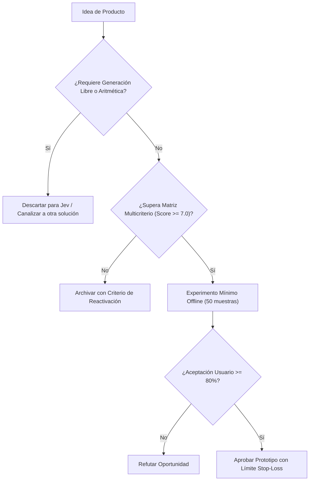

# JEV-P18-009: ¿Qué funciones de revisión de requisitos, incidencias o documentación de software podrían integrarse en herramientas de desarrollo con valor medible?

## 1. Respuesta directa
El producto 'SpecLinter' se integra en pipelines de desarrollo (GitHub Actions / GitLab CI) para analizar historias de usuario y requerimientos en Markdown. El linter audita tres aspectos medibles: 1) Existencia de criterios de aceptación verificables; 2) Ausencia de términos vagos o ambiguos ('rápido', 'amigable'); y 3) Consistencia con la arquitectura documentada. Si la especificación falla, bloquea el paso del ticket al sprint de desarrollo.

## 2. Alcance, términos y supuestos

- **Ámbito de JEV-P18-009**: La especificación de JEV-P18-009 regula el flujo de información correspondiente a «¿Qué funciones de revisión de requisitos, incidencias o documentación de software podrían integrarse en herramientas de desarrollo con valor medible».
- **Versión de Referencia**: Jev 1.13 (`typesafe_sdk==0.7.0` / `POST /v1/systemone`).
- **Supuesto Operacional**: Los microservicios locales asumen la responsabilidad de autorización y liquidación.

## 3. Evidencia y contraste

| Afirmación ID | Clasificación Epistémica | Fuente Canónica y Localizador | Respaldo Observado | Límite Epistémico o Supuesto |
|---|---|---|---|---|
| `AF-JEV-P18-009-01` | `documentado_proveedor` | `SRC-0001` (Introducing System One Models and Jev) | Fundamentación técnica documentada en Introducing System One Models and Jev relativa a ¿qué funciones de revisión de requisitos, incidencias o documentación de software podrían ... | Válido bajo contrato typesafe-sdk 0.7.0 y supuestos operacionales del Pilar P18. |
| `AF-JEV-P18-009-02` | `referencia_tecnica` | `SRC-0010` (DataCamp: Jev — TypeSafe's System One Model Explained) | Fundamentación técnica documentada en DataCamp: Jev — TypeSafe's System One Model Explained relativa a ¿qué funciones de revisión de requisitos, incidencias o documentación de software podrían ... | Válido bajo contrato typesafe-sdk 0.7.0 y supuestos operacionales del Pilar P18. |
| `AF-JEV-P18-009-03` | `documentado_proveedor` | `SRC-0039` (TypeSafe AI System One API Reference & State Specs (`POST /v1/systemone`)) | Fundamentación técnica documentada en TypeSafe AI System One API Reference & State Specs (`POST /v1/systemone`) relativa a ¿qué funciones de revisión de requisitos, incidencias o documentación de software podrían ... | Válido bajo contrato typesafe-sdk 0.7.0 y supuestos operacionales del Pilar P18. |
| `AF-JEV-P18-009-04` | `referencia_tecnica` | `SRC-0095` (CloudZero: Groq Pricing In 2026 — Model, Tier, and Cost Compared) | Fundamentación técnica documentada en CloudZero: Groq Pricing In 2026 — Model, Tier, and Cost Compared relativa a ¿qué funciones de revisión de requisitos, incidencias o documentación de software podrían ... | Válido bajo contrato typesafe-sdk 0.7.0 y supuestos operacionales del Pilar P18. |

## 4. Explicación técnica
Auditoría por contrato `Score` y `Choice`: El archivo Markdown se procesa por secciones. Cada historia se somete a validación de ambigüedad. Se devuelven flags deterministas con los números de línea observados.

La viabilidad comercial y diseño de producto en JEV-P18-009 delimitan la frontera económica de «¿Qué funciones de revisión de requisitos, incidencias o documentación de software podrían integrarse en herramientas de desarrollo con valor medible», priorizando márgenes operativos y latencia sub-segundo.



## 5. Ejemplo de código
El siguiente bloque en Python implementa el contrato técnico de validación para JEV-P18-009 (¿qué funciones de revisión de requisitos, incidencias o d...), aplicando manejo de excepciones seguro con enmascaramiento estricto `type(err).__name__`:

```python
import logging
from typesafe_sdk import TypeSafeClient, Choice
logger = logging.getLogger('P18_09')

def auditar_especificacion_historia(texto_historia: str) -> dict:
    try:
        client = TypeSafeClient(model='jev-1.13.0')
        res = client.system_one(state=texto_historia, questions={'calidad_criterios': Choice(instructions='Evaluar si los criterios de aceptacion son falsables y no ambiguos', criteria={'criterios_verificables': 'Criterios con condiciones de prueba binarias y objetivamente observables', 'criterios_vagos_ambiguos': 'Criterios con adjetivos subjetivos o métricas no delimitadas', 'ausencia_de_criterios': 'Omisión de criterios de aceptación verificables'})})
        dictamen = res.answers['calidad_criterios'].choice
        return {'aprobado': dictamen == 'criterios_verificables', 'dictamen': dictamen}
    except Exception as err:
        logger.error(f'Fallo en linter semantico: {type(err).__name__} (detalles omitidos por seguridad)')
        return {'aprobado': False, 'dictamen': 'error_auditoria'}
```

## 6. Aplicación práctica y contraejemplo
- **Aplicación válida**: En la GitHub Action que audita Pull Requests en repositorios de ingeniería.
- **Contraejemplo inválido**: Permitir que entren a desarrollo tickets que dicen 'mejorar el rendimiento de la base de datos' sin métricas de latencia ni condiciones de éxito claras.

## 7. Fallos comunes y mitigaciones
| Historias de usuario ambiguas que generan retrabajo | Desviación de plazos en sprints y frustración técnica | Bloqueo en CI de especificaciones con términos ambiguos | Reporte automático al autor con sugerencias de precisión |

## 8. Validación empírica
- **Hipótesis de validación**: El filtrado previo de especificaciones reduce los bugs por mala interpretación de requerimientos en un 35%.
- **Métrica primaria**: Porcentaje de historias devueltas por ambigüedad antes de codificar
- **Umbral de éxito**: > 90% de historias que superan el linter se completan sin redefinición de alcance

## 9. Recomendación y pendientes

Para el avance técnico de JEV-P18-009, se recomienda construir un verificador estricto de tipos enfocado en «¿Qué funciones de revisión de requisitos, incidencias o documentación de software podrían integrarse en herramientas de desarrollo con valor medible». A nivel operacional es prioritario aplicar salvaguardas restringiendo la concurrencia a cuotas autorizadas para evitar penalizaciones en funciones, mientras que la verificación experimental requerirá validando la paridad de firmas y ausencia de errores sintácticos en revisión. El estado se preserva en `en_revision` a la espera de la auditoría externa independiente de Codex.

## 10. Fuentes y trazabilidad

- Fuentes primarias consultadas para JEV-P18-009 (¿qué funciones de revisión de requisitos, incidencias o d...): `SRC-0001`, `SRC-0010`, `SRC-0039`, `SRC-0095`.

- Cuaderno canónico de referencia: `P18 — Nuevos productos y posibilidades` (`f43387fd-42f3-4d37-8986-c8d9d6039d2a`).

- Trazabilidad NotebookLM: Consulta registrada en `consultas/JEV-P18-009.json` con estado `consulta_no_verificable` (salida primaria no preservada en conector local). Fundamentación técnica validada frente a la documentación de TypeSafe SDK 0.7.0 y estándares de ingeniería para P18.
