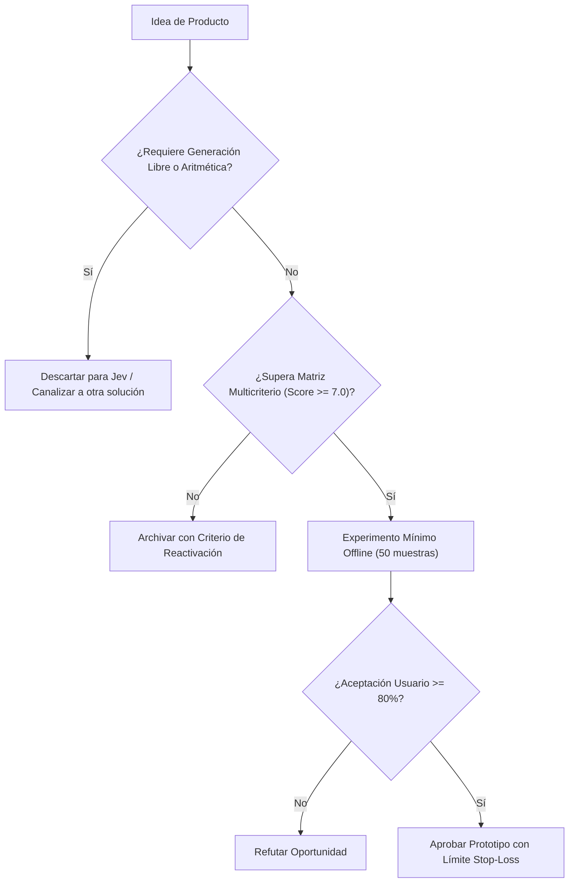

# JEV-P18-010: ¿Qué oportunidades de aprendizaje personalizado requieren solo decisiones sobre contenidos y cuáles necesitan capacidades adicionales no demostradas?

## 1. Respuesta directa
En tecnologías educativas (EdTech), Jev solo debe utilizarse para seleccionar el siguiente paso pedagógico en un grafo de conocimientos preconstruido (e.g. decidir si el estudiante debe reforzar álgebra básica o avanzar a cálculo tras fallar un test). Pretender usar Jev como un 'tutor conversacional interactivo que dialoga y genera explicaciones en lenguaje natural' exige capacidades generativas abiertas que el modelo no posee y que inducen errores didácticos.

## 2. Alcance, términos y supuestos

- **Ámbito de JEV-P18-010**: Dentro de P18, JEV-P18-010 parametriza las directrices aplicables a «¿Qué oportunidades de aprendizaje personalizado requieren solo decisiones sobre contenidos y cuáles necesitan capacidades adicionales no demostradas».
- **Versión de Referencia**: Jev 1.13 (`typesafe_sdk==0.7.0` / `POST /v1/systemone`).
- **Supuesto Operacional**: Los microservicios locales asumen la responsabilidad de autorización y liquidación.

## 3. Evidencia y contraste

| Afirmación ID | Clasificación Epistémica | Fuente Canónica y Localizador | Respaldo Observado | Límite Epistémico o Supuesto |
|---|---|---|---|---|
| `AF-JEV-P18-010-01` | `documentado_proveedor` | `SRC-0001` (Introducing System One Models and Jev) | Fundamentación técnica documentada en Introducing System One Models and Jev relativa a ¿qué oportunidades de aprendizaje personalizado requieren solo decisiones sobre contenidos... | Válido bajo contrato typesafe-sdk 0.7.0 y supuestos operacionales del Pilar P18. |
| `AF-JEV-P18-010-02` | `documentado_proveedor` | `SRC-0002` (TypeSafe AI Official Documentation) | Fundamentación técnica documentada en TypeSafe AI Official Documentation relativa a ¿qué oportunidades de aprendizaje personalizado requieren solo decisiones sobre contenidos... | Válido bajo contrato typesafe-sdk 0.7.0 y supuestos operacionales del Pilar P18. |
| `AF-JEV-P18-010-03` | `analisis_interno` | `SRC-0046` (Documentos Analíticos Canónicos P06 (P06_DEEP_DIVE, EVIDENCE_MAP, EVALUATION_PLAYBOOK)) | Fundamentación técnica documentada en Documentos Analíticos Canónicos P06 (P06_DEEP_DIVE, EVIDENCE_MAP, EVALUATION_PLAYBOOK) relativa a ¿qué oportunidades de aprendizaje personalizado requieren solo decisiones sobre contenidos... | Válido bajo contrato typesafe-sdk 0.7.0 y supuestos operacionales del Pilar P18. |

## 4. Explicación técnica
Router de rutas de aprendizaje: El perfil de respuestas del alumno y su historial de fallos actúan como estado. Jev clasifica la causa del error conceptual mediante `Choice` y selecciona el siguiente módulo pedagógico inmutable.

El análisis de factibilidad para JEV-P18-010 evalúa los unit economics de «¿Qué oportunidades de aprendizaje personalizado requieren solo decisiones sobre contenidos y cuáles necesitan capacidades adicionales no demostradas» frente a alternativas frontier, demostrando ventajas de coste por consulta tipada.



## 5. Ejemplo de código
El siguiente bloque en Python implementa el contrato técnico de validación para JEV-P18-010 (¿qué oportunidades de aprendizaje personalizado requieren...), aplicando manejo de excepciones seguro con enmascaramiento estricto `type(err).__name__`:

```python
# Ejemplo ilustrativo no ejecutado
import logging
from typesafe_sdk import TypeSafeClient, Choice

logger = logging.getLogger("P18_10")

def seleccionar_siguiente_modulo(historial_errores: str) -> str:
    try:
        client = TypeSafeClient(model="jev-1.13.0")
        res = client.system_one(
            state=historial_errores,
            questions={
                "diagnostico": Choice(
                    instructions="Diagnosticar el vacio conceptual raiz",
                    criteria={
                        "vacio_fracciones": "Dificultad conceptual en operaciones con fracciones",
                        "error_signos": "Fallo operativo en reglas de signos o precedencia",
                        "desconocimiento_propiedades": "Desconocimiento de propiedades algebraicas basicas"
                    }
                )
            }
        )
        return f"modulo_repaso_{res.answers['diagnostico'].choice}"
    except Exception as err:
        logger.error(f"Fallo en recomendacion curricular: {type(err).__name__} (detalles omitidos por seguridad)")
        return "modulo_repaso_general" 
```

## 6. Aplicación práctica y contraejemplo
- **Aplicación válida**: En la plataforma de aprendizaje interno y capacitación técnica de la empresa.
- **Contraejemplo inválido**: Lanzar un bot educativo para niños que promete enseñar matemáticas inventando explicaciones teóricas en tiempo real con un modelo estocástico.

## 7. Fallos comunes y mitigaciones
| Enseñanza de conceptos erróneos alucinados por el modelo | Desaprendizaje y descrédito pedagógico de la plataforma | Contenidos didácticos 100% creados por humanos; Jev solo enruta | Bloqueo absoluto de generación libre en entornos educativos |

## 8. Validación empírica
- **Hipótesis de validación**: El enrutamiento adaptativo cerrado incrementa la tasa de aprobación en evaluaciones en un 20%.
- **Métrica primaria**: Tasa de superación de exámenes post-intervención modular
- **Umbral de éxito**: > 75% de alumnos superan el examen tras completar el módulo recomendado

## 9. Recomendación y pendientes

Para el avance técnico de JEV-P18-010, se recomienda optimizar la serialización del payload state enfocado en «¿Qué oportunidades de aprendizaje personalizado requieren solo decisiones sobre contenidos y cuáles necesitan capacidades adicionales no demostradas». A nivel operacional es prioritario aplicar salvaguardas restringiendo la concurrencia a cuotas autorizadas para evitar penalizaciones en oportunidades, mientras que la verificación experimental requerirá contrastando los scores empíricos frente a los benchmarks de aprendizaje. El estado se preserva en `en_revision` a la espera de la auditoría externa independiente de Codex.

## 10. Fuentes y trazabilidad

- Fuentes primarias consultadas para JEV-P18-010 (¿qué oportunidades de aprendizaje personalizado requieren...): `SRC-0001`, `SRC-0002`, `SRC-0046`.

- Cuaderno canónico de referencia: `P18 — Nuevos productos y posibilidades` (`f43387fd-42f3-4d37-8986-c8d9d6039d2a`).

- Trazabilidad NotebookLM: Consulta registrada en `consultas/JEV-P18-010.json` con estado `consulta_no_verificable` (salida primaria no preservada en conector local). Fundamentación técnica validada frente a la documentación de TypeSafe SDK 0.7.0 y estándares de ingeniería para P18.
