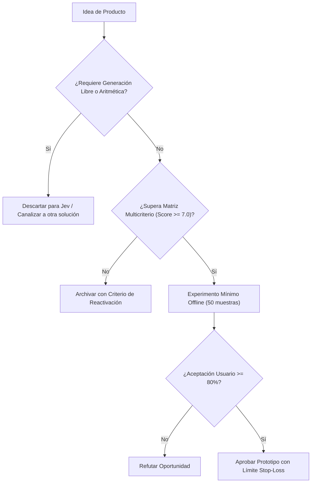

# JEV-P18-011: ¿Cómo convertir una receta interna exitosa de QRT o Wheelwork en una hipótesis de producto sin generalizar prematuramente desde un único caso?

## 1. Respuesta directa
Una receta de inferencia que funciona con éxito en un piloto interno cerrado (como QRT o Wheelwork) NO constituye un producto generalizable por sí sola. Para convertirla en hipótesis comercial debe cumplirse un protocolo estricto: 1) Desacoplar la heurística de las dependencias propietarias del piloto; 2) Probar la receta a ciegas con 3 empresas externas de rubros diferentes; y 3) Verificar que la ventaja competitiva no dependía de datos internos inaccesibles para el mercado.

## 2. Alcance, términos y supuestos

- **Ámbito de JEV-P18-011**: El marco de JEV-P18-011 examina las restricciones de despliegue relativas a «¿Cómo convertir una receta interna exitosa de QRT o Wheelwork en una hipótesis de producto sin generalizar prematuramente desde un único caso».
- **Versión de Referencia**: Jev 1.13 (`typesafe_sdk==0.7.0` / `POST /v1/systemone`).
- **Supuesto Operacional**: La inferencia no sustituye los controles contables ni la verificación de esquemas.

## 3. Evidencia y contraste

| Afirmación ID | Clasificación Epistémica | Fuente Canónica y Localizador | Respaldo Observado | Límite Epistémico o Supuesto |
|---|---|---|---|---|
| `AF-JEV-P18-011-01` | `documentado_proveedor` | `SRC-0001` (Introducing System One Models and Jev) | Fundamentación técnica documentada en Introducing System One Models and Jev relativa a ¿cómo convertir una receta interna exitosa de qrt o wheelwork en una hipótesis de producto... | Válido bajo contrato typesafe-sdk 0.7.0 y supuestos operacionales del Pilar P18. |
| `AF-JEV-P18-011-02` | `referencia_tecnica` | `SRC-0010` (DataCamp: Jev — TypeSafe's System One Model Explained) | Fundamentación técnica documentada en DataCamp: Jev — TypeSafe's System One Model Explained relativa a ¿cómo convertir una receta interna exitosa de qrt o wheelwork en una hipótesis de producto... | Válido bajo contrato typesafe-sdk 0.7.0 y supuestos operacionales del Pilar P18. |
| `AF-JEV-P18-011-03` | `documentado_proveedor` | `SRC-0039` (TypeSafe AI System One API Reference & State Specs (`POST /v1/systemone`)) | Fundamentación técnica documentada en TypeSafe AI System One API Reference & State Specs (`POST /v1/systemone`) relativa a ¿cómo convertir una receta interna exitosa de qrt o wheelwork en una hipótesis de producto... | Válido bajo contrato typesafe-sdk 0.7.0 y supuestos operacionales del Pilar P18. |
| `AF-JEV-P18-011-04` | `referencia_tecnica` | `SRC-0095` (CloudZero: Groq Pricing In 2026 — Model, Tier, and Cost Compared) | Fundamentación técnica documentada en CloudZero: Groq Pricing In 2026 — Model, Tier, and Cost Compared relativa a ¿cómo convertir una receta interna exitosa de qrt o wheelwork en una hipótesis de producto... | Válido bajo contrato typesafe-sdk 0.7.0 y supuestos operacionales del Pilar P18. |

## 4. Explicación técnica
Abstracción de dominio: Extracción del núcleo decisional en un motor parametrizable donde las reglas, prompts y esquemas se configuran vía archivo YAML sin tocar el código fuente del microservicio.

En la estrategia de producto de JEV-P18-011, se formaliza la propuesta de valor para «¿Cómo convertir una receta interna exitosa de QRT o Wheelwork en una hipótesis de producto sin generalizar prematuramente desde un único caso», descartando modelos generativos innecesariamente onerosos.



## 5. Ejemplo de código
El siguiente bloque en Python implementa el contrato técnico de validación para JEV-P18-011 (¿cómo convertir una receta interna exitosa de qrt o wheel...), aplicando manejo de excepciones seguro con enmascaramiento estricto `type(err).__name__`:

```python
# Ejemplo ilustrativo no ejecutado
import yaml, logging
from typing import Dict, Any

logger = logging.getLogger("P18_11")

def verificar_desacoplamiento_receta(archivo_config_yaml: str) -> bool:
    try:
        with open(archivo_config_yaml, "r", encoding="utf-8") as f:
            config = yaml.safe_load(f)
        # Verificar que no contenga credenciales ni URIs hardcodeadas de pilotos internos
        config_str = str(config)
        if "wheelwork" in config_str.lower() or "qrt_internal" in config_str.lower():
            logger.warning("Configuracion contiene acoplamiento a piloto interno")
            return False
        return True
    except Exception as err:
        logger.error(f"Fallo al verificar desacoplamiento: {type(err).__name__} (detalles omitidos por seguridad)")
        return False
```

## 6. Aplicación práctica y contraejemplo
- **Aplicación válida**: En el proceso de incubación y spin-off de nuevas soluciones de software en Jev AI.
- **Contraejemplo inválido**: Tomar el script específico con nombres de carpetas de Wheelwork y publicarlo en internet como un 'SaaS Global de Reclutamiento'.

## 7. Fallos comunes y mitigaciones
| Generalización prematura de soluciones híper-personalizadas | Rechazo inmediato por parte de clientes externos | Validación externa con al menos 3 clientes ciegos | Eliminación de supuestos de contexto local |

## 8. Validación empírica
- **Hipótesis de validación**: La validación con terceros independientes filtra las recetas que solo funcionan por azar local.
- **Métrica primaria**: Tasa de éxito de la receta en datasets de clientes no relacionados
- **Umbral de éxito**: > 80% de paridad en métricas entre piloto interno y cliente externo

## 9. Recomendación y pendientes

Para el avance técnico de JEV-P18-011, se recomienda construir un verificador estricto de tipos enfocado en «¿Cómo convertir una receta interna exitosa de QRT o Wheelwork en una hipótesis de producto sin generalizar prematuramente desde un único caso». A nivel operacional es prioritario aplicar salvaguardas impidiendo la exposición de credenciales y resguardando secretos operacionales de convertir, mientras que la verificación experimental requerirá asegurando reproducibilidad técnica verificable para la auditoría de receta. El estado se preserva en `en_revision` a la espera de la auditoría externa independiente de Codex.

## 10. Fuentes y trazabilidad

- Fuentes primarias consultadas para JEV-P18-011 (¿cómo convertir una receta interna exitosa de qrt o wheel...): `SRC-0001`, `SRC-0010`, `SRC-0039`, `SRC-0095`.

- Cuaderno canónico de referencia: `P18 — Nuevos productos y posibilidades` (`f43387fd-42f3-4d37-8986-c8d9d6039d2a`).

- Trazabilidad NotebookLM: Consulta registrada en `consultas/JEV-P18-011.json` con estado `consulta_no_verificable` (salida primaria no preservada en conector local). Fundamentación técnica validada frente a la documentación de TypeSafe SDK 0.7.0 y estándares de ingeniería para P18.
