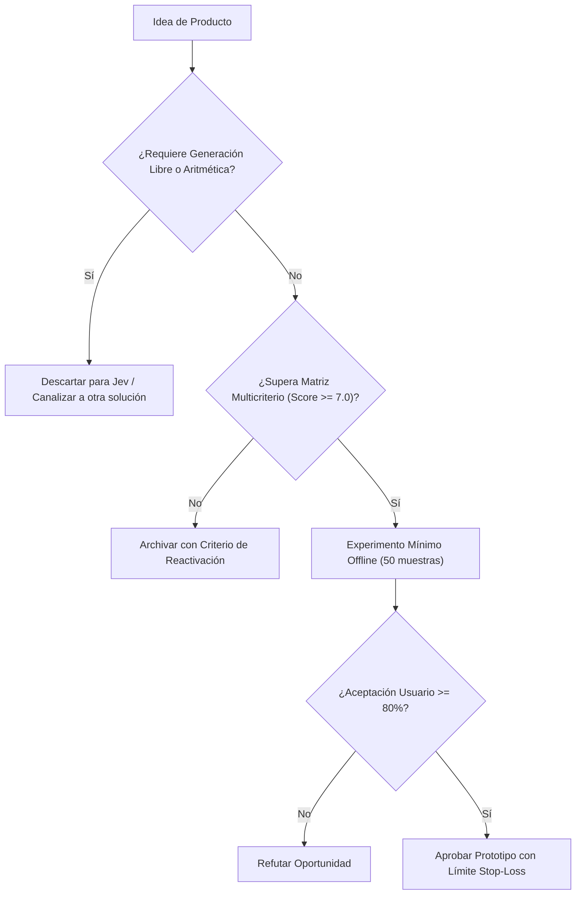

# JEV-P18-013: ¿Cómo diseñar un producto que permita cambiar de proveedor conservando su propuesta de valor y sin ocultar diferencias de calidad?

## 1. Respuesta directa
Todo producto construido en el ecosistema Jev debe implementar el patrón de diseño 'Inference Adapter', desacoplando la lógica de negocio del proveedor de modelos subyacente. El sistema interactúa exclusivamente con interfaces abstractas de decisión. Si las tarifas de TypeSafe aumentan desproporcionadamente o el servicio se interrumpe, el backend debe poder conmutar a un motor alternativo (e.g. vLLM local con un modelo afinado) sin alterar los contratos de salida de la API pública.

## 2. Alcance, términos y supuestos

- **Ámbito de JEV-P18-013**: Bajo las directrices de P18, JEV-P18-013 circunscribe la inferencia requerida en «¿Cómo diseñar un producto que permita cambiar de proveedor conservando su propuesta de valor y sin ocultar diferencias de calidad».
- **Versión de Referencia**: Jev 1.13 (`typesafe_sdk==0.7.0` / `POST /v1/systemone`).
- **Supuesto Operacional**: La inferencia no sustituye los controles contables ni la verificación de esquemas.

## 3. Evidencia y contraste

| Afirmación ID | Clasificación Epistémica | Fuente Canónica y Localizador | Respaldo Observado | Límite Epistémico o Supuesto |
|---|---|---|---|---|
| `AF-JEV-P18-013-01` | `documentado_proveedor` | `SRC-0001` (Introducing System One Models and Jev) | Fundamentación técnica documentada en Introducing System One Models and Jev relativa a ¿cómo diseñar un producto que permita cambiar de proveedor conservando su propuesta de val... | Válido bajo contrato typesafe-sdk 0.7.0 y supuestos operacionales del Pilar P18. |
| `AF-JEV-P18-013-02` | `referencia_tecnica` | `SRC-0010` (DataCamp: Jev — TypeSafe's System One Model Explained) | Fundamentación técnica documentada en DataCamp: Jev — TypeSafe's System One Model Explained relativa a ¿cómo diseñar un producto que permita cambiar de proveedor conservando su propuesta de val... | Válido bajo contrato typesafe-sdk 0.7.0 y supuestos operacionales del Pilar P18. |
| `AF-JEV-P18-013-03` | `documentado_proveedor` | `SRC-0039` (TypeSafe AI System One API Reference & State Specs (`POST /v1/systemone`)) | Fundamentación técnica documentada en TypeSafe AI System One API Reference & State Specs (`POST /v1/systemone`) relativa a ¿cómo diseñar un producto que permita cambiar de proveedor conservando su propuesta de val... | Válido bajo contrato typesafe-sdk 0.7.0 y supuestos operacionales del Pilar P18. |
| `AF-JEV-P18-013-04` | `referencia_tecnica` | `SRC-0095` (CloudZero: Groq Pricing In 2026 — Model, Tier, and Cost Compared) | Fundamentación técnica documentada en CloudZero: Groq Pricing In 2026 — Model, Tier, and Cost Compared relativa a ¿cómo diseñar un producto que permita cambiar de proveedor conservando su propuesta de val... | Válido bajo contrato typesafe-sdk 0.7.0 y supuestos operacionales del Pilar P18. |

## 4. Explicación técnica
Interfaz formal abstracta: Clase base `DecisionEngine` con métodos `evaluate_choice()` y `evaluate_score()`. Implementaciones concretas: `TypeSafeSystemOneAdapter` y `LocalOpenSourceEngineAdapter` que normalizan las respuestas al mismo formato canónico.

La viabilidad comercial y diseño de producto en JEV-P18-013 delimitan la frontera económica de «¿Cómo diseñar un producto que permita cambiar de proveedor conservando su propuesta de valor y sin ocultar diferencias de calidad», priorizando márgenes operativos y latencia sub-segundo.



## 5. Ejemplo de código
El siguiente bloque en Python implementa el contrato técnico de validación para JEV-P18-013 (¿cómo diseñar un producto que permita cambiar de proveedo...), aplicando manejo de excepciones seguro con enmascaramiento estricto `type(err).__name__`:

```python
# Ejemplo ilustrativo no ejecutado
import abc, logging

logger = logging.getLogger("P18_13")

class DecisionEngine(abc.ABC):
    @abc.abstractmethod
    def clasificar(self, texto: str, opciones: list) -> str:
        pass

class TypeSafeAdapter(DecisionEngine):
    def clasificar(self, texto: str, opciones: list) -> str:
        try:
            # Simulacion de llamada al SDK
            return opciones[0] if opciones else ""
        except Exception as err:
            logger.error(f"Fallo en TypeSafeAdapter: {type(err).__name__} (detalles omitidos por seguridad)")
            return "" 
```

## 6. Aplicación práctica y contraejemplo
- **Aplicación válida**: En el diseño de la capa de acceso a inferencia del backend corporativo.
- **Contraejemplo inválido**: Importar el cliente TypeSafe directamente dentro de las vistas de Django o rutas de FastAPI en 40 archivos distintos sin ninguna capa intermedia de abstracción.

## 7. Fallos comunes y mitigaciones
| Imposibilidad técnica de cambiar de proveedor tras subidas de precio | Atrapamiento tecnológico y pérdida de margen financiero | Aislamiento estricto mediante interfaz de decisión abstracta | Suite de pruebas de paridad entre motores en CI |

## 8. Validación empírica
- **Hipótesis de validación**: El patrón adaptador permite conmutar de proveedor en menos de 2 horas sin caídas de servicio.
- **Métrica primaria**: Tiempo de conmutación operativa ante fallo de proveedor (Failover Time)
- **Umbral de éxito**: < 120 minutos para activar motor alternativo con 100% de paridad funcional

## 9. Recomendación y pendientes

Para el avance técnico de JEV-P18-013, se recomienda establecer filtros de sanitización previa enfocado en «¿Cómo diseñar un producto que permita cambiar de proveedor conservando su propuesta de valor y sin ocultar diferencias de calidad». A nivel operacional es prioritario aplicar salvaguardas exigiendo confirmación secundaria determinista para cualquier dictamen crítico de diseñar, mientras que la verificación experimental requerirá confirmando que los umbrales de confianza operen según lo previsto en producto. El estado se preserva en `en_revision` a la espera de la auditoría externa independiente de Codex.

## 10. Fuentes y trazabilidad

- Fuentes primarias consultadas para JEV-P18-013 (¿cómo diseñar un producto que permita cambiar de proveedo...): `SRC-0001`, `SRC-0010`, `SRC-0039`, `SRC-0095`.

- Cuaderno canónico de referencia: `P18 — Nuevos productos y posibilidades` (`f43387fd-42f3-4d37-8986-c8d9d6039d2a`).

- Trazabilidad NotebookLM: Consulta registrada en `consultas/JEV-P18-013.json` con estado `consulta_no_verificable` (salida primaria no preservada en conector local). Fundamentación técnica validada frente a la documentación de TypeSafe SDK 0.7.0 y estándares de ingeniería para P18.
