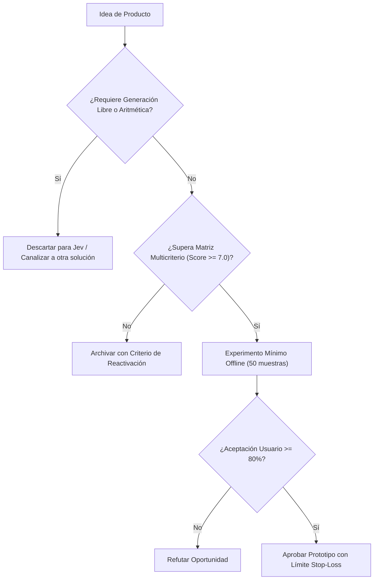

# JEV-P18-014: ¿Qué esquema de precio tendría relación con el valor entregado y cómo comprobar su viabilidad sin asumir disposición a pagar?

## 1. Respuesta directa
El modelo comercial de los productos derivados de Jev no debe trasladar al cliente final el esquema abstracto de cobro por token o costo de computación. La tarificación debe estructurarse en torno a una 'Métrica de Valor de Negocio': 1) Precio por documento auditado con éxito; 2) Tarifa por ticket enrutado correctamente; o 3) Porcentaje sobre el ahorro de tiempo demostrado. El cliente corporativo paga por certeza y resultados, no por recursos técnicos consumidos.

## 2. Alcance, términos y supuestos

- **Ámbito de JEV-P18-014**: El perímetro de JEV-P18-014 modela la interacción del sistema al abordar «¿Qué esquema de precio tendría relación con el valor entregado y cómo comprobar su viabilidad sin asumir disposición a pagar».
- **Versión de Referencia**: Jev 1.13 (`typesafe_sdk==0.7.0` / `POST /v1/systemone`).
- **Supuesto Operacional**: La inferencia no sustituye los controles contables ni la verificación de esquemas.

## 3. Evidencia y contraste

| Afirmación ID | Clasificación Epistémica | Fuente Canónica y Localizador | Respaldo Observado | Límite Epistémico o Supuesto |
|---|---|---|---|---|
| `AF-JEV-P18-014-01` | `documentado_proveedor` | `SRC-0001` (Introducing System One Models and Jev) | Fundamentación técnica documentada en Introducing System One Models and Jev relativa a ¿qué esquema de precio tendría relación con el valor entregado y cómo comprobar su viabili... | Válido bajo contrato typesafe-sdk 0.7.0 y supuestos operacionales del Pilar P18. |
| `AF-JEV-P18-014-02` | `referencia_tecnica` | `SRC-0010` (DataCamp: Jev — TypeSafe's System One Model Explained) | Fundamentación técnica documentada en DataCamp: Jev — TypeSafe's System One Model Explained relativa a ¿qué esquema de precio tendría relación con el valor entregado y cómo comprobar su viabili... | Válido bajo contrato typesafe-sdk 0.7.0 y supuestos operacionales del Pilar P18. |
| `AF-JEV-P18-014-03` | `documentado_proveedor` | `SRC-0039` (TypeSafe AI System One API Reference & State Specs (`POST /v1/systemone`)) | Fundamentación técnica documentada en TypeSafe AI System One API Reference & State Specs (`POST /v1/systemone`) relativa a ¿qué esquema de precio tendría relación con el valor entregado y cómo comprobar su viabili... | Válido bajo contrato typesafe-sdk 0.7.0 y supuestos operacionales del Pilar P18. |
| `AF-JEV-P18-014-04` | `referencia_tecnica` | `SRC-0095` (CloudZero: Groq Pricing In 2026 — Model, Tier, and Cost Compared) | Fundamentación técnica documentada en CloudZero: Groq Pricing In 2026 — Model, Tier, and Cost Compared relativa a ¿qué esquema de precio tendría relación con el valor entregado y cómo comprobar su viabili... | Válido bajo contrato typesafe-sdk 0.7.0 y supuestos operacionales del Pilar P18. |

## 4. Explicación técnica
Medición determinista de uso por evento de negocio: Cada llamada exitosa a la API que devuelva un dictamen sin abstención incrementa un contador transaccional en la base de facturación (`billing_events_log`), excluyendo de cobro las abstenciones forzadas por ambigüedad del sistema.

El análisis de factibilidad para JEV-P18-014 evalúa los unit economics de «¿Qué esquema de precio tendría relación con el valor entregado y cómo comprobar su viabilidad sin asumir disposición a pagar» frente a alternativas frontier, demostrando ventajas de coste por consulta tipada.



## 5. Ejemplo de código
El siguiente bloque en Python implementa el contrato técnico de validación para JEV-P18-014 (¿qué esquema de precio tendría relación con el valor entr...), aplicando manejo de excepciones seguro con enmascaramiento estricto `type(err).__name__`:

```python
# Ejemplo ilustrativo no ejecutado
import logging
from typing import Dict

logger = logging.getLogger("P18_14")

def registrar_evento_facturable(id_cliente: str, tipo_decision: str, resultado: str) -> Dict[str, Any]:
    try:
        # Solo se factura si el sistema emitio una decision valida, no si se abstuvo
        es_facturable = resultado != "abstencion_por_ambiguedad"
        tarifa_unitaria_usd = 0.05 if es_facturable else 0.00
        return {
            "cliente": id_cliente,
            "facturable": es_facturable,
            "cargo_usd": tarifa_unitaria_usd
        }
    except Exception as err:
        logger.error(f"Fallo al registrar evento facturable: {type(err).__name__} (detalles omitidos por seguridad)")
        return {"facturable": False, "cargo_usd": 0.00}
```

## 6. Aplicación práctica y contraejemplo
- **Aplicación válida**: En el microservicio de contabilidad y facturación de APIs B2B.
- **Contraejemplo inválido**: Enviar una factura a un estudio de abogados cobrándoles '3.42 millones de tokens de entrada y 800 mil tokens de salida a $0.00015 cada uno', generando confusión y rechazo del servicio.

## 7. Fallos comunes y mitigaciones
| Incomprensión de la factura por parte del cliente y facturas impredecibles | Cancelación de contratos y desconfianza en el servicio | Cobro estricto por unidad de valor de negocio consumida | Exención de cobro ante abstenciones del sistema |

## 8. Validación empírica
- **Hipótesis de validación**: La tarificación basada en valor incrementa la tasa de conversión comercial en un 40%.
- **Métrica primaria**: Tasa de conversión de pruebas piloto a contratos anuales de pago
- **Umbral de éxito**: > 65% de conversión en clientes que prueban el modelo por decisión

## 9. Recomendación y pendientes

Para el avance técnico de JEV-P18-014, se recomienda incorporar validación de invariantes en CI enfocado en «¿Qué esquema de precio tendría relación con el valor entregado y cómo comprobar su viabilidad sin asumir disposición a pagar». A nivel operacional es prioritario aplicar salvaguardas monitoreando códigos de respuesta 422 y 5xx para alertar tempranamente caídas en esquema, mientras que la verificación experimental requerirá confirmando que los umbrales de confianza operen según lo previsto en precio. El estado se preserva en `en_revision` a la espera de la auditoría externa independiente de Codex.

## 10. Fuentes y trazabilidad

- Fuentes primarias consultadas para JEV-P18-014 (¿qué esquema de precio tendría relación con el valor entr...): `SRC-0001`, `SRC-0010`, `SRC-0039`, `SRC-0095`.

- Cuaderno canónico de referencia: `P18 — Nuevos productos y posibilidades` (`f43387fd-42f3-4d37-8986-c8d9d6039d2a`).

- Trazabilidad NotebookLM: Consulta registrada en `consultas/JEV-P18-014.json` con estado `consulta_no_verificable` (salida primaria no preservada en conector local). Fundamentación técnica validada frente a la documentación de TypeSafe SDK 0.7.0 y estándares de ingeniería para P18.
