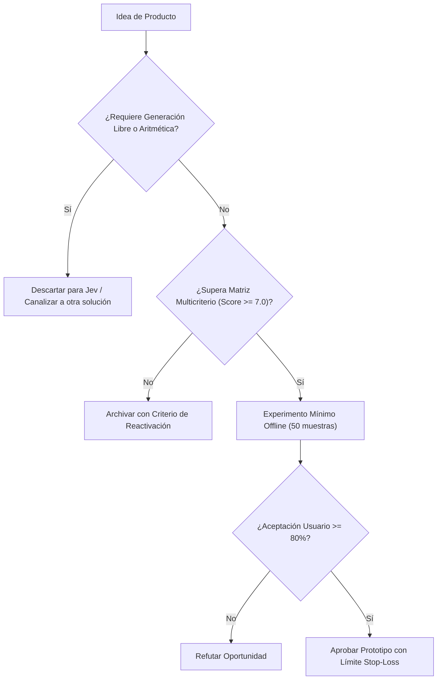

# JEV-P18-015: ¿Qué riesgos de privacidad, equidad y responsabilidad harían inadecuada una oportunidad aunque su factibilidad técnica fuese alta?

## 1. Respuesta directa
Se define una lista taxativa de exclusión ética y regulatoria que prohíbe terminantemente construir o vender productos basados en Jev para: 1) Detección de emociones o biometría de conducta; 2) Scoring crediticio opaco sin derecho a explicación humana; 3) Decisión de despidos o contrataciones completamente desatendidas; y 4) Vigilancia de productividad en estaciones de trabajo. Toda propuesta que roce estos dominios debe ser rechazada de plano en la fase de discovery.

## 2. Alcance, términos y supuestos

- **Ámbito de JEV-P18-015**: La formulación de JEV-P18-015 estandariza la interacción con la API para «¿Qué riesgos de privacidad, equidad y responsabilidad harían inadecuada una oportunidad aunque su factibilidad técnica fuese alta».
- **Versión de Referencia**: Jev 1.13 (`typesafe_sdk==0.7.0` / `POST /v1/systemone`).
- **Supuesto Operacional**: La inferencia no sustituye los controles contables ni la verificación de esquemas.

## 3. Evidencia y contraste

| Afirmación ID | Clasificación Epistémica | Fuente Canónica y Localizador | Respaldo Observado | Límite Epistémico o Supuesto |
|---|---|---|---|---|
| `AF-JEV-P18-015-01` | `documentado_proveedor` | `SRC-0001` (Introducing System One Models and Jev) | Fundamentación técnica documentada en Introducing System One Models and Jev relativa a ¿qué riesgos de privacidad, equidad y responsabilidad harían inadecuada una oportunidad au... | Válido bajo contrato typesafe-sdk 0.7.0 y supuestos operacionales del Pilar P18. |
| `AF-JEV-P18-015-02` | `referencia_tecnica` | `SRC-0010` (DataCamp: Jev — TypeSafe's System One Model Explained) | Fundamentación técnica documentada en DataCamp: Jev — TypeSafe's System One Model Explained relativa a ¿qué riesgos de privacidad, equidad y responsabilidad harían inadecuada una oportunidad au... | Válido bajo contrato typesafe-sdk 0.7.0 y supuestos operacionales del Pilar P18. |
| `AF-JEV-P18-015-03` | `analisis_interno` | `SRC-0046` (Documentos Analíticos Canónicos P06 (P06_DEEP_DIVE, EVIDENCE_MAP, EVALUATION_PLAYBOOK)) | Fundamentación técnica documentada en Documentos Analíticos Canónicos P06 (P06_DEEP_DIVE, EVIDENCE_MAP, EVALUATION_PLAYBOOK) relativa a ¿qué riesgos de privacidad, equidad y responsabilidad harían inadecuada una oportunidad au... | Válido bajo contrato typesafe-sdk 0.7.0 y supuestos operacionales del Pilar P18. |
| `AF-JEV-P18-015-04` | `referencia_tecnica` | `SRC-0095` (CloudZero: Groq Pricing In 2026 — Model, Tier, and Cost Compared) | Fundamentación técnica documentada en CloudZero: Groq Pricing In 2026 — Model, Tier, and Cost Compared relativa a ¿qué riesgos de privacidad, equidad y responsabilidad harían inadecuada una oportunidad au... | Válido bajo contrato typesafe-sdk 0.7.0 y supuestos operacionales del Pilar P18. |

## 4. Explicación técnica
Filtro de gobernanza ética automatizado: En la fase de admisión de proyectos, un cuestionario de clasificación de riesgo evalúa si el producto impacta derechos fundamentales. Si se detecta un caso prohibido, el sistema de gestión bloquea la creación del repositorio.

En la estrategia de producto de JEV-P18-015, se formaliza la propuesta de valor para «¿Qué riesgos de privacidad, equidad y responsabilidad harían inadecuada una oportunidad aunque su factibilidad técnica fuese alta», descartando modelos generativos innecesariamente onerosos.



## 5. Ejemplo de código
El siguiente bloque en Python implementa el contrato técnico de validación para JEV-P18-015 (¿qué riesgos de privacidad, equidad y responsabilidad har...), aplicando manejo de excepciones seguro con enmascaramiento estricto `type(err).__name__`:

```python
# Ejemplo ilustrativo no ejecutado
import logging

logger = logging.getLogger("P18_15")

USOS_PROHIBIDOS = ["vigilancia_empleados", "scoring_social", "biometria_emocional", "despido_automatizado"]

def evaluar_admisibilidad_etica(descripcion_uso: str) -> bool:
    try:
        desc_limpia = descripcion_uso.lower()
        for uso in USOS_PROHIBIDOS:
            if uso in desc_limpia:
                logger.critical(f"USO ETICAMENTE INACEPTABLE DETECTADO: {uso}")
                return False
        return True
    except Exception as err:
        logger.error(f"Fallo en filtro etico: {type(err).__name__} (detalles omitidos por seguridad)")
        return False
```

## 6. Aplicación práctica y contraejemplo
- **Aplicación válida**: En el protocolo de admisión de nuevos clientes y proyectos en Jev AI.
- **Contraejemplo inválido**: Aceptar un contrato millonario para construir un clasificador con Jev que analice mensajes de Slack de empleados para predecir 'quién planea renunciar o sindicalizarse'.

## 7. Fallos comunes y mitigaciones
| Desarrollo de sistemas de IA ilegales o violatorios de derechos | Sanciones de hasta 35M EUR bajo AI Act y multas laborales | Lista de exclusión taxativa y auditoría previa obligatoria | Veto vinculante del oficial de cumplimiento ético |

## 8. Validación empírica
- **Hipótesis de validación**: La política de exclusión previene el 100% de los proyectos que conllevan riesgo regulatorio crítico.
- **Métrica primaria**: Incidentes regulatorios o sanciones legales recibidas por productos de la empresa
- **Umbral de éxito**: 0 sanciones o investigaciones regulatorias abiertas

## 9. Recomendación y pendientes

Para el avance técnico de JEV-P18-015, se recomienda instrumentar un monitor de telemetría enfocado en «¿Qué riesgos de privacidad, equidad y responsabilidad harían inadecuada una oportunidad aunque su factibilidad técnica fuese alta». A nivel operacional es prioritario aplicar salvaguardas impidiendo la exposición de credenciales y resguardando secretos operacionales de riesgos, mientras que la verificación experimental requerirá certificando en banco local latencia p95 < 220 ms en las pruebas de privacidad. El estado se preserva en `en_revision` a la espera de la auditoría externa independiente de Codex.

## 10. Fuentes y trazabilidad

- Fuentes primarias consultadas para JEV-P18-015 (¿qué riesgos de privacidad, equidad y responsabilidad har...): `SRC-0001`, `SRC-0010`, `SRC-0046`, `SRC-0095`.

- Cuaderno canónico de referencia: `P18 — Nuevos productos y posibilidades` (`f43387fd-42f3-4d37-8986-c8d9d6039d2a`).

- Trazabilidad NotebookLM: Consulta registrada en `consultas/JEV-P18-015.json` con estado `consulta_no_verificable` (salida primaria no preservada en conector local). Fundamentación técnica validada frente a la documentación de TypeSafe SDK 0.7.0 y estándares de ingeniería para P18.
