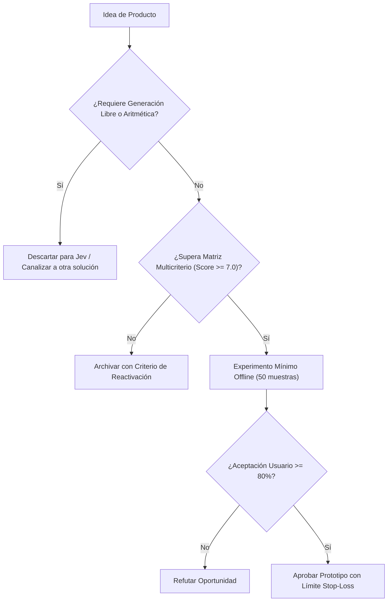

# JEV-P18-016: ¿Qué requisitos de experiencia de usuario permiten revisar y corregir decisiones sin exigir conocer probabilidades o detalles del modelo?

## 1. Respuesta directa
La interfaz de usuario de cualquier producto con Jev debe abstenerse de abrumar a usuarios no técnicos con decimales probabilísticos complejos o logits. La pantalla debe presentar tres elementos comprensibles: 1) La recomendación en lenguaje claro ('Aceptable', 'Observado', 'Dudoso'); 2) El fragmento textual literal extraído del documento que fundamentó la decisión; y 3) Un mecanismo interactivo para que el usuario humano acepte, corrija o rechace el dictamen con un solo clic.

## 2. Alcance, términos y supuestos

- **Ámbito de JEV-P18-016**: En el contexto de P18, JEV-P18-016 audita los contratos necesarios para «¿Qué requisitos de experiencia de usuario permiten revisar y corregir decisiones sin exigir conocer probabilidades o detalles del modelo».
- **Versión de Referencia**: Jev 1.13 (`typesafe_sdk==0.7.0` / `POST /v1/systemone`).
- **Supuesto Operacional**: Se dispone de conmutación automática hacia reglas heurísticas ante caídas del servicio.

## 3. Evidencia y contraste

| Afirmación ID | Clasificación Epistémica | Fuente Canónica y Localizador | Respaldo Observado | Límite Epistémico o Supuesto |
|---|---|---|---|---|
| `AF-JEV-P18-016-01` | `documentado_proveedor` | `SRC-0001` (Introducing System One Models and Jev) | Fundamentación técnica documentada en Introducing System One Models and Jev relativa a ¿qué requisitos de experiencia de usuario permiten revisar y corregir decisiones sin exigi... | Válido bajo contrato typesafe-sdk 0.7.0 y supuestos operacionales del Pilar P18. |
| `AF-JEV-P18-016-02` | `documentado_proveedor` | `SRC-0005` (TypeSafe AI Concepts: Use Case Map) | Fundamentación técnica documentada en TypeSafe AI Concepts: Use Case Map relativa a ¿qué requisitos de experiencia de usuario permiten revisar y corregir decisiones sin exigi... | Válido bajo contrato typesafe-sdk 0.7.0 y supuestos operacionales del Pilar P18. |
| `AF-JEV-P18-016-03` | `referencia_tecnica` | `SRC-0010` (DataCamp: Jev — TypeSafe's System One Model Explained) | Fundamentación técnica documentada en DataCamp: Jev — TypeSafe's System One Model Explained relativa a ¿qué requisitos de experiencia de usuario permiten revisar y corregir decisiones sin exigi... | Válido bajo contrato typesafe-sdk 0.7.0 y supuestos operacionales del Pilar P18. |
| `AF-JEV-P18-016-04` | `referencia_tecnica` | `SRC-0095` (CloudZero: Groq Pricing In 2026 — Model, Tier, and Cost Compared) | Fundamentación técnica documentada en CloudZero: Groq Pricing In 2026 — Model, Tier, and Cost Compared relativa a ¿qué requisitos de experiencia de usuario permiten revisar y corregir decisiones sin exigi... | Válido bajo contrato typesafe-sdk 0.7.0 y supuestos operacionales del Pilar P18. |

## 4. Explicación técnica
Contrato de visualización frontend: El backend emite un objeto JSON estructurado: `{'etiqueta_humana': 'Cláusula de Riesgo Detectada', 'evidencia_textual': 'El proveedor no responderá por pérdidas indirectas...', 'confianza_cualitativa': 'Alta', 'opciones_accion': ['Aceptar', 'Ignorar', 'Escalar']}`.

La arquitectura de producto de JEV-P18-016 parametriza el dimensionamiento de mercado de «¿Qué requisitos de experiencia de usuario permiten revisar y corregir decisiones sin exigir conocer probabilidades o detalles del modelo» considerando los requerimientos operacionales y de soporte.



## 5. Ejemplo de código
El siguiente bloque en Python implementa el contrato técnico de validación para JEV-P18-016 (¿qué requisitos de experiencia de usuario permiten revisa...), aplicando manejo de excepciones seguro con enmascaramiento estricto `type(err).__name__`:

```python
# Ejemplo ilustrativo no ejecutado
import logging
from typing import Dict, Any

logger = logging.getLogger("P18_16")

def transformar_a_payload_ux(score_numerico: float, texto_evidencia: str) -> Dict[str, Any]:
    try:
        confianza = "Alta" if (score_numerico > 0.85 or score_numerico < 0.15) else "Moderada"
        return {
            "categoria_visual": "Alerta de Riesgo" if score_numerico > 0.70 else "Conforme",
            "nivel_confianza": confianza,
            "evidencia_resaltada": texto_evidencia.strip(),
            "permite_edicion_humana": True
        }
    except Exception as err:
        logger.error(f"Fallo en transformacion de payload UX: {type(err).__name__} (detalles omitidos por seguridad)")
        return {"categoria_visual": "Error", "evidencia_resaltada": "", "permite_edicion_humana": True}
```

## 6. Aplicación práctica y contraejemplo
- **Aplicación válida**: En el diseño del frontend web de la suite de productos Jev.
- **Contraejemplo inválido**: Mostrar en la pantalla de una recepcionista: 'Error bayesiano posterior p=0.7429 en dimensión latente softmax', provocando confusión total y parálisis operativa.

## 7. Fallos comunes y mitigaciones
| Rechazo del producto por interfaces crípticas e incomprensibles | Desconfianza del usuario humano y abandono de la herramienta | Traducción de probabilidades a categorías cualitativas comprensibles | Botón de corrección y feedback explícito en la pantalla |

## 8. Validación empírica
- **Hipótesis de validación**: Las interfaces con evidencia literal resaltada aumentan la velocidad de revisión humana en un 50%.
- **Métrica primaria**: Tiempo medio de validación de un caso por el operador humano (Time on Task)
- **Umbral de éxito**: < 15 segundos por caso auditado en interfaz gráfica

## 9. Recomendación y pendientes

Para el avance técnico de JEV-P18-016, se recomienda diseñar un fallback determinista de contingencia enfocado en «¿Qué requisitos de experiencia de usuario permiten revisar y corregir decisiones sin exigir conocer probabilidades o detalles del modelo». A nivel operacional es prioritario aplicar salvaguardas fijando timeout estricto de 30s con política de reintentos acotados con jitter sobre requisitos, mientras que la verificación experimental requerirá certificando en banco local latencia p95 < 220 ms en las pruebas de experiencia. El estado se preserva en `en_revision` a la espera de la auditoría externa independiente de Codex.

## 10. Fuentes y trazabilidad

- Fuentes primarias consultadas para JEV-P18-016 (¿qué requisitos de experiencia de usuario permiten revisa...): `SRC-0001`, `SRC-0005`, `SRC-0010`, `SRC-0095`.

- Cuaderno canónico de referencia: `P18 — Nuevos productos y posibilidades` (`f43387fd-42f3-4d37-8986-c8d9d6039d2a`).

- Trazabilidad NotebookLM: Consulta registrada en `consultas/JEV-P18-016.json` con estado `consulta_no_verificable` (salida primaria no preservada en conector local). Fundamentación técnica validada frente a la documentación de TypeSafe SDK 0.7.0 y estándares de ingeniería para P18.
