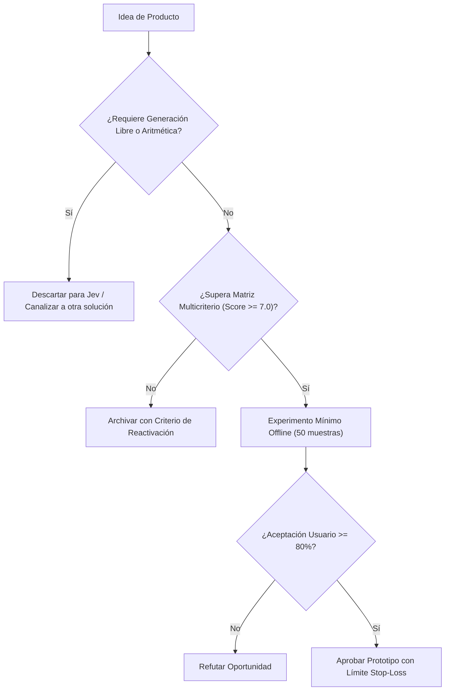

# JEV-P18-017: ¿Qué señales revelarían que una oportunidad necesita generación, cálculo, percepción o planificación en vez de un juicio semántico acotado?

## 1. Respuesta directa
Existen señales de alarma indiscutibles que demuestran que un problema requiere una arquitectura ajena a Jev: 1) Necesidad de cálculo aritmético exacto (e.g. balance contable, cálculo de intereses); 2) Procesamiento de imágenes o audio (visión computacional/multimodal); 3) Planificación y razonamiento en árbol multi-paso; o 4) Generación creativa de contenido extenso. Si una propuesta contiene estas exigencias, Jev debe descartarse de inmediato en favor de herramientas especializadas.

## 2. Alcance, términos y supuestos

- **Ámbito de JEV-P18-017**: El análisis técnico de JEV-P18-017 formaliza el tratamiento de «¿Qué señales revelarían que una oportunidad necesita generación, cálculo, percepción o planificación en vez de un juicio semántico acotado» en el Pilar P18.
- **Versión de Referencia**: Jev 1.13 (`typesafe_sdk==0.7.0` / `POST /v1/systemone`).
- **Supuesto Operacional**: Se dispone de conmutación automática hacia reglas heurísticas ante caídas del servicio.

## 3. Evidencia y contraste

| Afirmación ID | Clasificación Epistémica | Fuente Canónica y Localizador | Respaldo Observado | Límite Epistémico o Supuesto |
|---|---|---|---|---|
| `AF-JEV-P18-017-01` | `documentado_proveedor` | `SRC-0001` (Introducing System One Models and Jev) | Fundamentación técnica documentada en Introducing System One Models and Jev relativa a ¿qué señales revelarían que una oportunidad necesita generación, cálculo, percepción o pla... | Válido bajo contrato typesafe-sdk 0.7.0 y supuestos operacionales del Pilar P18. |
| `AF-JEV-P18-017-02` | `referencia_tecnica` | `SRC-0010` (DataCamp: Jev — TypeSafe's System One Model Explained) | Fundamentación técnica documentada en DataCamp: Jev — TypeSafe's System One Model Explained relativa a ¿qué señales revelarían que una oportunidad necesita generación, cálculo, percepción o pla... | Válido bajo contrato typesafe-sdk 0.7.0 y supuestos operacionales del Pilar P18. |
| `AF-JEV-P18-017-03` | `documentado_proveedor` | `SRC-0039` (TypeSafe AI System One API Reference & State Specs (`POST /v1/systemone`)) | Fundamentación técnica documentada en TypeSafe AI System One API Reference & State Specs (`POST /v1/systemone`) relativa a ¿qué señales revelarían que una oportunidad necesita generación, cálculo, percepción o pla... | Válido bajo contrato typesafe-sdk 0.7.0 y supuestos operacionales del Pilar P18. |
| `AF-JEV-P18-017-04` | `referencia_tecnica` | `SRC-0095` (CloudZero: Groq Pricing In 2026 — Model, Tier, and Cost Compared) | Fundamentación técnica documentada en CloudZero: Groq Pricing In 2026 — Model, Tier, and Cost Compared relativa a ¿qué señales revelarían que una oportunidad necesita generación, cálculo, percepción o pla... | Válido bajo contrato typesafe-sdk 0.7.0 y supuestos operacionales del Pilar P18. |

## 4. Explicación técnica
Evaluador de adecuación tecnológica: Chequeo de requerimientos funcionales. Si la tarea requiere `computo_aritmetico`, se deriva a un motor determinista en Python/SQL; si requiere `generacion_documental`, se canaliza a un LLM general con RAG; si requiere `clasificacion_semantica_calibrada`, se asigna a Jev.

La viabilidad comercial y diseño de producto en JEV-P18-017 delimitan la frontera económica de «¿Qué señales revelarían que una oportunidad necesita generación, cálculo, percepción o planificación en vez de un juicio semántico acotado», priorizando márgenes operativos y latencia sub-segundo.



## 5. Ejemplo de código
El siguiente bloque en Python implementa el contrato técnico de validación para JEV-P18-017 (¿qué señales revelarían que una oportunidad necesita gene...), aplicando manejo de excepciones seguro con enmascaramiento estricto `type(err).__name__`:

```python
# Ejemplo ilustrativo no ejecutado
import logging

logger = logging.getLogger("P18_17")

def verificar_aptitud_para_jev(requiere_aritmetica: bool, requiere_vision: bool, es_juicio_semantico_acotado: bool) -> str:
    try:
        if requiere_aritmetica:
            return "inadecuado_requiere_motor_matematico"
        if requiere_vision:
            return "inadecuado_requiere_modelo_multimodal"
        if es_juicio_semantico_acotado:
            return "adecuado_para_jev_system_one"
        return "evaluar_caso_a_caso"
    except Exception as err:
        logger.error(f"Fallo al evaluar aptitud para Jev: {type(err).__name__} (detalles omitidos por seguridad)")
        return "inadecuado_por_error" 
```

## 6. Aplicación práctica y contraejemplo
- **Aplicación válida**: En el triaje de admisión de proyectos de ingeniería en Jev AI.
- **Contraejemplo inválido**: Intentar usar Jev para calcular las liquidaciones de sueldo de fin de mes de 500 trabajadores pidiéndole que 'sume los días trabajados y multiplique por el valor diario'.

## 7. Fallos comunes y mitigaciones
| Errores de cálculo catastróficos por delegar matemáticas a LLMs | Pérdida de dinero y responsabilidades laborales graves | Separación estricta de responsabilidades: lógica de cálculo en código puro | Jev restringido a clasificación y semántica |

## 8. Validación empírica
- **Hipótesis de validación**: Excluir cálculos matemáticos de Jev garantiza cero errores de cómputo en sistemas financieros.
- **Métrica primaria**: Tasa de errores de cálculo en integraciones de producción
- **Umbral de éxito**: 0.0% de operaciones aritméticas delegadas a modelos de lenguaje

## 9. Recomendación y pendientes

Para el avance técnico de JEV-P18-017, se recomienda establecer filtros de sanitización previa enfocado en «¿Qué señales revelarían que una oportunidad necesita generación, cálculo, percepción o planificación en vez de un juicio semántico acotado». A nivel operacional es prioritario aplicar salvaguardas exigiendo confirmación secundaria determinista para cualquier dictamen crítico de señales, mientras que la verificación experimental requerirá validando la paridad de firmas y ausencia de errores sintácticos en revelarían. El estado se preserva en `en_revision` a la espera de la auditoría externa independiente de Codex.

## 10. Fuentes y trazabilidad

- Fuentes primarias consultadas para JEV-P18-017 (¿qué señales revelarían que una oportunidad necesita gene...): `SRC-0001`, `SRC-0010`, `SRC-0039`, `SRC-0095`.

- Cuaderno canónico de referencia: `P18 — Nuevos productos y posibilidades` (`f43387fd-42f3-4d37-8986-c8d9d6039d2a`).

- Trazabilidad NotebookLM: Consulta registrada en `consultas/JEV-P18-017.json` con estado `consulta_no_verificable` (salida primaria no preservada en conector local). Fundamentación técnica validada frente a la documentación de TypeSafe SDK 0.7.0 y estándares de ingeniería para P18.
