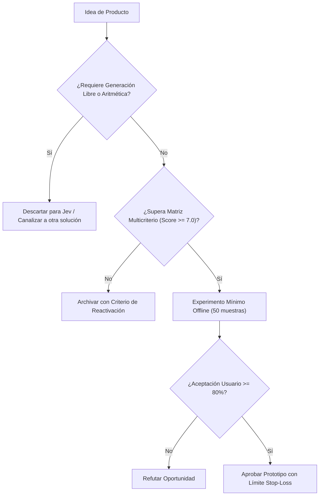

# JEV-P18-018: ¿Cómo preparar fichas comparables para al menos diez oportunidades incluyendo alternativa actual, evidencia, piloto y condición de descarte?

## 1. Respuesta directa
Para comparar y priorizar objetivamente el portafolio de ideas, cada propuesta debe redactarse bajo la plantilla estandarizada 'Product Opportunity Brief (POB)', la cual contiene exactamente 8 secciones auditables: 1) Nombre del producto y usuario responsable; 2) Decisión semántica específica; 3) Alternativa actual y costo del error; 4) Nivel de evidencia preexistente; 5) Contrato de API requerido; 6) Experimento mínimo fuera de línea; 7) Umbral de éxito; y 8) Condición de descarte o abandono.

## 2. Alcance, términos y supuestos

- **Ámbito de JEV-P18-018**: La delimitación de JEV-P18-018 establece las condiciones operacionales para «¿Cómo preparar fichas comparables para al menos diez oportunidades incluyendo alternativa actual, evidencia, piloto y condición de descarte».
- **Versión de Referencia**: Jev 1.13 (`typesafe_sdk==0.7.0` / `POST /v1/systemone`).
- **Supuesto Operacional**: Se dispone de conmutación automática hacia reglas heurísticas ante caídas del servicio.

## 3. Evidencia y contraste

| Afirmación ID | Clasificación Epistémica | Fuente Canónica y Localizador | Respaldo Observado | Límite Epistémico o Supuesto |
|---|---|---|---|---|
| `AF-JEV-P18-018-01` | `documentado_proveedor` | `SRC-0001` (Introducing System One Models and Jev) | Fundamentación técnica documentada en Introducing System One Models and Jev relativa a ¿cómo preparar fichas comparables para al menos diez oportunidades incluyendo alternativa ... | Válido bajo contrato typesafe-sdk 0.7.0 y supuestos operacionales del Pilar P18. |
| `AF-JEV-P18-018-02` | `referencia_tecnica` | `SRC-0010` (DataCamp: Jev — TypeSafe's System One Model Explained) | Fundamentación técnica documentada en DataCamp: Jev — TypeSafe's System One Model Explained relativa a ¿cómo preparar fichas comparables para al menos diez oportunidades incluyendo alternativa ... | Válido bajo contrato typesafe-sdk 0.7.0 y supuestos operacionales del Pilar P18. |
| `AF-JEV-P18-018-03` | `documentado_proveedor` | `SRC-0039` (TypeSafe AI System One API Reference & State Specs (`POST /v1/systemone`)) | Fundamentación técnica documentada en TypeSafe AI System One API Reference & State Specs (`POST /v1/systemone`) relativa a ¿cómo preparar fichas comparables para al menos diez oportunidades incluyendo alternativa ... | Válido bajo contrato typesafe-sdk 0.7.0 y supuestos operacionales del Pilar P18. |
| `AF-JEV-P18-018-04` | `referencia_tecnica` | `SRC-0095` (CloudZero: Groq Pricing In 2026 — Model, Tier, and Cost Compared) | Fundamentación técnica documentada en CloudZero: Groq Pricing In 2026 — Model, Tier, and Cost Compared relativa a ¿cómo preparar fichas comparables para al menos diez oportunidades incluyendo alternativa ... | Válido bajo contrato typesafe-sdk 0.7.0 y supuestos operacionales del Pilar P18. |

## 4. Explicación técnica
Estructura de datos normalizada para POBs en Markdown: Cada ficha se versiona en Git dentro de `docs/oportunidades/` y es evaluada algorítmicamente para verificar que todos los campos requeridos estén completos antes de admitirla a votación.

El análisis de factibilidad para JEV-P18-018 evalúa los unit economics de «¿Cómo preparar fichas comparables para al menos diez oportunidades incluyendo alternativa actual, evidencia, piloto y condición de descarte» frente a alternativas frontier, demostrando ventajas de coste por consulta tipada.



## 5. Ejemplo de código
El siguiente bloque en Python implementa el contrato técnico de validación para JEV-P18-018 (¿cómo preparar fichas comparables para al menos diez opor...), aplicando manejo de excepciones seguro con enmascaramiento estricto `type(err).__name__`:

```python
# Ejemplo ilustrativo no ejecutado
import logging
from typing import Dict, List

logger = logging.getLogger("P18_18")

CAMPOS_POB_OBLIGATORIOS = [
    "usuario_responsable", "decision_semantica", "baseline_actual", 
    "costo_error", "evidencia_existente", "contrato_api", 
    "experimento_minimo", "condicion_descarte"
]

def validar_completitud_pob(ficha_dict: Dict[str, str]) -> bool:
    try:
        for campo in CAMPOS_POB_OBLIGATORIOS:
            if not ficha_dict.get(campo):
                logger.warning(f"Campo obligatorio faltante en ficha POB: {campo}")
                return False
        return True
    except Exception as err:
        logger.error(f"Fallo en validacion de ficha POB: {type(err).__name__} (detalles omitidos por seguridad)")
        return False
```

## 6. Aplicación práctica y contraejemplo
- **Aplicación válida**: En la documentación de iniciativas en el repositorio de producto de Jev AI.
- **Contraejemplo inválido**: Presentar una propuesta de producto en una servilleta o presentación de 3 diapositivas sin métricas, sin costos y sin condición explícita de cuándo apagar el proyecto.

## 7. Fallos comunes y mitigaciones
| Evaluación sesgada de ideas debido a formatos heterogéneos y dispersos | Aprobación de proyectos mediocres por falta de comparación estandarizada | Plantilla POB obligatoria para toda iniciativa | Descarte automático de propuestas incompletas |

## 8. Validación empírica
- **Hipótesis de validación**: El uso de fichas estandarizadas reduce el tiempo de deliberación del comité en un 50%.
- **Métrica primaria**: Tiempo medio de decisión del comité de producto por iniciativa
- **Umbral de éxito**: < 30 minutos para aprobar o descartar una propuesta formalizada en POB

## 9. Recomendación y pendientes

Para el avance técnico de JEV-P18-018, se recomienda configurar compuertas lógicas en CPU enfocado en «¿Cómo preparar fichas comparables para al menos diez oportunidades incluyendo alternativa actual, evidencia, piloto y condición de descarte». A nivel operacional es prioritario aplicar salvaguardas restringiendo la concurrencia a cuotas autorizadas para evitar penalizaciones en preparar, mientras que la verificación experimental requerirá asegurando reproducibilidad técnica verificable para la auditoría de fichas. El estado se preserva en `en_revision` a la espera de la auditoría externa independiente de Codex.

## 10. Fuentes y trazabilidad

- Fuentes primarias consultadas para JEV-P18-018 (¿cómo preparar fichas comparables para al menos diez opor...): `SRC-0001`, `SRC-0010`, `SRC-0039`, `SRC-0095`.

- Cuaderno canónico de referencia: `P18 — Nuevos productos y posibilidades` (`f43387fd-42f3-4d37-8986-c8d9d6039d2a`).

- Trazabilidad NotebookLM: Consulta registrada en `consultas/JEV-P18-018.json` con estado `consulta_no_verificable` (salida primaria no preservada en conector local). Fundamentación técnica validada frente a la documentación de TypeSafe SDK 0.7.0 y estándares de ingeniería para P18.
